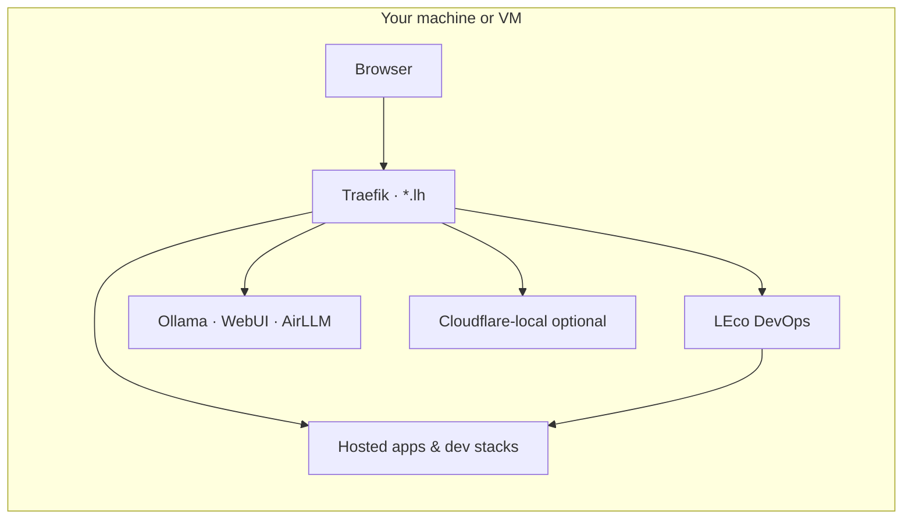

<h1 align="center">LEco DevOps Open Project</h1>

<p align="center">
  <strong>Your local cloud edge — on Docker</strong><br />
  Named HTTPS hosts · AI stack · app lifecycle · optional Cloudflare-local — all on <code>*.lh</code>
</p>

<p align="center">
  <a href="#start-in-minutes"><strong>Get started</strong></a>
  &nbsp;·&nbsp;
  <a href="#features"><strong>Features</strong></a>
  &nbsp;·&nbsp;
  <a href="#use-cases"><strong>Use cases</strong></a>
  &nbsp;·&nbsp;
  <a href="docs/PROJECT.md"><strong>Technical guide</strong></a>
  &nbsp;·&nbsp;
  <a href="https://github.com/leco-devops/local-ecosystem"><strong>Source</strong></a>
</p>

<p align="center">
  
  
  
  
</p>

---

<p align="center">
  Stop memorizing ports. Run <strong>LEco DevOps</strong> — a free, MIT-licensed platform that gives your laptop the feel of a small cloud:<br />
  real hostnames, TLS, a control dashboard, LLM tooling, and repeatable deploys for the apps you already have in Git.
</p>

---

## Features

### Edge & networking

| Capability | What it does for you |
|------------|----------------------|
| **Traefik reverse proxy** | One entry on ports 80/443; route by hostname instead of `:8080`, `:3000`, … |
| **`*.lh` local DNS** | Stable URLs like `https://n8n.lh` and `https://dashboard.lh` that match how teams talk about services |
| **mkcert TLS** | Trusted HTTPS in the browser without fighting self-signed warnings |
| **Network repair** | `repair-network` and dashboard heals re-attach `lh-network` when containers drift |

### Operations dashboard

| Capability | What it does for you |
|------------|----------------------|
| **LEco DevOps UI** | Single pane for stack status, metrics, logs, in-app docs, and service control |
| **Control tab** | Start, stop, restart, and repair ecosystem services without memorizing shell scripts |
| **Hosted apps** | Register third-party repos, materialize manifests under `hosting/`, probe URLs, manage lifecycle |
| **Platform tab** | Cloud/local platform settings, component catalog, and **dev stack builder** with Start / Stop / Repair / Reinstall / Destroy |
| **Built-in help** | Operator and developer manuals served from the same UI you run the stack with |

### Application toolchain

| Capability | What it does for you |
|------------|----------------------|
| **`leco-devops` CLI** | Scaffold apps, generate `leco.app.yaml` + profiles, run Compose and Wrangler, merge Traefik routes |
| **Hosted app slots** | Keep upstream repos clean; overrides and symlinks live in `hosting/app-available/<slug>/` |
| **Isolated dev stacks** | Per-team or per-CMS Compose projects (`platform/dev-stacks/`) with their own DB/network |
| **Manifest binding** | Attach a hosted app to a dev stack via `platform.devStackId` for shared infra without port clashes |
| **Split API + UI routes** | Traefik rules for React/Vue frontends and `/api` backends (same pattern as production edge configs) |

### AI & automation

| Capability | What it does for you |
|------------|----------------------|
| **Ollama** | Pull and run local models; manage from the dashboard |
| **Open WebUI** | Chat UI at `https://ai.lh` wired to your local models |
| **AirLLM** | Ollama-compatible API for very large models on modest VRAM (layer streaming) |
| **n8n** | Workflow automation on `https://n8n.lh` beside the rest of the stack |
| **AI-assisted onboarding** | Dashboard flows to help scaffold and configure apps with provider abstraction |

### Cloud-shaped development (optional)

| Capability | What it does for you |
|------------|----------------------|
| **Cloudflare-local** | R2-, KV-, D1-, and Workers-style adapters on `*.lh` without hitting production Cloudflare |
| **Cloud VM profiles** | Install selective services on a Linux VM with real domains, TLS (mkcert / ACME / static), and external LLM APIs |
| **Update catalog** | Track ecosystem, stack, and upstream image/release updates from the dashboard |

---

## Use cases

<table>
<tr>
<td width="50%" valign="top">

### Develop like production — locally

Use real hostnames and HTTPS while you code. Frontend, API, and workers each get Traefik routes; no more “works on `localhost:3000` only.”

**Ideal for:** full-stack engineers, platform engineers validating routing before deploy.

</td>
<td width="50%" valign="top">

### Many apps, one machine

Materialize multiple LEco-hosted apps from separate Git repos. Each slot has its own manifest, compose merge, and Traefik fragment — without folding every app into one mega-compose file.

**Ideal for:** agencies, consultants, and polyglot teams juggling client projects.

</td>
</tr>
<tr>
<td valign="top">

### Isolated stacks for CMS & commerce

Spin up **WordPress**, **Magento**, **Laravel**, or custom component bundles as separate dev stacks. Each stack owns its database and internal network; bind a hosted app when you need shared connections.

**Ideal for:** e-commerce devs, QA reproducing customer stacks, trainers running demos side by side.

</td>
<td valign="top">

### AI product development offline

Run **Ollama**, **Open WebUI**, and **AirLLM** on the same `lh-network` as your app. Prototype RAG, agents, and automation (n8n) without cloud API keys for every iteration.

**Ideal for:** AI engineers, hackathons, air-gapped or cost-sensitive experimentation.

</td>
</tr>
<tr>
<td valign="top">

### Cloudflare Workers & bindings — locally

Start **cloudflare-local** to exercise R2, KV, D1, and Workers-style endpoints on `*.lh`. Provision bindings from `leco-devops` and test Workers-shaped apps before CI deploys.

**Ideal for:** edge developers using Wrangler who want fast feedback loops.

</td>
<td valign="top">

### Preproduction on a cloud VM

Use **Platform** profiles and `cloud-install.sh` to stand up a selective subset of services on a VM with your domain, TLS mode, and optional external LLM providers — closer to staging than a laptop-only compose file.

**Ideal for:** small teams without a full Kubernetes estate, demos, and partner sandboxes.

</td>
</tr>
</table>

---

## How it fits together



| Layer | Role |
|-------|------|
| **DNS** (`*.lh`) | Resolve friendly hostnames to `127.0.0.1` |
| **Traefik** | TLS termination and HTTP routing |
| **ecosystem-stack** | Start order, service scripts, repair, updates |
| **LEco DevOps** | Dashboard + APIs + docs |
| **`leco-devops`** | CLI for manifests, deploy, platform, and dev stacks |

Deep dive: [Architecture](docs/ARCHITECTURE.md) · [Hosted apps runbook](docs/HOSTED_APPS_TRAEFIK_RUNBOOK.md) · [Dev stack isolation](docs/DEV_STACK_ISOLATION.md)

---

## What you get

| | |
|---|---|
| **Application** | **LEco DevOps** — web UI + `leco-devops` CLI |
| **License** | [MIT](LICENSE) — commercial use, fork, contribute |
| **Official repository** | [github.com/leco-devops/local-ecosystem](https://github.com/leco-devops/local-ecosystem) |
| **Governance** | Community-owned; [Open source](docs/OPEN_SOURCE.md) |
| **Contact** | [leco@techtonic.systems](mailto:leco@techtonic.systems) |

---

## Start in minutes

**Prerequisites:** Docker, `*.lh` DNS, mkcert ([setup guide](docs/SETUP.md)).

```bash
git clone https://github.com/leco-devops/local-ecosystem.git
cd local-ecosystem
./ecosystem-stack/install-foundation.sh
./ecosystem-stack/ecosystem-stack.sh start
```

Open **http://localhost.lh** or **http://dashboard.lh** for the LEco DevOps dashboard.

<p align="center">
  <a href="docs/SETUP.md"><strong>→ Full first-time setup</strong></a>
  &nbsp;·&nbsp;
  <a href="docs/DEPLOY_CLI.md"><strong>→ CLI reference</strong></a>
</p>

---

## Documentation

| Guide | For |
|-------|-----|
| [Setup](docs/SETUP.md) | First machine install (DNS, TLS, troubleshooting) |
| [Deployment](docs/DEPLOYMENT.md) | Day-2 operations and updates |
| [Platform tab](docs/help/03-platform-tab.md) | Dev stacks and cloud platform UI |
| [Architecture](docs/ARCHITECTURE.md) | System design and module map |
| [Development playbook](docs/DEVELOPMENT_PLAYBOOK.md) | Extend services and APIs |
| [PROJECT.md](docs/PROJECT.md) | Full repository technical guide |

---

## Contribute

This project is **community-driven**: fork, fix, document, and open pull requests. We welcome dev-stack presets, hosted-app samples, docs, and reviews.

<p align="center">
  <a href="CONTRIBUTING.md"><strong>Contribution guide</strong></a>
  &nbsp;·&nbsp;
  <a href="https://github.com/leco-devops/local-ecosystem/issues"><strong>Issues</strong></a>
  &nbsp;·&nbsp;
  <a href="https://github.com/leco-devops/local-ecosystem/fork"><strong>Fork</strong></a>
</p>

| | |
|---|---|
| [Contributing](CONTRIBUTING.md) | Branch workflow, changelog, safety |
| [Security](SECURITY.md) | Responsible disclosure |
| [Changelog](CHANGELOG.md) | Release history |

---

## Top contributors

| Role | Name | Links |
|------|------|--------|
| **Manager & moderator** | [Techtonic Systems Media And Research LLC](https://techtonic.systems/) | [Website](https://techtonic.systems/) · [leco@techtonic.systems](mailto:leco@techtonic.systems) |
| **Contributor** | Rajneesh Maurya | [GitHub](https://github.com/rmaurya) · [LinkedIn](https://www.linkedin.com/in/rajneeshmaurya/) |

The **official repository** is hosted under [`leco-devops`](https://github.com/leco-devops) on GitHub. **Commits and pushes** are made by contributors under their own accounts — primarily [@rmaurya](https://github.com/rmaurya) (Rajneesh Maurya).

---

## GitHub Pages

Publish this landing page: **Repository → Settings → Pages → Deploy from branch → `main` → `/ (root)`**. GitHub serves this `README.md` as your project homepage.

---

## Governance

**LEco DevOps Open Project** grows through contributors and maintainers in this repository. **[Techtonic Systems Media And Research LLC](https://techtonic.systems/)** provides operational stewardship (releases, contact: [leco@techtonic.systems](mailto:leco@techtonic.systems)) — supporting the community, not replacing MIT-licensed ownership of the codebase.

Copyright (c) contributors · [NOTICE](NOTICE.md) · [OPEN_SOURCE.md](docs/OPEN_SOURCE.md)
