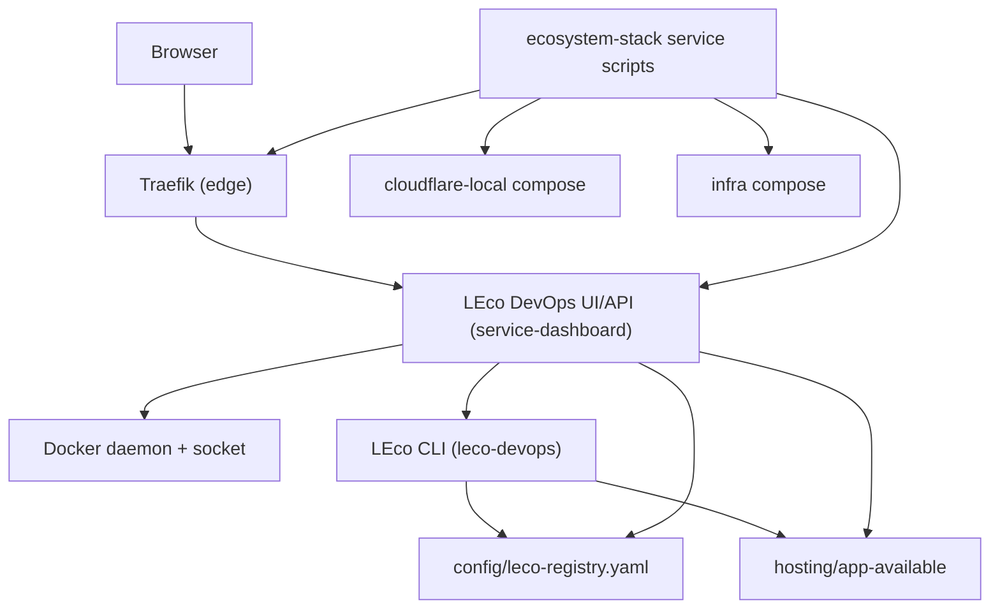

# LEco DevOps Open Project - Architecture

This document is the architecture entry point for the project.

- High-level design (HLD): [`HLD.md`](HLD.md)
- Low-level design (LLD): [`LLD.md`](LLD.md)
- AI-assisted onboarding plan: [`AI_ONBOARDING_PLAN.md`](AI_ONBOARDING_PLAN.md)
- LEco toolchain details: [`LECO_TOOLING.md`](LECO_TOOLING.md)
- Agent operating guide: [`../AGENTS.md`](../AGENTS.md)
- Versioning and releases: [`VERSIONING.md`](VERSIONING.md) · [`RELEASE_NOTES.md`](RELEASE_NOTES.md) · [`../CHANGELOG.md`](../CHANGELOG.md)

## System context

The platform provides a local cloud-like environment around `*.lh` hostnames:

- Traefik as edge router and TLS termination.
- LEco DevOps web UI for operations, docs, monitoring, and controls.
- LEco CLI (`leco-devops`) for app onboarding and lifecycle.
- Optional Cloudflare-local adapters (KV/R2/D1/Workers-style).
- Shared Docker network (`lh-network`) and service orchestration via `ecosystem-stack`.

## Runtime topology (overview)

## Code ownership map

- `ecosystem-stack/`: stack orchestration scripts and lifecycle wrappers.
- `dashboard/`: LEco DevOps Flask app, APIs, UI, and docs catalog.
- `dashboard/ai_*.py`: AI-assisted onboarding modules (provider abstraction, file collection, prompts, templates, orchestrator).
- `tools/deploy-cli/`: LEco CLI package and manifest tooling.
- `hosting/`: hosted-app materialization area and templates.
- `cloudflare-local/`: adapter compose stack and adapter implementations.
- `infra/`: optional infra add-on compose stack.
- `traefik/`: static Traefik config and canonical **`dynamic.yml`**; runtime file-provider payloads live under **`hosting/traefik/`** (see **DEPLOYMENT.md** §7, **SETUP.md**).
- `config/`: runtime configuration — `leco-registry.yaml` (app registry), `ai-providers.yaml` (AI provider settings, gitignored).
- `docs/`: operator, developer, and architecture documentation.

## Primary integration contracts

- Control API: `POST /api/control` and `POST /api/control/stream`.
- LEco registration APIs: `POST /api/leco/detect|generate-yaml|save-yaml|register`.
- AI onboarding APIs: `GET|POST /api/ai/settings`, `POST /api/ai/test`, `GET /api/ai/models`, `POST /api/leco/ai-analyze/stream|write`.
- Hosted app APIs: `/api/hosted-apps*`, `/api/hosted/upload-zip`.
- Docs APIs: `/api/docs/catalog` and `/api/docs/content`.
- Registry source of truth: `config/leco-registry.yaml`.
- AI provider config: `config/ai-providers.yaml` (server-side, gitignored).

## Next reading order

1. [`HLD.md`](HLD.md) for subsystem boundaries and flows.
2. [`LLD.md`](LLD.md) for module-level responsibilities.
3. [`AI_ONBOARDING_PLAN.md`](AI_ONBOARDING_PLAN.md) for hybrid AI provider design and pipeline.
4. [`LECO_TOOLING.md`](LECO_TOOLING.md) for CLI + dashboard integration.
5. [`../AGENTS.md`](../AGENTS.md) for automation guardrails.
