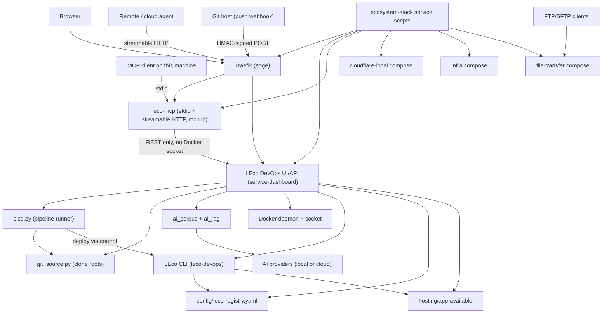

# LEco DevOps Open Project - Architecture

> **Open source** · [MIT License](../LICENSE) · Maintained by [Techtonic Systems Media And Research LLC](https://techtonic.systems/)

This document is the architecture entry point for the project.

- High-level design (HLD): [`HLD.md`](HLD.md)
- Low-level design (LLD): [`LLD.md`](LLD.md)
- AI-assisted onboarding plan: [`AI_ONBOARDING_PLAN.md`](AI_ONBOARDING_PLAN.md)
- LEco toolchain details: [`LECO_TOOLING.md`](LECO_TOOLING.md)
- Agent access over MCP: [`MCP_SERVER.md`](MCP_SERVER.md)
- Git onboarding and CI/CD: [`GIT_AND_CICD.md`](GIT_AND_CICD.md)
- Real domains and exposure: [`PRODUCTION_HARDENING.md`](PRODUCTION_HARDENING.md) · [`CLOUD_VM_DEPLOYMENT.md`](CLOUD_VM_DEPLOYMENT.md)
- Agent operating guide: [`../AGENTS.md`](../AGENTS.md)
- Versioning and releases: [`VERSIONING.md`](VERSIONING.md) · [`RELEASE_NOTES.md`](RELEASE_NOTES.md) · [`../CHANGELOG.md`](../CHANGELOG.md)
- Cloudflare ↔ LEco service map: [`CF_LECO_SERVICE_MAP.md`](CF_LECO_SERVICE_MAP.md)

## System context

The platform provides a cloud-like environment around a single wildcard domain — `*.lh` on a laptop, a real domain on a server:

- Traefik as edge router and TLS termination.
- LEco DevOps web UI for operations, docs, monitoring, and controls.
- LEco CLI (`leco-devops`) for app onboarding and lifecycle.
- **MCP server** (`leco-mcp`) so AI agents drive the same operations the UI exposes — a proxy over the dashboard REST API, with no Docker access of its own.
- **App sources**: a local path, or a Git URL cloned into a managed clone root.
- **CI/CD**: a signature-authenticated push webhook that runs pull → build hook → deploy → verify → record for one registered app.
- **AI layer**: a provider abstraction (local Ollama/AirLLM, cloud vendors, OpenAI-compatible aggregators) used both for onboarding analysis and for retrieval-grounded answers over the repository's own documentation plus live machine state.
- Optional Cloudflare-local adapters (KV/R2/D1/Workers-style).
- Shared Docker network (`lh-network`) and service orchestration via `ecosystem-stack`.

Deployment mode is a first-class input, not an afterthought: `config/leco-platform.yaml` carries `deployment_mode` (`local` | `cloud`), `base_domain`, and `tls.mode` (`mkcert` | `acme` | `static` | `cloudflare`), and every hostname the platform emits is derived from them.

## Runtime topology (overview)

```mermaid
flowchart TD
  Browser["Browser"]
  AgentLocal["MCP client on this machine"]
  AgentRemote["Remote / cloud agent"]
  GitHost["Git host (push webhook)"]

  Traefik["Traefik (edge)"]
  Mcp["leco-mcp (stdio + streamable HTTP, mcp.lh)"]
  Dash["LEco DevOps UI/API (service-dashboard)"]
  Cicd["cicd.py (pipeline runner)"]
  GitSrc["git_source.py (clone roots)"]
  Rag["ai_corpus + ai_rag"]
  Providers["AI providers (local or cloud)"]

  AiStack["ecosystem-stack service scripts"]
  DockerApi["Docker daemon + socket"]
  LecoCli["LEco CLI (leco-devops)"]
  Registry["config/leco-registry.yaml"]
  Hosted["hosting/app-available"]
  CfLocal["cloudflare-local compose"]
  Infra["infra compose"]
  FileTransfer["file-transfer compose"]
  ClientFTP["FTP/SFTP clients"]

  Browser --> Traefik
  AgentLocal -->|stdio| Mcp
  AgentRemote -->|streamable HTTP| Traefik
  GitHost -->|HMAC-signed POST| Traefik
  Traefik --> Mcp
  Traefik --> Dash
  Mcp -->|REST only, no Docker socket| Dash
  Dash --> Cicd
  Cicd --> GitSrc
  Cicd -->|deploy via control| LecoCli
  Dash --> GitSrc
  Dash --> Rag
  Rag --> Providers
  Dash --> DockerApi
  Dash --> LecoCli
  LecoCli --> Registry
  LecoCli --> Hosted
  Dash --> Registry
  Dash --> Hosted
  AiStack --> Traefik
  AiStack --> Dash
  AiStack --> Mcp
  AiStack --> CfLocal
  AiStack --> Infra
  AiStack --> FileTransfer
  ClientFTP --> FileTransfer
```

Data-flow sequence diagrams for onboarding-from-Git, CI/CD, agent-over-MCP, and RAG answering live in `docs/help/13-architecture-diagrams.md` — in the running dashboard, [Help → Architecture & diagrams](/help?topic=architecture-diagrams).

## Code ownership map

- `ecosystem-stack/`: stack orchestration scripts and lifecycle wrappers.
- `dashboard/`: LEco DevOps Flask app, APIs, UI, and docs catalog.
- `dashboard/ai_config.py`, `dashboard/ai_provider.py`: AI provider layer — configuration, key storage/masking, provider presets (including OpenAI-compatible aggregators), model discovery.
- `dashboard/ai_file_collector.py`, `ai_prompts.py`, `ai_template_generator.py`, `ai_orchestrator.py`: AI-assisted onboarding pipeline.
- `dashboard/ai_corpus.py`, `dashboard/ai_rag.py`: repository documentation index and retrieval-grounded answering over docs plus live state.
- `dashboard/git_source.py`: Git URL as an app source — URL validation, clone-root selection, credential isolation, clone/update streams.
- `dashboard/cicd.py`: webhook signature verification, run coalescing, and the pull → build → deploy → verify → record pipeline.
- `dashboard/mcp_insights.py`: read-only aggregation of MCP agent activity for the dashboard MCP tab.
- `dashboard/platform_config.py`: deployment mode, base domain, TLS mode, and `*.lh` → public-host rewriting.
- `dashboard/leco_wrangler_paths.py`: `wrangler.toml` / `.json` / `.jsonc` discovery, JSONC parsing, and Worker enumeration.
- `tools/deploy-cli/`: LEco CLI package and manifest tooling.
- `tools/mcp-server/`: `leco-mcp` MCP server (stdio + streamable HTTP) — see [`MCP_SERVER.md`](MCP_SERVER.md).
- `tools/claude-plugin/`: Claude Code plugin bundling the MCP server, skill, commands, and a read-only diagnostician subagent.
- `hosting/`: hosted-app materialization area and templates; `hosting/app-sources/` is the fallback Git clone root.
- `cloudflare-local/`: adapter compose stack and adapter implementations.
- `infra/`: optional infra add-on compose stack (MySQL, Redis, Adminer, …).
- `file-transfer/`: optional FTP, SFTP, and read-only file browser compose stack.
- `traefik/`: static Traefik config and canonical **`dynamic.yml`**; runtime file-provider payloads live under **`hosting/traefik/`** (see **DEPLOYMENT.md** §7, **SETUP.md**).
- `scripts/render-platform-traefik.py`: renders `traefik/dynamic.yml` into `hosting/traefik/01-stack-core.yml` for the configured base domain and TLS mode.
- `config/`: runtime configuration — `leco-registry.yaml` (app registry), `leco-platform.yaml` (deployment mode, base domain, TLS), and the gitignored secret files `ai-providers.yaml`, `git-credentials.yaml`, `cicd-pipelines.yaml`.
- `ecosystem-stack/config/generated/`: machine-written state — MCP activity log, CI/CD run history, RAG index.
- `docs/`: operator, developer, and architecture documentation.

## Primary integration contracts

- Control API: `POST /api/control` and `POST /api/control/stream`.
- LEco registration APIs: `POST /api/leco/detect|generate-yaml|save-yaml|register`.
- Git source APIs: `/api/leco/git/config|credentials|inspect|clone|clone/stream|status`.
- CI/CD APIs: `/api/cicd/overview|pipelines|runs`, plus `POST /api/cicd/webhook/<pipeline_id>` (HMAC-authenticated, deliberately **not** control-token gated).
- MCP insight APIs: `GET /api/mcp/insights|activity|install`.
- AI onboarding APIs: `GET|POST /api/ai/settings`, `POST /api/ai/test`, `POST /api/ai/discover`, `GET /api/ai/models`, `POST /api/leco/ai-analyze/stream|write`.
- RAG APIs: `POST /api/ai/rag/ask|ask/stream|reindex`, `GET /api/ai/rag/status`.
- Hosted app APIs: `/api/hosted-apps*`, `/api/hosted/upload-zip`.
- Docs APIs: `/api/docs/catalog` and `/api/docs/content`.
- Registry source of truth: `config/leco-registry.yaml`.
- Platform/domain source of truth: `config/leco-platform.yaml`.
- Secrets on disk (all `0600`, all gitignored): `config/ai-providers.yaml`, `config/git-credentials.yaml`, `config/cicd-pipelines.yaml`.

## Next reading order

1. [`HLD.md`](HLD.md) for subsystem boundaries and flows.
2. [`LLD.md`](LLD.md) for module-level responsibilities.
3. [`MCP_SERVER.md`](MCP_SERVER.md) for the agent-facing tool surface and safety model.
4. [`GIT_AND_CICD.md`](GIT_AND_CICD.md) for Git onboarding and pipeline behaviour.
5. [`AI_ONBOARDING_PLAN.md`](AI_ONBOARDING_PLAN.md) for hybrid AI provider design and pipeline.
6. [`LECO_TOOLING.md`](LECO_TOOLING.md) for CLI + dashboard integration.
7. [`PRODUCTION_HARDENING.md`](PRODUCTION_HARDENING.md) before any of this is exposed on a real domain.
8. [`FILE_TRANSFER.md`](FILE_TRANSFER.md) for FTP/SFTP/browser local file drop.
9. [`../AGENTS.md`](../AGENTS.md) for automation guardrails.
