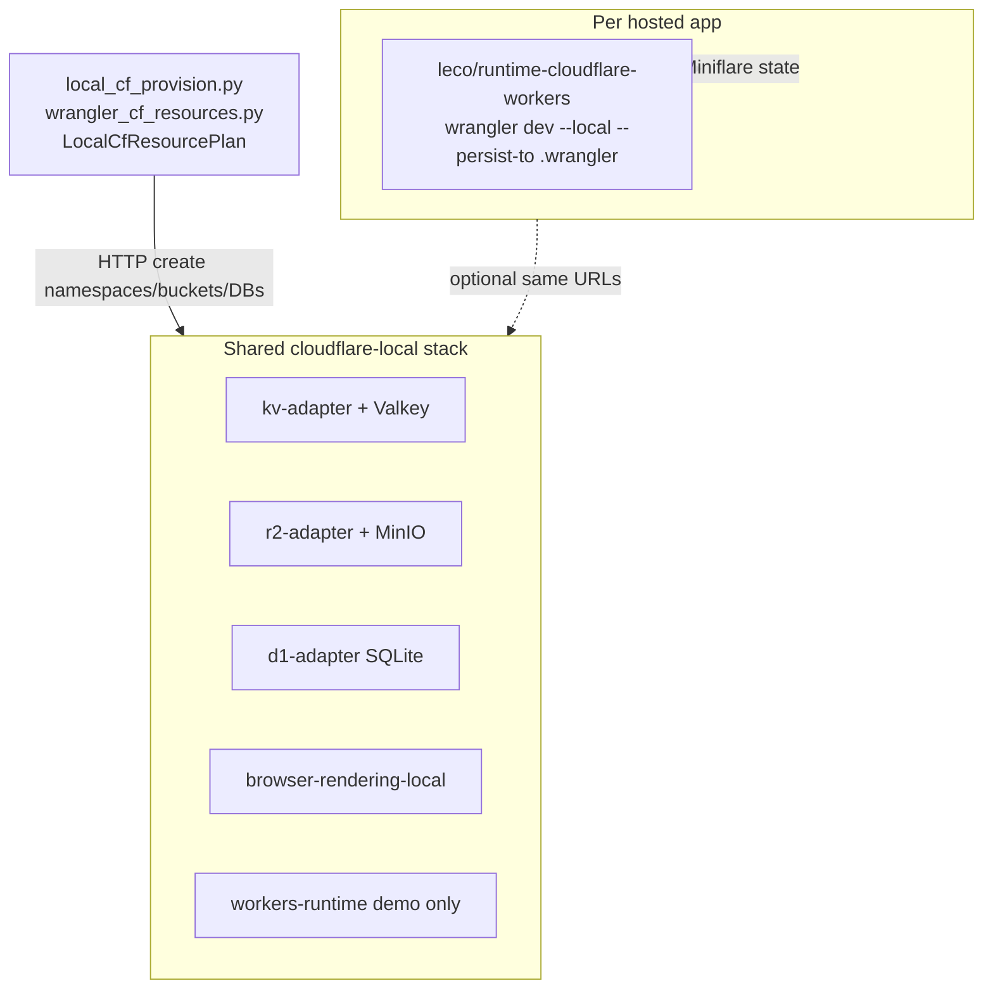

# Cloudflare ↔ LEco service map

Canonical mapping between Cloudflare products and their local LEco DevOps implementations. Machine-readable source: [`ecosystem-stack/config/cf-leco-service-registry.json`](../ecosystem-stack/config/cf-leco-service-registry.json).

## Architecture: dual-path design

LEco provides two complementary paths for Cloudflare services — shared adapters and per-app Miniflare. They are intentionally separate and should not be collapsed.



**Shared adapters** (`kv.lh`, `r2.lh`, `d1.lh`, `browser.lh`) serve ecosystem demos, dashboard probes, and CLI provision ([`local_cf_provision.py`](../tools/deploy-cli/leco_app/local_cf_provision.py)).

**Per-app Miniflare** ([`cloudflare_workers.py`](../dashboard/leco_runtimes/cloudflare_workers.py)) is the primary path for real Workers; KV/R2/D1 state persists under named `.wrangler` volumes without mutating upstream repos ([runtime README](../infra/runtimes/cloudflare-workers/README.md)).

The shared `workers-runtime` compose service is a stack smoke-test only — hosted apps must not depend on it.

## Reuse rules

These rules govern all onboarding phases:

1. **Extend registration modules** (`control_targets.py`, `monitor.py SERVICE_MAP`, `service_hub.py`, `collect_cloudflare_local_status`) before adding containers.
2. **Extend the provision pipeline** (`resource_plan.py`, `wrangler_cf_resources.py`, `local_cf_provision.py`, `traefik_fragment.py`) for new binding types.
3. **Clone adapter shape, not stack**: new CF HTTP adapters copy the kv-adapter/r2-adapter Flask pattern (`/health`, JSON `ok`, HTML panel).
4. **Prefer infra/ecosystem backends** over new databases: Mailpit for email, infra Redis for queues, existing postgres/mysql for Hyperdrive.
5. **Do not reuse Valkey for Queues** — Valkey is reserved for the KV adapter (`KV_REDIS_URL`); infra Redis (`redis.lh:6379`) is the queue backend target.
6. **Runtime adapters**: Pages extends the Workers image/entrypoint pattern; DO/Vectorize evaluate Wrangler/Miniflare upgrades in per-app runtime first.
7. **Dedicated per-app CF compose** ([sample](../hosting/samples/sample-cloudflare-application/docker-compose.leco-dedicated-cf.example.yml)) reuses the same adapter images/build contexts, not new implementations.

### Anti-patterns to reject

- Second object store or KV engine for CF bindings.
- Per-app duplicate of kv-adapter/r2-adapter unless using documented dedicated CF compose (same images).
- New Mailpit/SMTP container for email (use existing infra Mailpit).
- New Postgres/MySQL for Hyperdrive (use n8n_postgres or infra mysql).
- Replacing Miniflare with production Cloudflare APIs.

## Shared CF stack mapping

Services in [`cloudflare-local/docker-compose.yml`](../cloudflare-local/docker-compose.yml):

| CF product | Compose service | Container | Traefik `*.lh` | Control ID | Hub | Status |
|------------|-----------------|-----------|----------------|------------|-----|--------|
| Workers KV | kv-adapter | kv-adapter | kv.lh | cf-kv-adapter | kv | implemented |
| R2 Object Storage | r2-adapter | r2-adapter | r2.lh | cf-r2-adapter | r2 | implemented |
| D1 Database | d1-adapter | d1-adapter | d1.lh | cf-d1-adapter | d1 | implemented |
| Workers (demo) | workers-runtime | workers-runtime | workers.lh | cf-workers-runtime | workers | implemented |
| Browser Rendering | browser-rendering-local | browser-rendering-local | browser.lh | cf-browser-rendering-local | browser | partial |
| MinIO (S3 backend) | minio | minio | s3.lh, minio-console.lh | cf-minio | minio | implemented |
| Valkey (KV backend) | valkey | valkey | TCP valkey.lh:6380 | cf-valkey | valkey | implemented |
| Autoscaler | autoscaler | autoscaler | autoscale.lh | cf-autoscaler | autoscale | implemented |
| Autoscale demo | autoscale-demo | autoscale-demo | (internal) | cf-autoscale-demo | — | implemented |

## Infra substitutes for CF bindings

Services in [`infra/docker-compose.yml`](../infra/docker-compose.yml) that map to CF products without new adapters:

| CF product | CF binding | Infra service | Local URL | Reuse strategy | Notes |
|------------|------------|---------------|-----------|----------------|-------|
| Queues | `[[queues]]` | redis | redis.lh:6379 | new-adapter-on-existing-backend | Phase C: thin queues-adapter on infra Redis (NOT Valkey) |
| Hyperdrive | `[[hyperdrive]]` | n8n_postgres / mysql | postgres.lh:5432 | extend-runtime | `.dev.vars` DSN shim; no pooler container |
| Email Routing | `send_email` | mailpit | mail.lh | extend-runtime | SMTP env in Worker runtime compose |
| Cache / CDN | — | cache-varnish / cache-nginx | cache.lh | register-only | HTTP cache lab; not Workers Cache API |

## Hosted-app runtimes

| Runtime type | Status | Key file | Reuse strategy |
|-------------|--------|----------|----------------|
| `cloudflare-workers` | Implemented | [`dashboard/leco_runtimes/cloudflare_workers.py`](../dashboard/leco_runtimes/cloudflare_workers.py) | extend-runtime |
| `cloudflare-pages` | Stub (`AdapterNotReady`) | [`dashboard/leco_runtimes/cloudflare_pages.py`](../dashboard/leco_runtimes/cloudflare_pages.py) | extend-runtime |

## Wrangler binding provision

CLI provision currently covers KV, R2, and D1 only:

| Wrangler table | Local target | Provision module | Status |
|----------------|--------------|------------------|--------|
| `[[kv_namespaces]]` | kv.lh | `local_cf_provision.py` → `resource_plan.py` | implemented |
| `[[r2_buckets]]` | r2.lh | same | implemented |
| `[[d1_databases]]` | d1.lh | same | implemented |
| `[[queues]]` | (planned: queues.lh) | extend `wrangler_cf_resources.py` | planned |
| `[browser]` | browser.lh (service exists) | Wrangler bridge in Workers adapter | partial |
| `[[hyperdrive]]` | postgres.lh / mysql DSN | `.dev.vars` shim | partial |

## Production-only bindings (no local adapter planned)

These appear as `expected: production-only` badges in LEco DevOps and `leco-devops runtimes`:

| CF binding | Default in `INFORMATIONAL_PRODUCTION_ONLY_BINDINGS` | Notes |
|------------|------------------------------------------------------|-------|
| `browser` | Yes (bridge planned — Phase B) | Local service exists at browser.lh; Wrangler binding not yet wired |
| `vectorize` | Yes | Optional mock adapter in Phase D |
| `hyperdrive` | Yes (shim planned — Phase B) | DSN passthrough to postgres/mysql |
| `analytics_engine_datasets` | Yes | No local adapter planned |
| `send_email` | Yes (shim planned — Phase B) | Map to Mailpit SMTP |
| `mtls_certificates` | Yes | Cloud-only |

## Roadmap phases

| Phase | Product | Reuse target | New work |
|-------|---------|--------------|----------|
| **A** | Register gaps | `SERVICE_MAP`, `control_targets.py`, hubs | valkey, autoscale-demo, update-catalog, cache-nginx rows |
| **B** | Wrangler bridges | `cloudflare_workers.py`, `.dev.vars`, docs | browser binding, hyperdrive DSN, email SMTP |
| **C** | Queues | infra Redis + kv-adapter Flask pattern | `queues-adapter` HTTP facade |
| **D** | Vectorize | `productionOnlyBindings` | Optional mock adapter |
| **E** | Durable Objects | Existing `leco/runtime-cloudflare-workers` | Miniflare upgrade |
| **F** | Pages | Workers image/entrypoint, `cloudflare_pages.py` | `infra/runtimes/cloudflare-pages/` |

## Extension points for new bindings

When adding a new CF binding type (e.g. Queues), extend these modules in order. Do not fork a second provisioner or duplicate adapter images.

### CLI provision pipeline

| Module | What to add |
|--------|-------------|
| `tools/deploy-cli/leco_app/resource_plan.py` | New dataclass row (e.g. `QueueRow`) and field on `LocalCfResourcePlan` |
| `tools/deploy-cli/leco_app/wrangler_cf_resources.py` | Parser for the new `[[queues]]` wrangler.toml table → plan rows |
| `tools/deploy-cli/leco_app/local_cf_provision.py` | HTTP calls to create resources on the new adapter (same pattern as KV/R2/D1) |
| `tools/deploy-cli/leco_app/traefik_fragment.py` | Traefik route entry for the new `*.lh` host (if applicable) |

### Dashboard registration

| Module | What to add |
|--------|-------------|
| `dashboard/control_targets.py` | Entry in `CF_TARGETS` for the new compose service |
| `dashboard/monitor.py` | Entry in `SERVICE_MAP` and `CLOUDFLARE_ENDPOINTS`; probe in `collect_cloudflare_local_status` |
| `dashboard/service_hub.py` | Hub page entry (if user-facing) |

### Adapter implementation

New HTTP adapters clone the kv-adapter Flask layout:

```
cloudflare-local/adapters/<name>/
  Dockerfile
  app.py          # Flask: /health, /<resource>, /panel
  requirements.txt
```

Register in `cloudflare-local/docker-compose.yml` on `lh-network` and add Traefik route in `traefik/dynamic.yml`.

### Runtime adapter (Workers/Pages)

| Module | What to add |
|--------|-------------|
| `dashboard/leco_runtimes/cloudflare_workers.py` | Remove binding from `DEFAULT_LOCAL_UNSUPPORTED_BINDINGS` or `INFORMATIONAL_PRODUCTION_ONLY_BINDINGS` when the bridge is ready |
| `dashboard/leco_runtimes/cloudflare_pages.py` | Implement adapter (clone Workers adapter pattern) for Phase F |
| `infra/runtimes/cloudflare-pages/` | Docker image (clone Workers Dockerfile + `wrangler pages dev`) |

### Registry update

Update both `ecosystem-stack/config/cf-leco-service-registry.json` and `docs/CF_LECO_SERVICE_MAP.md` to reflect the new binding's status.

## Related documentation

- [Architecture overview](ARCHITECTURE.md) — system context and topology
- [Development playbook](DEVELOPMENT_PLAYBOOK.md) — adding new adapters and services
- [DevOps guide](DEVOPS_GUIDE.md) — deploy Workers, KV, R2, D1
- [Deploy CLI reference](DEPLOY_CLI.md) — manifest fields and provision policy
- [Hosted apps runbook](HOSTED_APPS_TRAEFIK_RUNBOOK.md) — production-only bindings and Traefik
- [Cloudflare-local architecture](../cloudflare-local/docs/ARCHITECTURE.md) — adapter topology
- [Agent guide](../AGENTS.md) — automation guardrails for CF-related changes
