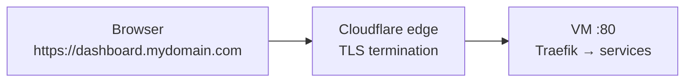

# Cloud VM install — Cloudflare DNS & SSL

Install **LEco DevOps** on a Linux cloud VM with a real domain (e.g. `*.mydomain.com`) where **Cloudflare terminates HTTPS** at the edge. Traefik on the VM serves HTTP to Cloudflare; visitors still see `https://` in the browser.

For ACME/Let's Encrypt on Traefik instead, see [CLOUD_VM_DEPLOYMENT.md](CLOUD_VM_DEPLOYMENT.md).

---

## What you get

| Local (`*.lh`) | Cloud (`base_domain: mydomain.com`) |
|----------------|-------------------------------------|
| `dashboard.lh` | `https://dashboard.mydomain.com` |
| `localhost.lh` | `https://localhost.mydomain.com` |
| `paperclip.lh` | `https://paperclip.mydomain.com` |
| `n8n.lh` | `https://n8n.mydomain.com` |
| `ai.lh` | `https://ai.mydomain.com` |
| `ollama.lh` | `https://ollama.mydomain.com` |
| `<stackId>.lh` | `https://<stackId>.mydomain.com` |

Use a subdomain zone if you prefer isolation, e.g. `base_domain: leco.mydomain.com` → `dashboard.leco.mydomain.com`.

---

## Architecture



LEco sets `tls.mode: cloudflare` in platform config. Traefik uses the default static config (no ACME). Cloudflare handles certificates for public hostnames.

---

## Prerequisites

| Requirement | Notes |
|-------------|--------|
| **Linux VM** | Ubuntu 22.04+ or similar; public IPv4 (or IPv6 with AAAA) |
| **Domain on Cloudflare** | `mydomain.com` added to your Cloudflare account |
| **Docker** | Engine + Compose plugin |
| **Git** | Clone this repository on the VM |
| **Firewall** | Allow inbound **TCP 80** from the internet (required). **443** optional with Flexible SSL (see below) |

---

## Step 1 — Cloudflare DNS

In the Cloudflare dashboard for `mydomain.com`:

| Type | Name | Content | Proxy |
|------|------|---------|-------|
| **A** | `*` | VM public IP | **Proxied** (orange cloud) |
| **A** (optional) | `@` | Same IP | Proxied |

The wildcard `*` covers all LEco service hostnames (`dashboard`, `n8n`, `paperclip`, dev stacks, hosted apps, etc.).

Wait for DNS to propagate (usually minutes). Confirm with:

```bash
dig +short dashboard.mydomain.com
```

You should see Cloudflare anycast addresses, not your VM IP directly (when proxied).

---

## Step 2 — Cloudflare SSL/TLS mode

Under **SSL/TLS → Overview**, choose how Cloudflare connects to your VM:

### Recommended: Flexible

| Setting | Value |
|---------|--------|
| **Encryption mode** | **Flexible** |
| **Origin** | HTTP on port **80** only |

Cloudflare presents HTTPS to browsers and connects to Traefik over plain HTTP. No origin certificate is required. This matches LEco's default `cloudflare` TLS mode out of the box.

### Optional: Full (strict) with Origin Certificate

Use this when you want encrypted traffic between Cloudflare and the VM.

1. Cloudflare → **SSL/TLS → Origin Server** → **Create Certificate** (15-year origin cert for `*.mydomain.com` and `mydomain.com`).
2. Save the certificate and private key on the VM under the repo, e.g.:
   - `certs/origin.pem`
   - `certs/origin-key.pem`
3. After `render-platform-traefik.py --write`, edit `hosting/traefik/01-stack-core.yml` **tls.certificates** to point at those files (mounted in Traefik as `/certs/...`).
4. Set Cloudflare encryption to **Full (strict)**.
5. Open **TCP 443** on the VM firewall.

Most operators start with **Flexible** and upgrade later if needed.

Document your choice in `config/leco-platform.yaml` under `tls.cloudflare_notes`.

---

## Step 3 — Clone and install LEco

On the VM:

```bash
git clone https://github.com/leco-devops/local-ecosystem.git
cd local-ecosystem

cp config/leco-platform.yaml.example config/leco-platform.yaml
cp config/ai-providers.yaml.example config/ai-providers.yaml   # optional, for external LLMs
```

Run the cloud installer (pick a profile for the services you need):

```bash
./ecosystem-stack/cloud-install.sh \
  --profile ai-full \
  --domain mydomain.com \
  --tls cloudflare
```

| Profile | Services |
|---------|----------|
| `minimal` | Traefik + dashboard |
| `platform` | + Postgres, n8n |
| `ai-full` | + Ollama, AirLLM, Open WebUI, update-catalog, Paperclip |
| `ai-cloud` | Same as `ai-full`; favors external LLM API keys |
| `cloudflare-full` | + Cloudflare-local mimic (R2, KV, D1, Workers adapters) |
| `full` | All ecosystem services |

To install without auto-start:

```bash
./ecosystem-stack/install-foundation.sh \
  --mode cloud \
  --profile ai-full \
  --domain mydomain.com \
  --tls cloudflare \
  --no-start
```

---

## Step 4 — Platform configuration

Confirm `config/leco-platform.yaml` (gitignored) contains:

```yaml
deployment_mode: cloud
base_domain: mydomain.com
extra_domains: []

tls:
  mode: cloudflare
  cloudflare_notes: "Proxied wildcard DNS; Cloudflare SSL Flexible; origin HTTP :80"

install_profile: ai-full   # matches your --profile choice
enabled_services:
  - traefik
  - dashboard
  # … other services from the profile
```

Edit anytime via the dashboard **Platform** tab, or manually on the VM.

---

## Step 5 — Apply domain routes and start

Rewrite Traefik host rules from `*.lh` to `*.mydomain.com`, then start the stack:

```bash
python3 scripts/render-platform-traefik.py --write
./ecosystem-stack/services/traefik.sh heal
./ecosystem-stack/ecosystem-stack.sh start
```

Or in the dashboard: **Platform** → **Apply Traefik routes**, then **Control** → start services.

Verify Traefik is listening:

```bash
curl -sI -H "Host: dashboard.mydomain.com" http://127.0.0.1/
```

---

## Step 6 — First login and Paperclip

1. Open **`https://dashboard.mydomain.com`** (or `https://localhost.mydomain.com`).
2. Complete dashboard setup if prompted.

If you use **Paperclip**, set the public URL before start/restart so invite links use your real domain:

```bash
export PAPERCLIP_PUBLIC_URL=https://paperclip.mydomain.com
./ecosystem-stack/ecosystem-stack.sh paperclip restart
```

Bootstrap the first CEO/admin:

```bash
PAPERCLIP_PUBLIC_URL=https://paperclip.mydomain.com \
  ./ecosystem-stack/ecosystem-stack.sh paperclip-bootstrap-ceo
```

**Inside Paperclip containers**, agent LLM adapters still use Docker DNS (`http://ollama:11434`, `http://airllm:11435`) — not the public hostname.

---

## Step 7 — Hosted apps and dev stacks

- **Dev stacks** — create from **Platform** tab; public URL becomes `https://<stackId>.mydomain.com`.
- **Hosted apps** — register with `leco-devops` as on a local machine; public URLs automatically use `base_domain` when `deployment_mode: cloud`.
- Optional `platform.devStackId` in `leco.yaml` binds an app to a dev stack.

After adding routes or changing `base_domain`, re-run:

```bash
python3 scripts/render-platform-traefik.py --write
./ecosystem-stack/services/traefik.sh heal
```

---

## Service URL reference

After install with `base_domain: mydomain.com`:

| Service | URL |
|---------|-----|
| LEco DevOps dashboard | `https://dashboard.mydomain.com` |
| Dashboard (alt host) | `https://localhost.mydomain.com` |
| Traefik dashboard | `https://traefik.mydomain.com` |
| Open WebUI | `https://ai.mydomain.com` |
| Ollama API | `https://ollama.mydomain.com` |
| AirLLM API | `https://airllm.mydomain.com` |
| n8n | `https://n8n.mydomain.com` |
| Paperclip | `https://paperclip.mydomain.com` |
| Dev stack | `https://<stackId>.mydomain.com` |
| Hosted app | `https://<app-slug>.mydomain.com` |

---

## Troubleshooting

| Symptom | Check |
|---------|--------|
| **522 / connection timed out** | VM firewall allows TCP 80; Docker running; `./ecosystem-stack/ecosystem-stack.sh status` |
| **404 from Traefik** | Run `render-platform-traefik.py --write` and `traefik.sh heal`; confirm `base_domain` in platform config |
| **SSL error in browser** | Cloudflare SSL mode; proxied DNS (orange cloud); certificate active on zone |
| **Redirect loop** | Often **Flexible** vs **Full** mismatch — if origin has no TLS cert, use **Flexible** |
| **Paperclip invite links show `.lh`** | Set `PAPERCLIP_PUBLIC_URL=https://paperclip.mydomain.com` and restart Paperclip |
| **Service up but wrong hostname** | `deployment_mode` must be `cloud`; re-apply Traefik routes |

Logs:

```bash
./ecosystem-stack/ecosystem-stack.sh traefik logs
./ecosystem-stack/ecosystem-stack.sh dashboard logs
```

---

## Changing domain or TLS later

1. Edit `config/leco-platform.yaml` (`base_domain`, `tls.mode`, notes).
2. Update Cloudflare DNS if the zone changed.
3. Re-render and heal Traefik (commands above).
4. Restart affected services (`paperclip`, hosted apps, dev stacks).

---

## Related docs

- [CLOUD_VM_DEPLOYMENT.md](CLOUD_VM_DEPLOYMENT.md) — all cloud profiles and TLS modes (including ACME)
- [help/03-platform-tab.md](help/03-platform-tab.md) — Platform tab, dev stacks, bundles
- [help/06-paperclip.md](help/06-paperclip.md) — Paperclip setup and agents
- [DEV_STACK_ISOLATION.md](DEV_STACK_ISOLATION.md) — isolated dev stack architecture
- [SRS_CLOUD_VM_PLATFORM.md](SRS_CLOUD_VM_PLATFORM.md) — requirements reference
