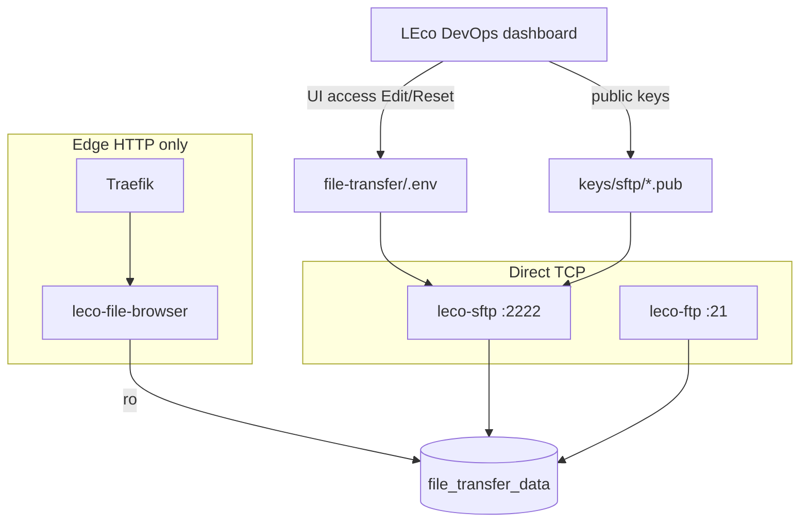

# FTP and SFTP file transfer

Local FTP and SFTP services for dev workflows (shared upload volume, default credentials for localhost only).

**Reading map:** Operator walkthrough → [`docs/help/12-file-transfer.md`](help/12-file-transfer.md) · Developer wiring → [`docs/help/dev-10-file-transfer.md`](help/dev-10-file-transfer.md) · Architecture → [ARCHITECTURE.md](ARCHITECTURE.md), [HLD.md](HLD.md), [LLD.md](LLD.md).

## Architecture (summary)

The file-transfer stack is an optional **infra add-on** compose project (`file-transfer/`), orchestrated like `infra/` and `cloudflare-local/`:

| Container | Image | Host exposure | Shared storage |
|-----------|-------|---------------|----------------|
| `leco-sftp` | `atmoz/sftp:alpine` | TCP **2222** → container 22 | `file_transfer_data:/home/leco` |
| `leco-ftp` | `delfer/alpine-ftp-server` | TCP **21**, PASV **21100–21110** | same volume |
| `leco-file-browser` | nginx autoindex (built) | HTTP via Traefik `files.lh` | same volume (read-only mount) |



Credentials and SFTP keys are managed through **Service hubs → UI access** (`ui-login-registry.json` slugs `sftp`, `ftp`, `files`). See [UI_CREDENTIAL_VAULT.md](UI_CREDENTIAL_VAULT.md).

## Start / stop

```bash
./ecosystem-stack/services/file-transfer.sh start
./ecosystem-stack/services/file-transfer.sh stop
./ecosystem-stack/services/file-transfer.sh status
```

Or via the main stack CLI (when `file-transfer` is in `config/leco-platform.yaml` `enabled_services`, or unrestricted):

```bash
./ecosystem-stack/ecosystem-stack.sh start file-transfer
```

Dashboard **Control** tab: **File transfer (FTP, SFTP)** or per-service **SFTP** / **FTP** targets.

## Install profile

Profile **`file-transfer-full`** enables only Traefik, dashboard, and the file-transfer compose stack. Profile **`full`** includes file-transfer with all other ecosystem services.

```bash
LECO_INSTALL_PROFILE=file-transfer-full ./ecosystem-stack/install-foundation.sh
```

## Connection defaults

| Protocol | Host | Port | User | Password |
|----------|------|------|------|----------|
| SFTP | `localhost` or `sftp.lh` | **2222** (avoids macOS SSH on :22) | `leco` | `leco#localhost-192` (or public key) |
| FTP | `ftp.lh` or `localhost` | **21** | `leco` | `leco#localhost-192` |

FTP passive mode uses ports **21100–21110** (published on the host). Set `FTP_PUBLICHOST=ftp.lh` (default) so clients receive correct PASV addresses.

Both services share the Docker volume **`file_transfer_data`** mounted at `/home/leco`.

## Configuration

Copy [`file-transfer/.env.example`](../file-transfer/.env.example) to `file-transfer/.env` to override ports, users, or passwords:

```bash
cp file-transfer/.env.example file-transfer/.env
# edit SFTP_USERS, FTP_USERS, SFTP_PORT, FTP_PORT, FTP_PUBLICHOST, …
./ecosystem-stack/services/file-transfer.sh restart
```

`SFTP_USERS` follows [atmoz/sftp](https://github.com/atmoz/sftp) format: `user:pass:uid:gid`. For **public-key-only** auth, use an empty password segment (`leco::1000:1000`) and place an OpenSSH public key in `file-transfer/keys/sftp/<user>.pub` (mounted into the container at `/home/<user>/.ssh/keys/`).

### SFTP authentication modes

Manage from **Service hubs → UI access → SFTP → Edit**:

| Mode | Description |
|------|-------------|
| **Password only** | Default `leco` / `leco#localhost-192` |
| **Public key only** | Empty password in `SFTP_USERS`; requires `file-transfer/keys/sftp/leco.pub` |
| **Password + public key** | Both password login and mounted public key accepted |

The dashboard writes `SFTP_AUTH_MODE`, `SFTP_USER`, `SFTP_USERS`, and the `.pub` file, then recreates `leco-sftp`.

## Client examples

```bash
# SFTP (password)
sftp -P 2222 leco@localhost

# SFTP (public key)
sftp -P 2222 -i ~/.ssh/id_ed25519 leco@localhost

# FTP (curl)
curl -u 'leco:leco#localhost-192' ftp://localhost:21/ --ftp-pasv
```

Service hubs (credentials + connection strings): **http://localhost.lh/hub/sftp** and **http://localhost.lh/hub/ftp**.

## Read-only file browser

Browse uploads in the browser (list + download only; no upload/delete/rename):

| URL | Purpose |
|-----|---------|
| **http://files.lh** | Canonical file browser |
| **http://ftp-files.lh** | Alias (same shared FTP/SFTP volume) |
| **http://sftp-files.lh** | Alias (same shared FTP/SFTP volume) |

The **`leco-file-browser`** container mounts the upload volume **read-only** and nginx rejects non-GET/HEAD requests.

## Security

Defaults are for **trusted local development only**. Change credentials before exposing ports beyond localhost. Do not enable on internet-facing hosts without TLS (FTPS) or VPN restrictions.

## Compose layout

- **SFTP:** `atmoz/sftp:alpine` → container `leco-sftp`
- **FTP:** `delfer/alpine-ftp-server` → container `leco-ftp`
- **Browser:** nginx autoindex → container `leco-file-browser` (read-only)
- Compose file: [`file-transfer/docker-compose.yml`](../file-transfer/docker-compose.yml)
- Service script: [`ecosystem-stack/services/file-transfer.sh`](../ecosystem-stack/services/file-transfer.sh)

See also [`DEPLOYMENT.md`](DEPLOYMENT.md) and [Ecosystem stack developer guide](help/dev-05-ecosystem-stack.md).
