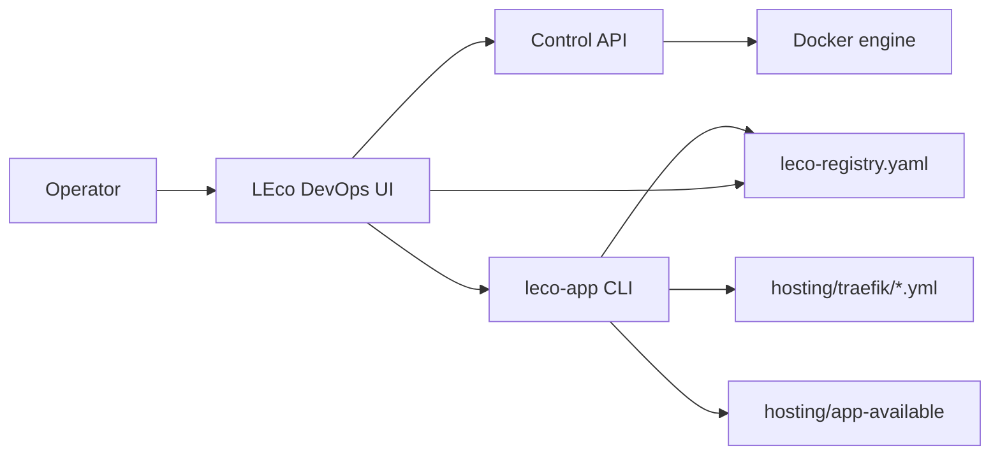

# LEco DevOps Open Project - HLD

This High-Level Design (HLD) defines major components, boundaries, and data/control flows.

## 1) Objectives

- Run a full local platform behind `*.lh` with consistent routing.
- Provide a single operations surface (LEco DevOps UI).
- Support external app onboarding via LEco manifests and registry.
- Keep hosted app lifecycle, routing, and local resource provisioning consistent.

## 2) Architectural layers

| Layer | Responsibility | Key artifacts |
| ----- | ----- | ----- |
| Edge | HTTP/S routing, TLS, service exposure | `traefik/dynamic.yml` (git) + **`hosting/traefik/`** loaded by Traefik (`01-stack-core.yml` copy + `dynamic.yml` merge) |
| Orchestration | Start/stop/restart/bulk operations | `ecosystem-stack/ecosystem-stack.sh`, `ecosystem-stack/core.sh`, `ecosystem-stack/services/*.sh` |
| Operations UI/API | Monitoring, control, docs, hosted app UX | `dashboard/` |
| LEco Toolchain | Manifest detection, register/unregister, deploy flows | `tools/deploy-cli/leco_app/` |
| Hosting materialization | Writable hosted app layout and symlink strategy | `hosting/`, `dashboard/hosting_layout.py` |
| Resource adapters | Optional local Cloudflare-style services | `cloudflare-local/` |

## 3) High-level flow

## 4) Core use cases

### A. Stack operations

- Operator triggers action from LEco DevOps Control tab.
- `dashboard/control.py` validates target/action, executes shell/compose/CLI flow.
- Status/stream updates are returned to UI.

### B. Hosted app registration

- Operator scans app root (`/api/leco/detect`).
- YAML is generated/saved (`/api/leco/generate-yaml`, `/api/leco/save-yaml`).
- Registration runs CLI (`/api/leco/register`), updates registry and optional Traefik routes.

### C. Hosted app offboarding

- Operator removes/reset app in Hosted apps.
- Offboard path uses `ecosystem-unregister`, local resource cleanup, route cleanup, and registry removal.

## 5) Non-functional goals

- Deterministic local behavior and path handling (`/project`, `workspace-parent`, hosted materialization).
- Safe defaults for destructive operations (token-gated mutations).
- Clear docs and discoverability in both repo docs and in-app Docs tab.

## 6) Interface boundaries

- UI/Backend: Flask + static JS APIs under `/api/*`.
- Backend/CLI: subprocess wrapper in `dashboard/leco_subprocess.py`.
- Backend/Docker: socket and compose invocations.
- CLI/Manifests: `leco.app.yaml` bridge + `leco.yaml` profile model.

## 7) Risks and mitigation

- Routing drift: keep Traefik fragment generation centralized in CLI.
- Path drift: standardize on `hosting/app-available` and registry-relative manifests.
- Destructive actions: require `DASHBOARD_CONTROL_TOKEN` in sensitive environments.
