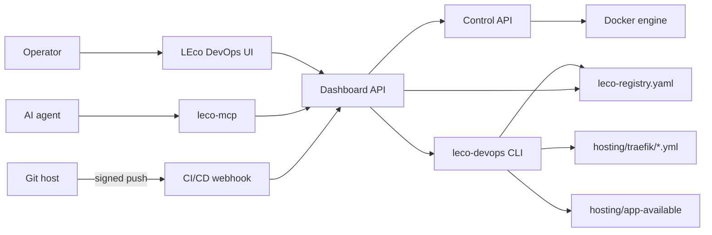
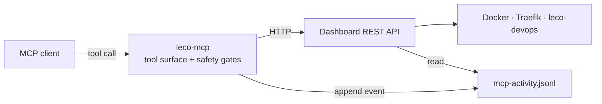

# LEco DevOps Open Project - HLD

> **Open source** · [MIT License](../LICENSE) · Maintained by [Techtonic Systems Media And Research LLC](https://techtonic.systems/)

This High-Level Design (HLD) defines major components, boundaries, and data/control flows.

## 1) Objectives

- Run a full platform behind one wildcard domain with consistent routing — `*.lh` locally, a real domain on a server.
- Provide a single operations surface (LEco DevOps UI) and one machine-readable equivalent of it (MCP).
- Support external app onboarding via LEco manifests and registry, from a local path **or** a Git URL.
- Keep hosted app lifecycle, routing, and local resource provisioning consistent.
- Keep every automated path (agent, webhook) strictly below what a human operator can already do.

## 2) Architectural layers

| Layer | Responsibility | Key artifacts |
| ----- | ----- | ----- |
| Edge | HTTP/S routing, TLS, service exposure | `traefik/dynamic.yml` (git) + **`hosting/traefik/`** loaded by Traefik (`01-stack-core.yml` copy + `dynamic.yml` merge) |
| Domain / TLS policy | Local-vs-cloud hostname derivation and certificate strategy | `config/leco-platform.yaml`, `dashboard/platform_config.py`, `ecosystem-stack/lib/platform_config.py`, `scripts/render-platform-traefik.py` |
| Orchestration | Start/stop/restart/bulk operations | `ecosystem-stack/ecosystem-stack.sh`, `ecosystem-stack/core.sh`, `ecosystem-stack/services/*.sh` |
| Operations UI/API | Monitoring, control, docs, hosted app UX | `dashboard/` |
| Agent access | Machine-readable equivalent of the UI over MCP | `tools/mcp-server/leco_mcp/`, `dashboard/mcp_insights.py` |
| App sources | Local path or Git clone feeding the register wizard | `dashboard/git_source.py`, `hosting/app-sources/` |
| Continuous delivery | Push-triggered pull → build → deploy → verify → record | `dashboard/cicd.py`, `config/cicd-pipelines.yaml`, `ecosystem-stack/config/generated/cicd-runs.jsonl` |
| LEco Toolchain | Manifest detection, register/unregister, deploy flows | `tools/deploy-cli/leco_app/` |
| Hosting materialization | Writable hosted app layout and symlink strategy | `hosting/`, `dashboard/hosting_layout.py` |
| AI providers | One interface over local and cloud models; key custody | `dashboard/ai_config.py`, `dashboard/ai_provider.py`, `config/ai-providers.yaml` |
| Knowledge / RAG | Indexed repo documentation + live state, grounded answers | `dashboard/ai_corpus.py`, `dashboard/ai_rag.py` |
| Resource adapters | Optional local Cloudflare-style services | `cloudflare-local/` |
| File transfer | Local FTP/SFTP + read-only browser on shared volume | `file-transfer/`, `ecosystem-stack/services/file-transfer.sh` |

## 3) High-level flow

```mermaid
flowchart LR
  User["Operator"]
  AgentC["AI agent"]
  GitHost["Git host"]

  Ui["LEco DevOps UI"]
  Mcp["leco-mcp"]
  Hook["CI/CD webhook"]
  Api["Dashboard API"]
  Control["Control API"]
  Cli["leco-devops CLI"]
  Registry["leco-registry.yaml"]
  Traefik["hosting/traefik/*.yml"]
  Docker["Docker engine"]
  Hosted["hosting/app-available"]

  User --> Ui
  AgentC --> Mcp
  GitHost -->|signed push| Hook
  Ui --> Api
  Mcp --> Api
  Hook --> Api
  Api --> Control
  Control --> Docker
  Api --> Cli
  Cli --> Registry
  Cli --> Traefik
  Cli --> Hosted
  Api --> Registry
```

Three entry points, one API. The UI, the MCP server and the CI/CD webhook differ in **how they authenticate**, not in what they can reach — which is why the dashboard API is the boundary that has to be defended (see [`PRODUCTION_HARDENING.md`](PRODUCTION_HARDENING.md)).

## 4) Core use cases

### A. Stack operations

- Operator triggers action from LEco DevOps Control tab.
- `dashboard/control.py` validates target/action, executes shell/compose/CLI flow.
- Status/stream updates are returned to UI.

### B. Hosted app registration

- Operator scans app root (`/api/leco/detect`).
- YAML is generated/saved (`/api/leco/generate-yaml`, `/api/leco/save-yaml`).
- Registration runs CLI (`/api/leco/register`), updates registry and optional Traefik routes.

### C. Hosted app offboarding

- Operator removes/reset app in Hosted apps.
- Offboard path uses `ecosystem-unregister`, local resource cleanup, route cleanup, and registry removal.

### D. AI-assisted onboarding

- Operator toggles "AI Assist" in the registration wizard or AI Settings panel.
- Provider selection: **No AI** (deterministic), **Ollama** / **AirLLM** (local), **OpenAI / Anthropic / Google** (cloud vendors), **OpenAI-Compatible** (aggregators such as Eden AI and OpenRouter, gateways, and local OpenAI-shaped servers — driven by a preset table, or a custom base URL), **Hybrid** (local SLM + cloud LLM).
- **Hybrid mode**: Local SLM (e.g. Ollama/qwen2.5-coder) pre-summarizes source files (fast, free, private) → Cloud LLM (e.g. OpenAI/gpt-4o-mini) analyzes the condensed summary (accurate, ~3-5x fewer tokens = lower cost). Combines speed, accuracy, and cost efficiency.
- 3-phase pipeline: **Collect** (smart file reading within token budget) → **Analyze** (single or two-stage LLM call, structured JSON) → **Generate** (deterministic Python templates).
- AI never writes raw text to disk — it produces structured JSON that drives Python template generators.
- Config files produced: `leco.yaml`, `leco.app.yaml`, `docker-compose.yml`, `docker-compose.leco-hosting.yml`, `leco-docker-preload.js`, `conf/varnish/default.vcl`.
- API keys stored server-side in `config/ai-providers.yaml` (gitignored, chmod 600). Browser only sees masked keys.
- Streaming NDJSON to dashboard mirrors existing registration stream pattern.

```mermaid
flowchart LR
  Wizard["Registration Wizard"]
  AiAPI["AI Endpoints"]
  Collect["File Collector"]
  SLM["Local SLM (Ollama)"]
  LLM["Cloud LLM (OpenAI/etc)"]
  Gen["Template Generator"]
  Disk["App Directory"]

  Wizard -->|toggle AI| AiAPI
  AiAPI --> Collect
  Collect -->|token-budgeted files| SLM
  SLM -->|condensed summary| LLM
  LLM -->|structured JSON| Gen
  Gen -->|deterministic configs| Disk
```

### E. File transfer (FTP / SFTP / browser)

- Operator starts **`file-transfer`** from Control tab or `ecosystem-stack/services/file-transfer.sh`.
- SFTP and FTP write to shared volume **`file_transfer_data`**; browser serves read-only HTTP on `files.lh` via Traefik.
- Credentials: **Service hubs → UI access** — vault + `file-transfer/.env` + optional `keys/sftp/*.pub`; dashboard recreates protocol containers on Edit/Reset.
- Not exposed as HTTP login UIs; no auto-login magic links (protocol auth only).

### F. Git as an app source

A registered application has a **root path**. That path may be a local folder the operator picked, or a directory produced by cloning a repository. Everything downstream of the path — detect, generate, register, deploy — is identical either way; Git is a *source adapter*, not a second onboarding pipeline.

- `dashboard/git_source.py` validates the URL first: only `https://` and SSH forms are accepted. `http://`, `file://`, `git://`, `ext::` and any `::` remote-helper syntax are refused, as are URLs that already embed a credential — because `git` copies the remote into the clone's `.git/config`, so a URL credential is a credential written to disk.
- Clone root is **chosen, then reported**: `LECO_GIT_CLONE_ROOT` if set and writable → the workspace parent if writable (yielding a `wsp:` path) → `hosting/app-sources/` inside the repo. The response names which root was used and why, rather than implying one. On a laptop the workspace parent is mounted read-only, so clones land in `hosting/app-sources/`.
- Credentials never appear in argv or in the URL. A token or SSH key is written to `0600` files in a per-invocation temp directory and reached through `GIT_ASKPASS` / `GIT_SSH_COMMAND`; `HOME` is redirected into that temp directory and `git` runs with `-c credential.helper=` so no helper can persist anything. The directory is removed when the context manager exits. Saved credentials live in the gitignored `config/git-credentials.yaml` and are only ever returned masked.
- `git` runs non-interactive (`GIT_TERMINAL_PROMPT=0`, ssh `BatchMode=yes`) under a wall-clock timeout and a clone-size cap, so a private repo without a credential fails quickly instead of blocking on a password prompt.
- The clone result carries a `path_field` (e.g. `wsp:MyApp`); the browser puts it into the App root field and runs Detect. The clone step itself does not invoke detection.

Canonical detail: [`GIT_AND_CICD.md`](GIT_AND_CICD.md) Part 1.

### G. CI/CD trigger path

A push to the repository triggers one run for one registered app: **pull → build hook → deploy → verify → record**.

The authentication model is deliberately different from the rest of the platform:

- The webhook is authenticated **by an HMAC signature over the raw body**, using a per-pipeline secret, compared with `hmac.compare_digest`. GitHub (`X-Hub-Signature-256`), GitLab (`X-Gitlab-Token`, a shared token — GitLab does not sign the body) and a generic `X-LEco-Signature` scheme are supported; `auto` tries each.
- It is **not** gated on `DASHBOARD_CONTROL_TOKEN`. A Git host cannot be made to send that header, so putting the endpoint behind the control token would break every webhook while looking like hardening. Every other `/api/cicd/*` mutation *is* control-token gated.
- Verification happens **before the payload is parsed and before any state is touched**. An unknown pipeline id, a wrong signature and an oversized body all return an identical opaque `403`, so pipeline ids cannot be enumerated.
- Per-pipeline secrets live in the gitignored `config/cicd-pipelines.yaml` (`0600`), are returned once at creation, and rotation invalidates the old secret immediately.

Two properties shape the runtime behaviour:

- **Coalescing.** At most one run per pipeline executes at a time; a newer commit arriving mid-run replaces the single queued slot, so ten rapid pushes produce at most two runs rather than ten. Retried deliveries are de-duplicated by delivery id for a bounded window.
- **Verify is load-bearing.** After deploy, the app's URL is probed over HTTP and only `2xx`/`3xx` counts. If verify fails the run is recorded as **failed** and the pipeline's last-deployed SHA is *not* advanced — so a later rollback still targets a release that actually answered. The deploy itself has already happened; nothing rolls back automatically. If no verify URL can be derived the step is recorded as **skipped**, the run succeeds, and the outcome says the release was not verified.

The build step names a **compose service** and runs `docker compose run --rm --no-deps <service>` with **no command override**: the command lives in the application's own compose file. An arbitrary command string in a webhook-reachable config would make one leaked secret equivalent to code execution on the host.

Canonical detail: [`GIT_AND_CICD.md`](GIT_AND_CICD.md) Part 2.

### H. Agent access over MCP

`leco-mcp` exposes the platform to MCP clients (Claude Code locally over stdio; remote agents over streamable HTTP on `mcp.lh`). Its defining boundary property is that **it is a proxy over the dashboard REST API and nothing else**: no Docker socket, no shell, no filesystem authority beyond its own activity log, no second copy of lifecycle or routing rules.

```mermaid
flowchart LR
  Agent["MCP client"]
  Mcp["leco-mcp<br/>tool surface + safety gates"]
  Dash["Dashboard REST API"]
  Engine["Docker · Traefik · leco-devops"]
  Log["mcp-activity.jsonl"]

  Agent -->|tool call| Mcp
  Mcp -->|HTTP| Dash
  Dash --> Engine
  Mcp -->|append event| Log
  Dash -->|read| Log
```

What that boundary buys:

- The dashboard stays the single source of truth. Anything an agent does is immediately visible in the UI, and vice versa. Lifecycle fixes land in one place.
- The HTTP container is a reduced-privilege surface. Compromising it grants no more than the dashboard API already grants — which is exactly why [`PRODUCTION_HARDENING.md`](PRODUCTION_HARDENING.md) treats the dashboard's own authentication as the control that matters.
- If the dashboard is down, every tool fails saying so. An agent cannot half-operate the stack from a stale local view.

Destructive operations sit behind **two independent gates** — the call must pass `confirm=true` *and* the server must have been started with `LECO_MCP_ALLOW_DESTRUCTIVE=1`. Neither alone is sufficient: the argument protects against an agent destroying data as a side effect of a vague instruction, the environment flag protects an operator who never opted in from being talked into it. Credential-reading tools have their own separate flag, `LECO_MCP_ALLOW_CREDENTIALS=1`. These gates are *additional* to `DASHBOARD_CONTROL_TOKEN`; they restrict an agent below what a token already permits.

Every dispatch is appended as one JSON line to `ecosystem-stack/config/generated/mcp-activity.jsonl` by the MCP server itself, with arguments summarised and secret-shaped values redacted. `dashboard/mcp_insights.py` reads that file (never writes it), optionally probes the running server's live session view, and joins the events onto the hosted-app fleet for the dashboard's MCP tab — including activity against slugs that are no longer registered.

Canonical detail: [`MCP_SERVER.md`](MCP_SERVER.md).

### I. Retrieval-grounded answering (RAG)

The platform answers questions about itself from two kinds of evidence: **documentation** (what should be true) and **live state** (what is true on this machine right now).

- `dashboard/ai_corpus.py` indexes the repository's own markdown — `docs/**`, a fixed list of root files, and the plugin skills — into heading-aligned chunks. Files that could contain secrets are excluded by path pattern, and every chunk is scrubbed at index time: known token shapes, PEM blocks, and secret-named fields are replaced with `[REDACTED]`. The index is a plain JSON file under `ecosystem-stack/config/generated/`, rebuilt when file mtimes change.
- Retrieval is **lexical BM25 by default** — no model, no network, no vector store — with heading and path fields scored separately and a coverage bonus for matching more of the query. Local embeddings are optional and opt-in: vectors are produced by an Ollama embedding model and fused with the lexical score. Embedding failures degrade to lexical retrieval rather than failing the query.
- **Live state is pulled at query time, and only when the question needs it.** A declarative rule table maps question shapes to collectors (stack status, services, control targets, hosted apps, Traefik routes, Cloudflare-local, AI config, service logs, and per-app snapshot/logs when a registered slug is named). A caller can override the selection explicitly or disable live collection entirely. A failing collector degrades to a note in the context, never a 500. Everything collected is scrubbed again before it enters the prompt.
- The assembled prompt carries live state first (capped at a fraction of the context budget), then numbered documentation passages, under a system prompt that requires inline `[n]` citations, requires live state to win for "what is" questions and documentation to win for "what should be", and forbids speculating about redacted values.
- **Degradation is a first-class path.** With no provider configured — or when the provider errors — retrieval still runs and the answer becomes the retrieved passages themselves, labelled as such. The feature is useful with no AI configured at all.

### J. Local and cloud domain model

One configuration file decides whether the platform is a laptop or a server: `config/leco-platform.yaml`.

| Key | Values | Effect |
| ----- | ----- | ----- |
| `deployment_mode` | `local` (default), `cloud` | Anything other than `cloud` behaves as local |
| `base_domain` | `lh` (default), or a real domain | Only consulted in cloud mode |
| `tls.mode` | `mkcert` (default), `acme`, `cloudflare`, `static` | Selects the Traefik static config and whether local certificates are generated |

- `routing_domain()` in `dashboard/leco_detect.py` returns `lh` unless the mode is `cloud` *and* the configured domain is a syntactically valid DNS name — an invalid domain falls back to `lh` rather than emitting broken hostnames. `app_hostname(slug, *labels)` composes every hostname the platform emits from that base, validating each label.
- `scripts/render-platform-traefik.py` renders the git-canonical `traefik/dynamic.yml` into the runtime `hosting/traefik/01-stack-core.yml`: byte-identical when the base domain is `lh`, otherwise rewriting `Host(...)` rules to the real domain, attaching an ACME certificate resolver when `tls.mode` is `acme`, and dropping the local `certificates` block whenever the mode is not `mkcert` — because that block points at the mkcert wildcard file.
- **Switching mode does not rewrite already-registered manifests.** Migrating an app's hostnames to a new domain is an explicit, opt-in step, so flipping the platform to cloud cannot silently repoint live routes.

Related: [`CLOUD_VM_DEPLOYMENT.md`](CLOUD_VM_DEPLOYMENT.md) · [`PRODUCTION_HARDENING.md`](PRODUCTION_HARDENING.md) · [`CLOUDFLARE_SSL_INSTALL.md`](CLOUDFLARE_SSL_INSTALL.md).

### K. Detection of app shape

Detection reads an app tree and proposes a manifest. Four behaviours are worth stating at design level because they change what gets registered:

- **Nested compose discovery.** Compose files are looked for in the root and a fixed list of conventional subdirectories (`docker/`, `infra/`, `deploy/`, `ops/`, …), root preferred. Separately, when a manifest needs a compose file, a bounded walk *up* from the app directory can adopt an ancestor's compose — unless the profile already pins one explicitly.
- **Wrangler configs in all three formats.** `dashboard/leco_wrangler_paths.py` resolves `wrangler.toml`, `wrangler.json` and `wrangler.jsonc`, preferring TOML on ties so a repo shipping both keeps resolving to the file it was registered with. JSONC comments and trailing commas are stripped by a character scanner, not a regex, so URLs inside string literals survive. Multi-Worker monorepos enumerate one entry per Worker.
- **Repository-boundary containment.** The walk *up* looking for a wrangler config stops at the first directory containing `.git`, `.hg` or `.svn`. A config beside the repository marker is still found; the level above it is never consulted. Without this guard the walk could adopt an unrelated sibling checkout's config and wire another project's KV/R2/D1 bindings into the manifest.
- **Container ports, not host ports.** Routing must target the **container** port, because Traefik reaches the app over `lh-network` where host port mappings do not exist. Detection parses both sides of every compose port mapping and keeps them distinct; published host ports remain a separate signal used for conflict reporting.
- **Mesh routing.** When one compose service publishes several *distinct container ports*, that is treated as several applications behind one container, and detection proposes **one route per port**: the lowest port becomes the front door on `<slug>.<domain>`, each other port gets a labelled sub-host derived from the matching runtime id. Several published ports forwarding to the same container port is not a mesh and is left alone. Only conventional two-service (frontend/API) apps take the earlier split path; mesh inference runs only when nothing else produced routing entries.

Note that the labelled sub-hosts are one DNS level deeper than the front door. A local mkcert wildcard covers them; on a real domain a `*.<slug>.<domain>` certificate requires a DNS-01 resolver.

## 5) Non-functional goals

- Deterministic local behavior and path handling (`/project`, `workspace-parent`, hosted materialization).
- Safe defaults for destructive operations (token-gated mutations).
- Clear docs and discoverability in both repo docs and in-app Docs tab.

## 6) Interface boundaries

- UI/Backend: Flask + static JS APIs under `/api/*`.
- Agent/Backend: MCP tools → dashboard REST API only (`tools/mcp-server/leco_mcp/client.py`). No Docker, no shell, no direct filesystem authority.
- Git host/Backend: `POST /api/cicd/webhook/<pipeline_id>`, HMAC signature over the raw body. No control token.
- Backend/CLI: subprocess wrapper in `dashboard/leco_subprocess.py`.
- Backend/Docker: socket and compose invocations.
- Backend/Git: `git` subprocesses with an isolated `HOME` and credentials supplied only through `GIT_ASKPASS` / `GIT_SSH_COMMAND`.
- Backend/AI provider: HTTP to a local endpoint (Ollama, AirLLM, LM Studio, vLLM, LocalAI) or to a cloud vendor/aggregator. The provider layer is the only place API keys are read in cleartext.
- CLI/Manifests: `leco.app.yaml` bridge + `leco.yaml` profile model.
- Edge/Domain: hostnames are derived, never hard-coded — `routing_domain()` / `app_hostname()` on the dashboard side, `scripts/render-platform-traefik.py` on the stack side.

### Trust boundaries

| Boundary | What crosses it | Control |
| ----- | ----- | ----- |
| Browser → dashboard | Operator actions, including destructive ones | `DASHBOARD_CONTROL_TOKEN` on mutating endpoints |
| Agent → MCP server → dashboard | Tool calls equivalent to UI actions | Two independent gates (`confirm=true` + `LECO_MCP_ALLOW_DESTRUCTIVE=1`); separate flag for credential tools; every dispatch logged |
| Git host → dashboard | Push events that cause a deploy | Per-pipeline HMAC verified before parsing; opaque `403`; branch filtering; coalescing |
| Repository → host | Cloned code, and a build command | Transport allow-list; credentials never written into the clone; build step runs an app-declared compose service with no command override |
| **Dashboard → cloud AI provider** | The question, retrieved documentation chunks, and any live state collected for that question — which can include container logs | Secret scrubbing at index time *and* again at prompt assembly; live collection is rule-gated and can be disabled; the RAG status surface names the destination host and states plainly that the context is sent there. **A local provider keeps this inside the machine; a cloud provider does not.** |
| Dashboard → disk | API keys, Git credentials, webhook secrets | Written server-side at `0600`, gitignored, returned to the browser masked only |

## 7) Risks and mitigation

- Routing drift: keep Traefik fragment generation centralized in CLI.
- Path drift: standardize on `hosting/app-available` and registry-relative manifests.
- Destructive actions: require `DASHBOARD_CONTROL_TOKEN` in sensitive environments.
- AI hallucination: AI produces structured data only; deterministic templates generate all config files. All output is human-reviewable before write.
- API key leakage: keys stored server-side (yaml, chmod 600, gitignored), never sent to browser. Masked display only.
- Token budget overrun: adaptive budgets per provider (12K local, 30-50K cloud) with priority-tiered file collection.
- Agent over-reach: MCP holds no Docker access, so its blast radius is bounded by the dashboard API; destructive tools need two independent gates; every call is logged with the session and target.
- Webhook forgery / enumeration: HMAC verified before parsing, constant-time compare, identical opaque `403` for unknown pipeline, bad signature and oversized body.
- Webhook-triggered code execution: the build step names a compose service, never a command string.
- Bad release promoted to "known good": the last-deployed SHA advances only after an HTTP verify passes.
- Context exfiltration through RAG: scrubbing at index time and at prompt assembly, rule-gated live collection, and an explicit statement of where the context is sent. Choosing a local provider removes the boundary entirely.
- Wrong repository adopted during detection: the wrangler walk-up stops at the repository boundary.
- Routing that works locally and breaks on a real domain: hostnames derive from `deployment_mode` / `base_domain`; mode changes never rewrite registered manifests implicitly. Mesh sub-hosts need a DNS-01 resolver on a real domain.
- Git credential persistence: transport allow-list, credential-bearing URLs refused, secrets passed only via `GIT_ASKPASS` / `GIT_SSH_COMMAND` from a temp directory that is deleted after the operation.
