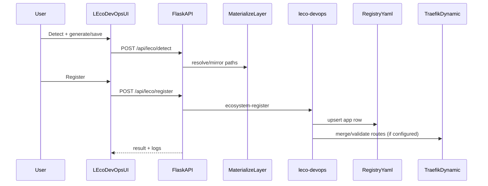
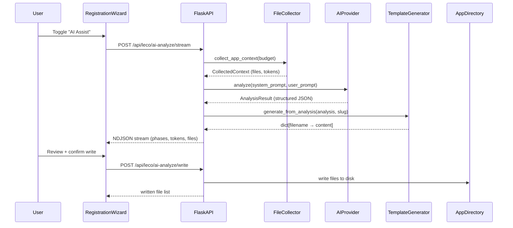

# LEco DevOps Open Project - LLD

> **Open source** · [MIT License](../LICENSE) · Maintained by [Techtonic Systems Media And Research LLC](https://techtonic.systems/)

This Low-Level Design (LLD) maps concrete modules, APIs, and responsibilities.

## 1) Dashboard backend module map

| Module | Responsibility |
| ----- | ----- |
| `dashboard/app.py` | Flask entrypoint and API routing (`/api/*`, docs, hosted and LEco endpoints) |
| `dashboard/control.py` | Control action validation/execution; stack and hosted action orchestration |
| `dashboard/control_targets.py` | Static target inventory for ecosystem stack, Cloudflare-local, infra |
| `dashboard/leco_subprocess.py` | Runs LEco CLI commands from dashboard runtime |
| `dashboard/leco_registration.py` | Register/stream register flow wrappers |
| `dashboard/leco_detect.py` | App scanning and YAML generation helpers |
| `dashboard/leco_materialize.py` | Writable materialization for read-only roots |
| `dashboard/hosting_layout.py` | Source/target path policy and symlink handling |
| `dashboard/hosted_apps.py` | Registry-based hosted listing, snapshots, manifest-driven UI fields |
| `dashboard/hosted_app_services.py` | Per-app attached services: compose merge, credentials, `connection_endpoints` (host vs Docker DNS) |
| `dashboard/hosted_data_import.py` | Seed data discover + NDJSON import stream bridge to `leco_app.data_import` |
| `tools/deploy-cli/leco_app/data_import/` | Import plan, orchestrator, per-store importers (`import-data` CLI) |
| `dashboard/hosted_offboard.py` | Offboard helper around unregister flow |
| `dashboard/docs_catalog.py` | Whitelisted docs surfaced in in-app Docs tab |
| `dashboard/monitor.py` | Service map, metrics aggregation, probes, and overview payloads |

### AI-assisted onboarding modules

| Module | Responsibility |
| ----- | ----- |
| `dashboard/ai_config.py` | Read/write `config/ai-providers.yaml`; mask keys for UI; merge UI updates |
| `dashboard/ai_provider.py` | ABC provider + 6 implementations (Ollama, OpenAI, Anthropic, Google, OpenAI-Compatible, Hybrid); JSON extraction; streaming; hybrid two-stage SLM→LLM pipeline |
| `dashboard/ai_file_collector.py` | 4-tier priority file collection within adaptive token budgets |
| `dashboard/ai_prompts.py` | System prompt (LEco architecture context), JSON schema, few-shot example, user prompt builder |
| `dashboard/ai_template_generator.py` | Deterministic generators: leco.yaml, leco.app.yaml, docker-compose, hosting overlay, preloader, VCL |
| `dashboard/ai_orchestrator.py` | 3-phase pipeline (collect → analyze → generate); sync and streaming modes; file writer |

## 2) LEco CLI module map

| Module | Responsibility |
| ----- | ----- |
| `tools/deploy-cli/leco_app/cli.py` | Typer CLI commands and operator UX |
| `tools/deploy-cli/leco_app/schema.py` | Manifest/profile schema and effective merge logic |
| `tools/deploy-cli/leco_app/ecosystem_registry.py` | Registry CRUD and unregister behavior |
| `tools/deploy-cli/leco_app/compose_runner.py` | Compose command orchestration and path handling |
| `tools/deploy-cli/leco_app/traefik_io.py` | Route fragment generation and dynamic file merge/strip |
| `tools/deploy-cli/leco_app/local_cf_*` | Local CF provisioning and teardown routines |

## 3) Main runtime APIs

### Control and observability

- `GET /api/overview`
- `GET /api/metrics/history`
- `GET /api/control/targets`
- `POST /api/control`
- `POST /api/control/stream`

### LEco hosted workflows

- `GET /api/hosted-apps`
- `GET /api/hosted-apps/<slug>/snapshot` — includes `attached_services` (grouped items with `connection_endpoints`: `host`, `host_lh`, `docker`) and `data_import` (seed folder discovery)
- `GET /api/hosted-apps/<slug>/data-import/discover` — import plan without writes
- `POST /api/hosted-apps/<slug>/data-import/stream` — NDJSON import (`log`, `progress`, `done`)
- `GET /api/hosted-apps/<slug>/insights`
- `POST /api/hosted/upload-zip`
- `POST /api/leco/browse`
- `POST /api/leco/detect`
- `POST /api/leco/yaml-status`
- `POST /api/leco/generate-yaml`
- `POST /api/leco/save-yaml`
- `POST /api/leco/register`
- `POST /api/leco/register/stream`

### AI-assisted onboarding

- `GET /api/ai/settings` — provider config (keys masked) for UI
- `POST /api/ai/settings` — update provider/key/model (control token)
- `POST /api/ai/test` — test provider connectivity
- `GET /api/ai/models` — list models on configured provider
- `POST /api/leco/ai-analyze/stream` — NDJSON streaming pipeline (collect → analyze → generate)
- `POST /api/leco/ai-analyze/write` — write generated files to app directory (control token)

### Docs

- `GET /api/docs/catalog`
- `GET /api/docs/content?id=<doc-id>`

## 4) Data/config contracts

- Registry: `config/leco-registry.yaml` (runtime) and `config/leco-registry.example.yaml`.
- AI providers: `config/ai-providers.yaml` (runtime, gitignored — API keys, provider selection, model defaults).
- Hosted materialization root: `hosting/app-available/<slug>/`.
- Traefik dynamic routes: `traefik/dynamic.yml`.
- App manifests:
  - Bridge: `leco.app.yaml`
  - Profile: `leco.yaml` (or referenced local profile variant)

## 5) Execution sequence (register)

## 6) Execution sequence (AI onboarding)

## 7) Operational guardrails

- Prefer token-gated control in shared environments (`DASHBOARD_CONTROL_TOKEN`).
- Keep CLI and dashboard semantics aligned through schema/effective-manifest logic.
- Avoid direct/manual registry or route mutation when equivalent CLI/API exists.
- AI provider keys: server-side only (`config/ai-providers.yaml`), masked for UI, gitignored.
- AI output guardrail: structured JSON only — deterministic templates produce all config. No raw AI text to disk.
