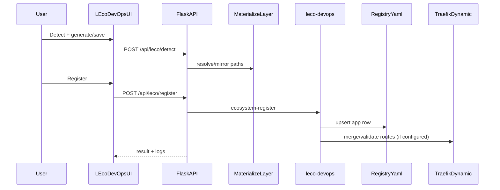
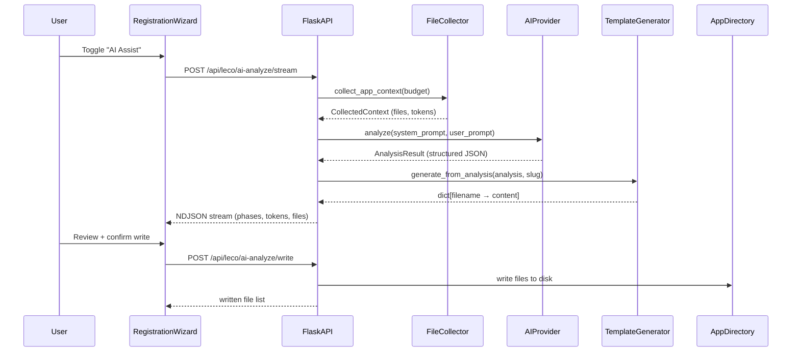

# LEco DevOps Open Project - LLD

> **Open source** · [MIT License](../LICENSE) · Maintained by [Techtonic Systems Media And Research LLC](https://techtonic.systems/)

This Low-Level Design (LLD) maps concrete modules, APIs, and responsibilities.

## 1) Dashboard backend module map

| Module | Responsibility |
| ----- | ----- |
| `dashboard/app.py` | Flask entrypoint and API routing (`/api/*`, docs, hosted and LEco endpoints) |
| `dashboard/control.py` | Control action validation/execution; stack and hosted action orchestration |
| `dashboard/control_targets.py` | Static target inventory for ecosystem stack, Cloudflare-local, infra, **file-transfer** |
| `dashboard/leco_subprocess.py` | Runs LEco CLI commands from dashboard runtime |
| `dashboard/leco_registration.py` | Register/stream register flow wrappers |
| `dashboard/leco_detect.py` | App scanning and YAML generation helpers |
| `dashboard/leco_materialize.py` | Writable materialization for read-only roots |
| `dashboard/hosting_layout.py` | Source/target path policy and symlink handling |
| `dashboard/hosted_apps.py` | Registry-based hosted listing, snapshots, manifest-driven UI fields |
| `dashboard/hosted_app_services.py` | Per-app attached services: compose merge, credentials, `connection_endpoints` (host vs Docker DNS) |
| `dashboard/hosted_data_import.py` | Seed data discover + NDJSON import stream bridge to `leco_app.data_import` |
| `tools/deploy-cli/leco_app/data_import/` | Import plan, orchestrator, per-store importers (`import-data` CLI) |
| `dashboard/hosted_offboard.py` | Offboard helper around unregister flow |
| `dashboard/docs_catalog.py` | Whitelisted docs surfaced in in-app Docs tab |
| `dashboard/monitor.py` | Service map, metrics aggregation, probes, and overview payloads |
| `dashboard/ui_credentials.py` | UI access vault merge, `login_details`, SFTP auth modes |
| `dashboard/ui_credential_reset.py` | Apply vault to running services (incl. `file-transfer/.env`, SFTP keys) |
| `dashboard/service_hub.py` | Per-service hub pages (`hub_slug` from `SERVICE_MAP`) |
| `dashboard/platform_config.py` | `deployment_mode` / `base_domain` / `tls.mode` accessors, `public_hostname()`, `router_tls_config()`, `*.lh` → public-host rewriting |
| `dashboard/leco_wrangler_paths.py` | Wrangler config discovery (`.toml` / `.json` / `.jsonc`), JSONC + trailing-comma stripping, Worker and Pages enumeration |
| `dashboard/git_source.py` | Git URL validation, clone-root selection, credential vault + `GIT_ASKPASS`/`GIT_SSH_COMMAND` isolation, streaming clone/update |
| `dashboard/cicd.py` | Pipeline store, webhook signature verification, per-pipeline coalescing, pull → build → deploy → verify → record, run history |
| `dashboard/mcp_insights.py` | Read-only aggregation of the MCP activity log + live server probe into the MCP tab payload |

### AI-assisted onboarding modules

| Module | Responsibility |
| ----- | ----- |
| `dashboard/ai_config.py` | Read/write `config/ai-providers.yaml` (`0600`); mask keys for UI; provider metadata, OpenAI-compatible presets, capability tiers |
| `dashboard/ai_provider.py` | ABC provider + 7 implementations (Ollama, AirLLM, OpenAI, Anthropic, Google, OpenAI-Compatible, Hybrid); model discovery; JSON extraction; streaming; hybrid two-stage SLM→LLM pipeline |
| `dashboard/ai_file_collector.py` | 4-tier priority file collection within adaptive token budgets |
| `dashboard/ai_prompts.py` | System prompt (LEco architecture context), JSON schema, few-shot example, user prompt builder |
| `dashboard/ai_template_generator.py` | Deterministic generators: leco.yaml, leco.app.yaml, docker-compose, hosting overlay, preloader, VCL |
| `dashboard/ai_orchestrator.py` | 3-phase pipeline (collect → analyze → generate); sync and streaming modes; file writer |

Provider ids: `none`, `ollama`, `airllm`, `openai`, `anthropic`, `google`, `openai-compatible`, `hybrid`. The `openai-compatible` provider is driven by a preset table covering aggregators (**Eden AI**, **OpenRouter**, Groq, Together, DeepInfra, Fireworks, Cerebras, NVIDIA NIM), single vendors (DeepSeek, Mistral, xAI), a gateway (LiteLLM), local servers (vLLM, LM Studio, LocalAI, Ollama's OpenAI shim) and `custom`; an explicit base URL always wins over a preset. Model discovery is an API call per provider (`/api/tags` for Ollama, `/models` for OpenAI-shaped endpoints, `?key=` for Google), with Anthropic falling back to a curated list when the models endpoint is unavailable. Provider config, presets and storage state are surfaced on the **Service hubs → AI providers** panel (`/hub#hub-ai-providers`); the browser only ever receives masked keys and `*_set` booleans.

### Knowledge / RAG modules

| Module | Responsibility |
| ----- | ----- |
| `dashboard/ai_corpus.py` | Discover repo markdown, heading-aligned chunking, secret scrubbing, JSON index + optional local embedding vectors |
| `dashboard/ai_rag.py` | BM25(F) retrieval, live-source planning and collection, prompt assembly with citations, streaming answers, retrieval-only degradation |

- Indexed sources: `docs/**/*.md`, a fixed root file list (`README.md`, `START_HERE.md`, `AGENTS.md`, `CHANGELOG.md`, `CONTRIBUTING.md`, `SECURITY.md`), and `tools/claude-plugin/skills/**/*.md`. Secret-bearing paths (`config/ai-providers.yaml`, `config/ui-credentials.yaml`, `.env*`, `certs/`, key material, …) are excluded outright.
- Scrubbing runs twice: on every chunk at index time, and again on every live payload at prompt-assembly time.
- Retrieval is lexical by default (`bm25`); optional Ollama-backed embeddings fuse into `bm25+embeddings` and degrade silently back to lexical on failure.
- Live sources are selected by a rule table and collected at query time — global collectors (stack status, services, control targets, hosted apps, Traefik routes, Cloudflare-local, AI config, service logs) and app-scoped collectors (app snapshot, app logs) that fire when a registered slug appears in the question.
- With no provider configured the answer is the retrieved passages themselves (`answered_by: "retrieval-only"`), not an error.

### MCP server module map (`tools/mcp-server/leco_mcp/`)

| Module | Responsibility |
| ----- | ----- |
| `config.py` | `Settings` resolved from environment; dashboard base-URL candidate list |
| `client.py` | Async HTTP client for the dashboard API — base-URL discovery, token injection, timeouts, NDJSON streams. The server's only egress |
| `server.py` | Server assembly: tool registration, middleware, prompts, insights route |
| `safety.py` | Destructive/credential gates (`confirm` argument + `LECO_MCP_ALLOW_*` flags) |
| `shaping.py` | Compact response views so one dashboard payload does not exhaust agent context |
| `activity.py` | Activity telemetry — JSONL append, dispatch middleware, live `/insights` route |
| `prompts.py` | Reusable workflow prompts exposed to MCP clients |
| `runtime.py` | `Deps` handed to every tool module |
| `healthcheck.py` | Container healthcheck for the streamable-HTTP transport |
| `tools/` | 9 modules — `observe`, `control`, `hosted`, `onboarding`, `platform`, `routing`, `models`, `knowledge`, `credentials` — 65 tools total |

Tool tables, transports, environment variables and the safety model are canonical in [`MCP_SERVER.md`](MCP_SERVER.md); do not duplicate them here.

## 2) LEco CLI module map

| Module | Responsibility |
| ----- | ----- |
| `tools/deploy-cli/leco_app/cli.py` | Typer CLI commands and operator UX |
| `tools/deploy-cli/leco_app/schema.py` | Manifest/profile schema and effective merge logic |
| `tools/deploy-cli/leco_app/ecosystem_registry.py` | Registry CRUD and unregister behavior |
| `tools/deploy-cli/leco_app/compose_runner.py` | Compose command orchestration and path handling |
| `tools/deploy-cli/leco_app/traefik_io.py` | Route fragment generation and dynamic file merge/strip |
| `tools/deploy-cli/leco_app/local_cf_*` | Local CF provisioning and teardown routines |

## 3) Main runtime APIs

### Control and observability

- `GET /api/overview`
- `GET /api/metrics/history`
- `GET /api/control/targets`
- `POST /api/control`
- `POST /api/control/stream`

### LEco hosted workflows

- `GET /api/hosted-apps`
- `GET /api/hosted-apps/<slug>/snapshot` — includes `attached_services` (grouped items with `connection_endpoints`: `host`, `host_lh`, `docker`) and `data_import` (seed folder discovery)
- `GET /api/hosted-apps/<slug>/data-import/discover` — import plan without writes
- `POST /api/hosted-apps/<slug>/data-import/stream` — NDJSON import (`log`, `progress`, `done`)
- `GET /api/hosted-apps/<slug>/insights`
- `POST /api/hosted/upload-zip`
- `POST /api/leco/browse`
- `POST /api/leco/detect`
- `POST /api/leco/yaml-status`
- `POST /api/leco/generate-yaml`
- `POST /api/leco/save-yaml`
- `POST /api/leco/register`
- `POST /api/leco/register/stream`

### Git source (app onboarding from a repository)

- `GET /api/leco/git/config` — clone-root selection (path, kind, why) and masked credential list
- `POST /api/leco/git/credentials` — save or delete an HTTPS token / SSH key (control token)
- `POST /api/leco/git/inspect` — list branches/tags on the remote without cloning (control token)
- `POST /api/leco/git/clone` — clone or update, buffered (control token)
- `POST /api/leco/git/clone/stream` — NDJSON clone/update with redacted git output (control token)
- `GET /api/leco/git/status?path=<path-field>` — repository state for an already-cloned path

Credential kinds: `https-token`, `ssh-key`. The request field is named `credential_token`, deliberately distinct from the control-token `token` field so the two cannot collide.

### CI/CD

- `GET /api/cicd/overview` — pipelines plus recent runs
- `GET /api/cicd/pipelines` — pipeline list (`secret_set` only; the secret is never returned after creation)
- `POST /api/cicd/pipelines` — create; returns the generated secret **once** (control token)
- `PUT|PATCH /api/cicd/pipelines/<pipeline_id>` — update (control token)
- `DELETE /api/cicd/pipelines/<pipeline_id>` — delete (control token)
- `POST /api/cicd/pipelines/<pipeline_id>/rotate-secret` — rotate, invalidating the old secret (control token)
- `POST /api/cicd/pipelines/<pipeline_id>/run` — manual trigger (control token)
- `POST /api/cicd/pipelines/<pipeline_id>/rollback` — redeploy a previous SHA (control token)
- `GET /api/cicd/runs` — run history, filterable by pipeline/status/trigger
- `GET /api/cicd/runs/<run_id>` — one run including its captured log
- `POST /api/cicd/webhook/<pipeline_id>` — **HMAC-authenticated, no control token**

Webhook schemes: GitHub `X-Hub-Signature-256` (HMAC-SHA256 over the raw body), GitLab `X-Gitlab-Token` (shared token), generic `X-LEco-Signature`; `auto` tries each. All comparisons use `hmac.compare_digest`. Unknown pipeline, bad signature and oversized body return the same opaque `403`. The advertised webhook URL is built from `LECO_PUBLIC_BASE_URL` / `DASHBOARD_PUBLIC_BASE_URL`, falling back to the request root.

> `GET` endpoints under `/api/cicd/*` carry no token check. Secrets are excluded from those payloads by construction, but `GET /api/cicd/runs/<run_id>` returns the captured build and deploy output — treat it as sensitive on an exposed host ([`PRODUCTION_HARDENING.md`](PRODUCTION_HARDENING.md)).

### MCP insights

- `GET /api/mcp/insights?hours=&limit=` — sessions, per-tool and per-target counts, per-app activity, server block
- `GET /api/mcp/activity` — filtered event feed (`tool`, `session`, `target`, `event`, `blocked`, `errors_only`, `hours`, `limit`)
- `GET /api/mcp/install` — install snippets and plugin command list for the MCP tab

All three are read-only `GET`s. The dashboard **reads** `ecosystem-stack/config/generated/mcp-activity.jsonl` and optionally probes the running server's own `/insights` route; it never writes the log.

### AI-assisted onboarding and providers

- `GET /api/ai/settings` — provider config (keys masked) for UI
- `POST /api/ai/settings` — update provider/key/model (control token)
- `POST /api/ai/test` — test provider connectivity (control token)
- `POST /api/ai/discover` — probe a not-yet-saved provider/base URL and list its models (control token)
- `GET /api/ai/models` — list models on the saved provider
- `POST /api/leco/ai-analyze/stream` — NDJSON streaming pipeline (collect → analyze → generate)
- `POST /api/leco/ai-analyze/write` — write generated files to app directory (control token)

### RAG (ask the platform about itself)

- `POST /api/ai/rag/ask` — grounded answer with citations (`stream: true` in the body switches to NDJSON) (control token)
- `POST /api/ai/rag/ask/stream` — NDJSON `status` → `sources` → `token`… → `done` (control token)
- `POST /api/ai/rag/reindex` — rebuild the corpus index; optionally build or drop embeddings (control token)
- `GET /api/ai/rag/status` — index metadata, retrieval method, embedding state, provider destination, live-source catalogue

Request shaping for both ask routes: `top_k` clamped to 1–20, `max_context_chars` clamped to 2 000–120 000, `live` accepts a boolean, an off-string, or an explicit list of source ids, plus `app`/`slug`, `use_embeddings`, `model`, `include_prompt`.

### UI access (local dev credentials)

- `GET /api/ui-credentials/catalog`
- `GET /api/ui-credentials/<slug>`
- `PUT /api/ui-credentials/<slug>` — save + apply for SFTP/FTP (`protocol` auth)
- `POST /api/ui-credentials/<slug>/reset`
- `POST /api/ui-credentials/<slug>/launch-token` — web UIs with sign-in only

Registry: `ecosystem-stack/config/ui-login-registry.json`. File-transfer slugs: **`sftp`**, **`ftp`**, **`files`**.

### Docs

- `GET /api/docs/catalog`
- `GET /api/docs/content?id=<doc-id>`

## 4) Data/config contracts

- Registry: `config/leco-registry.yaml` (runtime) and `config/leco-registry.example.yaml`.
- Platform / domain: `config/leco-platform.yaml` (`deployment_mode`, `base_domain`, `tls.mode`) and `config/leco-platform.yaml.example`.
- AI providers: `config/ai-providers.yaml` (runtime, gitignored, `0600` — API keys, provider selection, model defaults).
- Git credentials: `config/git-credentials.yaml` (runtime, gitignored, `0600` — HTTPS tokens and SSH keys; returned masked only).
- CI/CD pipelines: `config/cicd-pipelines.yaml` (runtime, gitignored, `0600` — includes the per-pipeline webhook secret, which HMAC verification requires in cleartext).
- Machine-written state under `ecosystem-stack/config/generated/`:
  - `mcp-activity.jsonl` — one JSON object per MCP session/tool event; written by the MCP server, read by the dashboard.
  - `cicd-runs.jsonl` — append-only run snapshots, last snapshot per `run_id` wins; rotated by size.
  - `ai-rag-index.json` and `ai-rag-embeddings.json` — corpus index and optional vectors, rebuilt from the repo's own markdown.
- Git clone roots, in preference order: `LECO_GIT_CLONE_ROOT` → writable workspace parent (`wsp:` paths) → `hosting/app-sources/` (gitignored).
- Hosted materialization root: `hosting/app-available/<slug>/`.
- Traefik dynamic routes: `traefik/dynamic.yml` (includes `files.lh` / `ftp-files.lh` / `sftp-files.lh` → file browser, and `mcp.lh` → `leco-mcp:8099`).
- Rendered stack routes: `hosting/traefik/01-stack-core.yml`, produced from `traefik/dynamic.yml` by `scripts/render-platform-traefik.py` for the configured base domain and TLS mode.
- File transfer runtime: `file-transfer/.env` (gitignored), `file-transfer/keys/sftp/*.pub` (gitignored).
- App manifests:
  - Bridge: `leco.app.yaml`
  - Profile: `leco.yaml` (or referenced local profile variant)

## 5) Execution sequence (register)

```mermaid
sequenceDiagram
  participant U as User
  participant UI as LEcoDevOpsUI
  participant API as FlaskAPI
  participant MAT as MaterializeLayer
  participant CLI as leco-devops
  participant REG as RegistryYaml
  participant TR as TraefikDynamic

  U->>UI: Detect + generate/save
  UI->>API: POST /api/leco/detect
  API->>MAT: resolve/mirror paths
  U->>UI: Register
  UI->>API: POST /api/leco/register
  API->>CLI: ecosystem-register
  CLI->>REG: upsert app row
  CLI->>TR: merge/validate routes (if configured)
  API-->>UI: result + logs
```

## 6) Execution sequence (AI onboarding)

```mermaid
sequenceDiagram
  participant U as User
  participant UI as RegistrationWizard
  participant API as FlaskAPI
  participant FC as FileCollector
  participant AI as AIProvider
  participant TG as TemplateGenerator
  participant FS as AppDirectory

  U->>UI: Toggle "AI Assist"
  UI->>API: POST /api/leco/ai-analyze/stream
  API->>FC: collect_app_context(budget)
  FC-->>API: CollectedContext (files, tokens)
  API->>AI: analyze(system_prompt, user_prompt)
  AI-->>API: AnalysisResult (structured JSON)
  API->>TG: generate_from_analysis(analysis, slug)
  TG-->>API: dict[filename → content]
  API-->>UI: NDJSON stream (phases, tokens, files)
  U->>UI: Review + confirm write
  UI->>API: POST /api/leco/ai-analyze/write
  API->>FS: write files to disk
  API-->>UI: written file list
```

## 7) Further data-flow sequences

Onboarding from Git, a CI/CD run (including the verify-failure branch), an agent tool call over MCP, and a RAG answer are drawn as sequence diagrams in `docs/help/13-architecture-diagrams.md` — in the running dashboard, [Help → Architecture & diagrams](/help?topic=architecture-diagrams).

## 8) Operational guardrails

- Prefer token-gated control in shared environments (`DASHBOARD_CONTROL_TOKEN`).
- Keep CLI and dashboard semantics aligned through schema/effective-manifest logic.
- Avoid direct/manual registry or route mutation when equivalent CLI/API exists.
- AI provider keys: server-side only (`config/ai-providers.yaml`), masked for UI, gitignored.
- AI output guardrail: structured JSON only — deterministic templates produce all config. No raw AI text to disk.
- MCP: no Docker socket on the container, no shell, no second lifecycle implementation. Destructive tools require `confirm=true` **and** `LECO_MCP_ALLOW_DESTRUCTIVE=1`; credential tools require `LECO_MCP_ALLOW_CREDENTIALS=1`.
- CI/CD webhook: never put it behind `DASHBOARD_CONTROL_TOKEN` — a Git host cannot send that header. Its authentication is the signature.
- CI/CD build hooks: a compose **service name**, never a command string.
- Git credentials: no credential in a URL, no credential in argv, isolated `HOME`, temp files removed after the operation.
- RAG: keep the exclusion list and the scrubbers in `ai_corpus.py` current when new secret files are introduced; they are the only thing standing between a cloud provider and a local secret.
- Hostnames: derive from `routing_domain()` / `app_hostname()` (dashboard) or the platform config (stack scripts). Never hard-code `.lh`.
