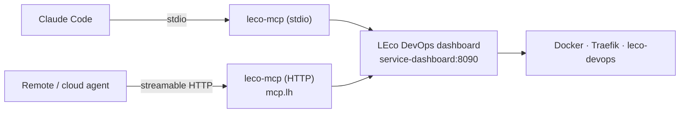

# MCP server — AI agent access to LEco DevOps

> **Open source** · [MIT License](../LICENSE) · Maintained by [Techtonic Systems Media And Research LLC](https://techtonic.systems/)

The **LEco DevOps MCP server** exposes the platform over the [Model Context Protocol](https://modelcontextprotocol.io), so Claude Code and other MCP clients can deploy applications, onboard repositories, turn infrastructure on and off, and monitor the stack — the same operations available in the dashboard UI.

**Package:** [`tools/mcp-server/`](../tools/mcp-server/) (`leco-mcp`) · **Plugin:** [`tools/claude-plugin/`](../tools/claude-plugin/) · **Agent route map:** [`../START_HERE.md`](../START_HERE.md)

---

## Design

Every tool is a call against the **LEco DevOps dashboard REST API**. The MCP server holds no independent Docker access, runs no shell commands, and keeps no second copy of lifecycle or routing rules.



Consequences worth knowing:

- The dashboard stays the **single source of truth**. Anything an agent does is visible in the UI immediately, and vice versa.
- If the dashboard is down, every tool fails with a message saying so — the agent cannot half-operate the stack.
- Fixes to lifecycle semantics land in one place, not two.
- The HTTP container gets **no Docker socket**. Compromising it grants no more than the dashboard API already allows.

---

## Install

### Local — stdio (Claude Code on this machine)

```bash
pipx install ./tools/mcp-server        # or: uv tool install ./tools/mcp-server
leco-mcp doctor                        # connectivity + configuration report
claude mcp add leco-devops -- leco-mcp stdio
```

### As a Claude Code plugin (skill + commands + MCP in one install)

```bash
claude plugin marketplace add /absolute/path/to/local-ecosystem
claude plugin install leco@leco-devops-open-project
```

> Use the **absolute path** to this checkout rather than `./` — `marketplace add` resolves a
> relative path against your current directory, and you are usually standing in the app you are
> onboarding. The GitHub form clones the repo's **default branch**; if the plugin is not merged
> there you get "Marketplace file not found", which means *wrong branch*, not broken install.

This installs the MCP server **plus** the `leco-devops` skill (operating rules and workflows), the `/leco:status`, `/leco:up`, `/leco:diagnose`, `/leco:onboard`, `/leco:routes` commands, and a read-only diagnostician subagent. See [`tools/claude-plugin/README.md`](../tools/claude-plugin/README.md).

### Shared — streamable HTTP (remote agents, other machines)

```bash
./ecosystem-stack/services/mcp.sh start        # https://mcp.lh/mcp
```

Runs as a stack service (`leco-mcp` container, host port `8099`, Traefik router `mcp.lh`). It appears in the dashboard **Control** and **Infrastructure** tabs as *MCP server (AI agents)*, target id `ai-mcp`, and is included in the `agent-full` and `full` install profiles.

---

## Configuration

| Variable | Default | Purpose |
|----------|---------|---------|
| `LECO_MCP_DASHBOARD_URL` | auto-discovered | Dashboard base URL. Candidates tried in order: `localhost:8090`, `dashboard.lh` (http/https), `localhost.lh`, `service-dashboard:8090` |
| `LECO_MCP_CONTROL_TOKEN` | — | Control token; also read from `DASHBOARD_CONTROL_TOKEN`. Needed only when the dashboard enforces one |
| `LECO_MCP_ALLOW_DESTRUCTIVE` | `0` | Enables `remove` / `reset` / `destroy` / `reinstall` / offboard / route-strip / model-delete |
| `LECO_MCP_ALLOW_CREDENTIALS` | `0` | Enables the UI credential vault tools |
| `LECO_MCP_READ_TIMEOUT` | `120` | Seconds for read calls |
| `LECO_MCP_ACTION_TIMEOUT` | `900` | Seconds for deploys and other streaming actions |
| `LECO_MCP_MAX_RESPONSE_CHARS` | `60000` | Hard cap on any tool result |
| `LECO_MCP_VERIFY_TLS` | `1` | Set `0` when the mkcert root is not trusted by this process |
| `LECO_MCP_HTTP_HOST` / `_PORT` / `_PATH` | `127.0.0.1` / `8099` / `/mcp` | HTTP transport bind |
| `LECO_MCP_LOG_LEVEL` | `INFO` | Server log level |

The base URL is **discovered, not assumed**: the first candidate that answers `GET /api/version` wins and is cached. An explicit `LECO_MCP_DASHBOARD_URL` is tried first but the defaults remain as fallbacks, so a stale value in a shell profile cannot brick every tool.

---

## Safety model

Destructive operations sit behind **two independent gates**:

1. the call must pass **`confirm=true`**, and
2. the server must have been started with **`LECO_MCP_ALLOW_DESTRUCTIVE=1`**.

Neither alone is sufficient.

| Gate | Protects against |
|------|------------------|
| `confirm=true` | An agent destroying data as a side effect of a vaguely-worded instruction |
| `LECO_MCP_ALLOW_DESTRUCTIVE=1` | An operator who never opted in being talked into it by a prompt |

Gated operations: `leco_control` with `remove`/`reset`, `leco_app_control` with `remove`/`reset`, `leco_app_offboard`, `leco_dev_stack_action` with `destroy`/`reinstall`, `leco_route_strip_keys`, `leco_llm_model_action` with `delete`, `leco_ui_credentials_reset`.

Credential tools (`leco_ui_credentials*`) have a separate gate, `LECO_MCP_ALLOW_CREDENTIALS=1`, because they return plaintext local-development secrets from the [UI credential vault](UI_CREDENTIAL_VAULT.md).

A blocked call fails with a message naming **both** gates and what was attempted, so the agent reports the block accurately instead of looking for a way around it.

> The dashboard's own `DASHBOARD_CONTROL_TOKEN` is unchanged and still applies. The MCP gates are *additional* — they restrict an agent below what a token already permits.

---

## Tools

65 tools. Read-only tools declare `read_only_hint`; lifecycle tools declare `destructive_hint`, so a client can surface the difference before calling.

| Family | Tools |
|--------|-------|
| **Observe** | `leco_server_info` `leco_status` `leco_services` `leco_logs` `leco_urls` `leco_metrics` `leco_cloudflare_local` `leco_traefik_routes` `leco_version` |
| **Control** | `leco_control_targets` `leco_control` `leco_control_policies` |
| **Hosted apps** | `leco_apps` `leco_app_snapshot` `leco_app_control` `leco_app_logs` `leco_app_insights` `leco_app_metrics` `leco_app_validate` `leco_app_bind_dev_stack` `leco_app_data_import_plan` `leco_app_data_import` `leco_app_offboard` `leco_verify` `leco_certs_refresh` |
| **Onboarding** | `leco_browse` `leco_detect` `leco_app_evidence` `leco_compose_validate` `leco_manifest_status` `leco_manifest_generate` `leco_manifest_read` `leco_manifest_validate` `leco_manifest_overlay` `leco_manifest_save` `leco_manifest_urls` `leco_manifest_samples` `leco_register` `leco_onboard` |
| **Platform** | `leco_platform_config` `leco_platform_catalog` `leco_platform_services` `leco_platform_service_action` `leco_platform_traefik_apply` |
| **Dev stacks** | `leco_dev_stacks` `leco_dev_stack_create` `leco_dev_stack_action` `leco_dev_stack_snapshot` `leco_dev_stack_access` `leco_dev_stack_files` `leco_dev_stack_reset_admin` |
| **Routing** | `leco_route_fragment_from_app` `leco_route_merge_fragment` `leco_route_strip_keys` |
| **AI models** | `leco_llm_models` `leco_llm_model_action` `leco_llm_model_inspect` `leco_llm_catalog` |
| **Knowledge** | `leco_docs` `leco_help` `leco_updates` `leco_updates_mark_read` |
| **Credentials** | `leco_ui_credentials` `leco_ui_credentials_set` `leco_ui_credentials_reset` |

Prompts: `onboard_app`, `diagnose_stack`, `bring_up_stack`.

### Onboarding an application

The step tools mirror the dashboard wizard:

```
leco_browse → leco_detect → leco_manifest_generate → [leco_manifest_save] → leco_register
```

`leco_onboard(path, app_id)` runs the whole path in one call — detect → generate manifest → register → deploy → verify — and reports **each stage separately** so a failure is attributable. Use the step tools when an app needs hand-tuned routes or ports.

#### Complex applications: ask for evidence, never guess a port

`leco_detect` answers *what kind of app is this*. It is not enough for an app whose ports live in
its own topology file, whose compose sits three directories down, or which runs ten services in one
container. For those, the failure mode is specific and silent: the agent invents a plausible port,
the stack builds, starts, and serves nothing.

`leco_app_evidence(path)` exists to remove the guess. It returns which compose service owns which
port, the container name Traefik must target, what each published port maps to **inside** the
container, which Workers exist — and every attributed port carries an `owner_source` naming the
file the number came from. What it could not determine is listed in `unknowns` rather than filled
in. **A port without an `owner_source` is not evidence; leave it out of the manifest and say so.**

```
leco_app_evidence → leco_manifest_generate → leco_compose_validate → leco_manifest_overlay → leco_register → leco_verify
```

- `leco_compose_validate` merges the app's compose with a proposed overlay and reports what
  Docker actually resolves. It catches the merge traps that look correct in YAML — notably
  `ports: !reset`, which yields *zero* published ports where `!override` was meant.
- `leco_manifest_overlay` writes overlay files without clobbering: an existing file is backed up,
  never silently replaced.
- `leco_verify(slug)` probes every declared URL and classifies each as `ok` / `route_missing` /
  `backend_unreachable` / `tls_invalid` / `unhealthy`, with the resolved Traefik router and
  declared backend attached. Those need different fixes, and a bare 502 names none of them.
- `leco_certs_refresh` reissues the local certificate after new hostnames are added, so
  `tls_invalid` does not become the permanent state of a correctly routed app.

Worked example, including why the front door answering **404** is a pass rather than a failure:
[Onboarding a complex application](ONBOARDING_COMPLEX_APPS.md).

Application paths use the dashboard's allowed-path form: `wsp:MyApp` for a repo under the workspace parent, or a repo-relative path. `leco_browse` lists what is reachable; `leco_detect` echoes the canonical form back as `path_field`.

### Infrastructure on/off

`leco_control(target_id, action)` drives every controllable unit. Discover ids with `leco_control_targets` — never guess them. Bulk pseudo-targets: `stack-ecosystem-all`, `stack-infra-all`, `stack-file-transfer-all`, `stack-cf-all`.

Dependency order matters and is not enforced for you: **Traefik first**, `postgres` before `n8n`, `paperclip-postgres` before `paperclip`, dashboard before `mcp`.

### Streaming

Long actions (deploy, register, dev-stack lifecycle, data import) consume the dashboard's NDJSON streams and forward each line as an **MCP progress notification**, so a client shows compose output live rather than waiting blind. The final result carries a tail of the log regardless of client support.

---

## Response shaping

Dashboard payloads are built for a browser: `/api/overview` is ~56 KB and takes 10–15 seconds because it collects live Docker stats. Returning that verbatim would spend an agent's context on one call.

Tools therefore return **compact views by default**:

| Tool | Knob |
|------|------|
| `leco_status` | `detail="summary"` (default) → `"services"` → `"full"` |
| `leco_app_snapshot` | `sections=["identity","runtime","urls",…]` or `full=true` |
| `leco_logs` / `leco_app_logs` | entries flattened to text, tail-clipped |
| `leco_urls` | `only_unhealthy=true`, `category=` |
| `leco_control_targets` / `leco_apps` | `group=` `running=` `query=` |

`LECO_MCP_MAX_RESPONSE_CHARS` is a hard backstop: a result above it is replaced with a truncation notice explaining how to narrow the query.

---

## Verify an install

```bash
leco-mcp doctor                 # local package
docker exec leco-mcp leco-mcp doctor    # HTTP service
```

Reports the resolved dashboard URL, whether the dashboard requires a token, the number of control targets it can see, and the full tool list. It warns when the dashboard enforces a token that the MCP server does not have — the case where reads work and every action returns 401.

---

## Troubleshooting

| Symptom | Cause and fix |
|---------|---------------|
| Every tool: *dashboard is not reachable* | Stack is down. `./ecosystem-stack/ecosystem-stack.sh start dashboard`, or set `LECO_MCP_DASHBOARD_URL` |
| Reads work, actions return **401** | Dashboard enforces `DASHBOARD_CONTROL_TOKEN`; set the same value in `LECO_MCP_CONTROL_TOKEN` |
| *Blocked destructive action* | Working as designed. Both `confirm=true` and `LECO_MCP_ALLOW_DESTRUCTIVE=1` are required |
| `https://mcp.lh` → 404 | Traefik has a stale core file. `./ecosystem-stack/services/traefik.sh ensure-hosting-files` |
| `https://mcp.lh` → 502 | `leco-mcp` container is down or off `lh-network`. `./ecosystem-stack/ecosystem-stack.sh repair-network` |
| Stream cut off mid-deploy | Raise `LECO_MCP_ACTION_TIMEOUT` (default 900s) |
| Result says `truncated: true` | Narrow with `sections` / filters, or raise `LECO_MCP_MAX_RESPONSE_CHARS` |
| TLS errors against `*.lh` | mkcert root not trusted by that process — set `LECO_MCP_VERIFY_TLS=0` for local use |

---

## Development

```bash
pip install -e './tools/mcp-server[dev]'
python -m pytest tools/mcp-server/tests -q
```

Tests cover the safety gates, response shaping, configuration resolution, and server assembly without needing a running stack.

**Adding a tool:** put it in the matching module under `tools/mcp-server/leco_mcp/tools/`, wrap any dashboard call through `deps.client`, shape the response with `shaping.guard_size`, and gate destructive paths through `safety`. Then update the tool tables in this file, [`tools/mcp-server/README.md`](../tools/mcp-server/README.md), and the plugin skill's `references/tool-map.md`.

---

## See also

- [`START_HERE.md`](../START_HERE.md) — agent route map: install → deploy → use → skills → MCP
- [`AGENTS.md`](../AGENTS.md) — agent guardrails and change-together rules
- [`ARCHITECTURE.md`](ARCHITECTURE.md) · [`HLD.md`](HLD.md) · [`LLD.md`](LLD.md)
- [`DEVELOPMENT_PLAYBOOK.md`](DEVELOPMENT_PLAYBOOK.md) — dashboard API reference
- [`HOSTED_APPS_TRAEFIK_RUNBOOK.md`](HOSTED_APPS_TRAEFIK_RUNBOOK.md) — 502 / routing failures agents hit
- [`UI_CREDENTIAL_VAULT.md`](UI_CREDENTIAL_VAULT.md) — what the credential tools expose
