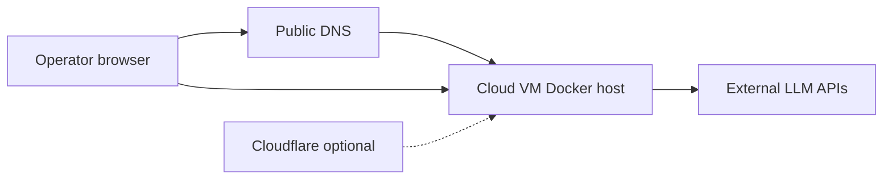

# Software Requirements Specification (SRS)

## Cloud VM Platform for LEco DevOps

| Field | Value |
|-------|--------|
| **Document ID** | SRS-CLOUD-VM-001 |
| **Product** | LEco DevOps Open Project |
| **Feature branch** | `feature/cloud-vm-platform` |
| **Status** | Draft — approved for implementation |
| **Version** | 0.1 |
| **Date** | 2026-05-19 |
| **Related plan** | Cloud VM Platform v2 (internal plan) |

---

## 1. Introduction

### 1.1 Purpose

This document specifies software requirements for extending **LEco DevOps** from a local `*.lh` developer workstation stack into a **cloud VM** deployment suitable for **development** and **preproduction** environments. Operators must be able to install only required containers, configure custom domains and TLS, use external LLM APIs, compose isolated development stacks (Postgres, MySQL, Redis, Node/Python versions), and manage platform bundles, dev stacks, and hosted applications from the dashboard.

### 1.2 Scope

**In scope**

- Selective installation via profiles and component catalog
- Platform configuration (`leco-platform.yaml`) for cloud vs local mode
- Custom base domain and multiple TLS modes (mkcert, ACME, static certs, Cloudflare proxy/tunnel)
- Full **Cloudflare-local mimic** profile (`cloudflare-full`)
- Full **AI/LLM** profile (`ai-full`, `ai-cloud`) with external API key configuration
- **Dev stack instances**: isolated Docker Compose projects with selectable data stores and toolchain versions
- Dashboard APIs and UI for platform bundles, stack builder, and hosted app binding
- Documentation and operator runbooks

**Out of scope**

- Kubernetes or multi-node clustering
- Multi-tenant RBAC and per-user auth on the dashboard
- Production deployment to real Cloudflare (`leco-devops cf-deploy --env production`)
- Managed SaaS control plane operated by a third party

### 1.3 Definitions

| Term | Definition |
|------|------------|
| **Edge plane** | Shared Traefik + LEco DevOps dashboard |
| **Bundle** | A predefined set of containers started as one unit (e.g. `cloudflare-full`, `ai-full`) |
| **Dev stack** | An isolated Compose project (`leco-devstack-<id>`) with its own internal network |
| **Hosted app** | A registered application (`leco-stack-<slug>`) with materialized manifest under `hosting/app-available/` |
| **Component catalog** | Committed YAML listing installable components and version pins |
| **Host connection** | URI reachable from the VM host or operator laptop (`127.0.0.1` or public domain) |
| **Docker DNS connection** | URI using Compose service names; valid only inside the stack/app network |

### 1.4 References

- [ARCHITECTURE.md](ARCHITECTURE.md), [HLD.md](HLD.md), [LLD.md](LLD.md)
- [SETUP.md](SETUP.md), [DEPLOYMENT.md](DEPLOYMENT.md)
- [LECO_APP_BLUEPRINT.md](LECO_APP_BLUEPRINT.md)
- [AI_ONBOARDING_PLAN.md](AI_ONBOARDING_PLAN.md)
- [12-hosted-app-attached-services.md](help/12-hosted-app-attached-services.md)

---

## 2. Overall description

### 2.1 Product perspective

LEco DevOps today assumes a single machine with `*.lh` DNS (dnsmasq), mkcert TLS, and a monolithic `ecosystem-stack.sh start` that brings up all ecosystem services. Cloud VMs require:

- Real DNS names (`*.mydomain.com`)
- Public TLS (Let’s Encrypt or operator-provided certs)
- Optional omission of local-only services (dnsmasq, mkcert)
- Multiple applications on one VM with **different Node/Python versions** via **isolated dev stacks**

### 2.2 User classes

| User | Needs |
|------|--------|
| **Platform operator** | Install platform, pick profiles, configure domain/TLS, manage bundles |
| **Application developer** | Create dev stack, bind hosted app, copy connection strings, deploy/offload |
| **DevOps / automation** | Non-interactive install, REST APIs with control token |

### 2.3 Operating environment

- Linux cloud VM (primary); macOS remains supported for `deployment_mode: local`
- Docker Engine + Compose v2
- Outbound HTTPS for external LLM APIs and ACME
- Inbound TCP 80/443 (and optionally Cloudflare tunnel)

### 2.4 Design constraints

- **Backward compatibility:** `deployment_mode: local` with no `leco-platform.yaml` must behave as today (`*.lh`, full stack defaults).
- **Single VM:** No distributed orchestration in v1.
- **Shared Traefik:** One edge router; dev stacks and apps attach for HTTP only.
- **Secrets:** API keys and TLS keys in gitignored files under `config/` and `certs/`.

---

## 3. System context

On the VM:

- **Edge plane:** Traefik, dashboard (always-on for cloud installs)
- **Optional bundles:** `cloudflare-full`, `ai-full`, `infra-full`
- **Dev stacks:** N isolated compose projects
- **Hosted apps:** M compose projects (`leco-stack-<slug>`)

---

## 4. Functional requirements

Requirements use IDs **FR-xxx** for traceability to implementation phases.

### 4.1 Installation and profiles

| ID | Requirement | Priority |
|----|-------------|----------|
| FR-101 | The installer SHALL support named profiles: `minimal`, `platform`, `cloudflare-full`, `ai-full`, `ai-cloud`, `infra-full`, `full`, `custom`. | Must |
| FR-102 | Profile `cloudflare-full` SHALL enable the complete [cloudflare-local/docker-compose.yml](../cloudflare-local/docker-compose.yml) bundle (minio, valkey, r2/kv/d1 adapters, workers-runtime, browser-rendering-local, autoscaler, autoscale-demo). | Must |
| FR-103 | Profiles `ai-full` and `ai-cloud` SHALL enable ecosystem services: `ollama`, `airllm`, `webui`, `update-catalog`. | Must |
| FR-104 | Profile `ai-cloud` SHALL configure external LLM providers as the recommended default path; `ai-full` SHALL treat local inference as the recommended path. | Must |
| FR-105 | The installer SHALL support non-interactive mode: `--profile <name>`, `--mode cloud`, and env `LECO_INSTALL_PROFILE`. | Must |
| FR-106 | Selected services SHALL be persisted in `config/leco-platform.yaml` and enforced by `ecosystem-stack.sh start` (no silent start of disabled services). | Must |
| FR-107 | Cloud install mode SHALL NOT require mkcert or dnsmasq on the host. | Must |

### 4.2 Platform configuration

| ID | Requirement | Priority |
|----|-------------|----------|
| FR-201 | A committed example `config/leco-platform.yaml.example` SHALL document all platform fields. | Must |
| FR-202 | Runtime config `config/leco-platform.yaml` SHALL be gitignored. | Must |
| FR-203 | Platform config SHALL include `deployment_mode` (`local` \| `cloud`), `base_domain`, `extra_domains[]`, `enabled_bundles[]`, `dev_stacks[]`, and `tls` settings. | Must |
| FR-204 | The dashboard SHALL expose GET/POST `/api/platform/config` (POST requires control token). | Must |

### 4.3 Custom domain and TLS

| ID | Requirement | Priority |
|----|-------------|----------|
| FR-301 | Operators SHALL choose TLS mode: `mkcert`, `acme`, `static`, or `cloudflare`. | Must |
| FR-302 | ACME mode SHALL obtain certificates via Traefik for `base_domain` and configured hostnames. | Must |
| FR-303 | Static mode SHALL load operator-provided PEM/key paths from platform config. | Must |
| FR-304 | Cloudflare mode SHALL document orange-cloud and/or Tunnel setup; platform SHALL support HTTP origin or origin cert paths. | Must |
| FR-305 | Stack/core Traefik routes SHALL be generated from `base_domain` (not hardcoded `.lh` only). | Must |
| FR-306 | Applying domain/TLS changes SHALL regenerate `hosting/traefik/01-stack-core.yml` and restart Traefik via dashboard action or CLI. | Must |
| FR-307 | Hosted app hostnames SHALL use `{slug}.{base_domain}` in cloud mode. | Must |

### 4.4 Component catalog and dev stacks

| ID | Requirement | Priority |
|----|-------------|----------|
| FR-401 | A committed `ecosystem-stack/config/component-catalog.yaml` SHALL define components: SQL (postgres, mysql, mariadb), cache (redis, valkey, mongodb), object storage (minio), toolchains (node, python, java, go, php), mail (mailpit), and optional messaging (rabbitmq phase 2). | Must |
| FR-402 | Each catalog entry SHALL specify image template, default env, internal ports, and dependency rules. | Must |
| FR-403 | Operators SHALL create a dev stack by selecting components and versions from the catalog. | Must |
| FR-404 | Each dev stack SHALL run as an isolated Compose project `leco-devstack-<id>` with network `leco-devstack-<id>-internal`. | Must |
| FR-405 | Start/stop/destroy on a dev stack SHALL affect only that project’s containers. | Must |
| FR-406 | Databases in a dev stack SHALL NOT publish host ports by default; HTTP services needing public access SHALL attach to `lh-network` for Traefik. | Must |
| FR-407 | Dev stack snapshots SHALL expose `connection_endpoints` with scopes: host, docker, and public domain where applicable. | Must |
| FR-408 | Toolchain components (e.g. Node 20 vs 22) SHALL be expressible in the same stack for build/run image pinning. | Should |

### 4.5 Dev stack and hosted app APIs

| ID | Requirement | Priority |
|----|-------------|----------|
| FR-501 | `GET /api/dev-stacks` SHALL list stacks with Docker state. | Must |
| FR-502 | `POST /api/dev-stacks` SHALL create a stack from component selections and generate compose under `platform/dev-stacks/<id>/`. | Must |
| FR-503 | `POST /api/dev-stacks/<id>/action` SHALL support `start`, `stop`, `destroy` (destroy token-gated). | Must |
| FR-504 | `GET /api/dev-stacks/<id>/snapshot` SHALL return credentials and connection endpoints. | Must |
| FR-505 | Hosted app manifests SHALL support optional `platform.devStackId` to bind an app to a stack. | Should |
| FR-506 | Materialization SHALL inject stack network membership or connection env when `devStackId` is set. | Should |

### 4.6 AI / LLM configuration

| ID | Requirement | Priority |
|----|-------------|----------|
| FR-601 | A committed `config/ai-providers.yaml.example` SHALL document OpenAI, Anthropic, Google, openai-compatible, ollama, airllm, hybrid. | Must |
| FR-602 | Cloud installer SHALL optionally seed `config/ai-providers.yaml` with operator-supplied API keys. | Should |
| FR-603 | Dashboard AI Settings SHALL remain the primary UI for provider configuration. | Must |
| FR-604 | When `ai-full`/`ai-cloud` is not enabled, dashboard SHALL hide or disable Ollama/AirLLM management cards. | Should |
| FR-605 | AI-assisted onboarding SHALL work with external providers without requiring local Ollama. | Must |

### 4.7 Dashboard platform operations

| ID | Requirement | Priority |
|----|-------------|----------|
| FR-701 | Dashboard SHALL provide a **Platform** view: install/start/stop shared bundles (`cloudflare-full`, `ai-full`, `infra-full`, edge services). | Must |
| FR-702 | Dashboard SHALL provide a **Stack Builder** view: create stack, start/stop isolated stack, view connections, assign hosted app. | Must |
| FR-703 | Hosted apps SHALL retain register, deploy, offload, staging, attached services (existing behavior), with cloud-domain-aware URLs. | Must |
| FR-704 | Destructive actions (destroy stack, remove app, TLS apply) SHALL require control token when `DASHBOARD_CONTROL_TOKEN` is set. | Must |
| FR-705 | Dashboard SHALL show basic capacity hints (container count, memory warning) on cloud mode. | Should |

### 4.8 CLI (future-compatible)

| ID | Requirement | Priority |
|----|-------------|----------|
| FR-801 | `leco-devops` MAY add `stack create|start|stop|list` commands mirroring dev-stack APIs. | Could |

---

## 5. Non-functional requirements

| ID | Category | Requirement |
|----|----------|-------------|
| NFR-01 | Compatibility | Local `*.lh` installs unchanged when `leco-platform.yaml` absent or `deployment_mode: local`. |
| NFR-02 | Security | Secrets not committed; control token for mutating APIs; TLS for public endpoints in cloud mode. |
| NFR-03 | Operability | Non-interactive install suitable for cloud-init / Ansible. |
| NFR-04 | Performance | Dev stack start &lt; 120s for typical 3-component stack on 4 vCPU VM. |
| NFR-05 | Resource | Documentation SHALL state minimum VM sizing per profile (e.g. `full` vs `minimal`). |
| NFR-06 | Maintainability | Component catalog version bumps via repo commits; generated compose not hand-edited. |
| NFR-07 | Testability | Unit tests for catalog parsing, compose generation, profile enforcement; integration smoke on Linux VM. |

---

## 6. External interface requirements

### 6.1 User interfaces

- **Installer:** TTY prompts or flags (`install-foundation.sh` / `cloud-install.sh`)
- **Dashboard:** Platform tab, Stack Builder tab, existing Hosted apps + Infrastructure AI settings
- **Help:** `docs/CLOUD_VM_DEPLOYMENT.md`, `docs/help/12-cloud-vm-deployment.md`

### 6.2 REST APIs (summary)

| Endpoint | Method | Purpose |
|----------|--------|---------|
| `/api/platform/config` | GET, POST | Platform settings |
| `/api/platform/services` | GET | Bundle/service catalog + state |
| `/api/platform/services/<id>/action` | POST | install, start, stop, disable |
| `/api/platform/traefik/apply` | POST | Regenerate routes + restart Traefik |
| `/api/dev-stacks` | GET, POST | List / create stacks |
| `/api/dev-stacks/<id>/action` | POST | start, stop, destroy |
| `/api/dev-stacks/<id>/snapshot` | GET | Connections + credentials |
| Existing `/api/hosted-apps/*`, `/api/control`, `/api/ai/*` | — | Unchanged semantics; cloud-aware URLs |

### 6.3 Hardware / software interfaces

- Docker Engine API via CLI
- Traefik file provider (`hosting/traefik/`)
- ACME with Let’s Encrypt (HTTP-01 or TLS-ALPN)
- External HTTPS APIs: OpenAI, Anthropic, Google Generative Language API

---

## 7. Data requirements

| Store | Content | Sensitivity |
|-------|---------|-------------|
| `config/leco-platform.yaml` | Domain, TLS, bundles, dev stack registry | Operational |
| `config/ai-providers.yaml` | LLM API keys | Secret |
| `platform/dev-stacks/<id>/` | Generated compose, stack metadata | Operational |
| `config/leco-registry.yaml` | Hosted app registry | Operational |
| `hosting/traefik/*.yml` | Dynamic routes | Operational |
| `certs/` | TLS material | Secret |

---

## 8. Acceptance criteria

### 8.1 MVP (release 0.1)

1. Cloud install with profile `minimal` + `cloudflare-full` + `ai-cloud` completes on Ubuntu 22.04+ without mkcert/dnsmasq.
2. ACME TLS serves `https://dashboard.<base_domain>`.
3. External OpenAI key configured; AI onboarding analyze completes without Ollama running.
4. One dev stack (Postgres 16 + Redis 7 + Node 20) starts and stops in isolation; second stack unaffected.
5. Connection endpoints show host and Docker DNS labels for stack databases.
6. Existing hosted app deploys with hostname `<slug>.<base_domain>`.

### 8.2 Production-like (release 0.2)

1. Stack Builder UI creates/destroys stacks from catalog.
2. Two+ dev stacks run concurrently with different Node versions.
3. Hosted app bound to `devStackId` receives stack connection env in materialized overlay.
4. All four TLS modes documented and verified (mkcert optional on cloud for dev only).

---

## 9. Implementation traceability

| SRS section | Implementation phase | Primary artifacts |
|-------------|---------------------|-----------------|
| FR-101–107, FR-201–204 | Phase 1 — Foundation | `component-catalog.yaml`, install profiles, `core.sh`, `leco-platform.yaml.example` |
| FR-401–408, FR-501–504 | Phase 2 — Isolation | `dev_stack_compose.py`, `dev_stacks.py`, `platform/dev-stacks/` |
| FR-301–307, FR-306 | Phase 3 — Edge | `render-platform-traefik.py`, `traefik-static.yaml`, Platform UI |
| FR-601–605 | Phase 4 — AI | `ai-providers.yaml.example`, installer seed, AI panel |
| FR-701–705, FR-505–506 | Phase 5–6 — UI & apps | `dashboard.js`, `platform_services.py`, manifest schema |
| Section 8 docs | Phase 7 | `CLOUD_VM_DEPLOYMENT.md`, help topics |

---

## 10. Revision history

| Version | Date | Author | Changes |
|---------|------|--------|---------|
| 0.1 | 2026-05-19 | LEco DevOps | Initial SRS from Cloud VM Platform v2 plan |

---

## 11. Approval

| Role | Name | Date | Signature |
|------|------|------|-----------|
| Product owner | | | |
| Technical lead | | | |

Implementation SHALL NOT begin until this SRS is reviewed; feature work proceeds on branch `feature/cloud-vm-platform`.
