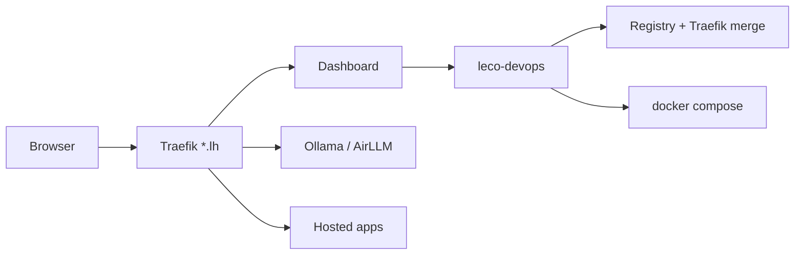

# Welcome to LEco DevOps

**LEco DevOps** is the local platform UI and CLI for running a personal DevOps stack on your machine: Traefik edge routing (`*.lh`), Ollama, AirLLM, Open WebUI, n8n, Postgres, Cloudflare-local adapters, and **hosted apps** you register with `leco-devops`.

This **Help & User Manual** is a guided tour from first install through daily management and complete removal. Use the **tree on the left** to jump between topics, or **search** (top) for keywords like `ollama`, `airllm`, `502`, or `uninstall`.

## Platform at a glance

See **[Architecture & diagrams](help:architecture-diagrams)** for full interactive charts (stack, hosting, onboarding flow, Traefik, overrides).

## How this manual is organized

| Section | What you will learn |
|--------|---------------------|
| **Architecture & diagrams** | Stack, hosting, data flows (illustrated) |
| **Updates & LLM catalogs** | Auto-checked stack versions + Ollama/AirLLM model tables |
| **Requirements** | Docker, disk, RAM, macOS vs Linux notes |
| **Installation** | Stack, CLI, DNS (`*.lh`) |
| **Daily operations** | Dashboard tabs, Control, Infrastructure |
| **Local AI** | Ollama + AirLLM model managers (UI + CLI) |
| **Hosting & onboarding** | New apps, `wsp:` materialize, overrides, deploy/rebuild |
| **LEco CLI** | `leco-devops`, register, offload, hooks |
| **Developer's guide** | Codebase map, dashboard/CLI/stack, debugging |
| **Troubleshooting** | 404/502, containers, Traefik |
| **Removal** | Stop stack, delete volumes, uninstall CLI |

## Quick links (in the dashboard)

- **Overview** — live CPU/RAM charts and service health.
- **Infrastructure** — scroll to **5 · Ollama** and **6 · AirLLM** for the **Model manager** panels (Popular dropdown, Install / Load / Unload / Remove, **Show CLI**).
- **Control** — start/stop/restart ecosystem services (needs optional control token).
- **Hosted apps** — register, deploy, logs; wizard under **Register application**.
- **Help** (this page) — `https://localhost.lh/help` — includes **Hosting & onboarding** and **Developer's guide**.
- **Docs** — deep technical markdown (architecture, blueprint, runbooks).

## Product names (avoid confusion)

| Name | Meaning |
|------|---------|
| **LEco DevOps Open Project** | The repository / open-source project |
| **LEco DevOps** | The web dashboard at `https://localhost.lh` |
| **`leco-devops`** | The CLI command (`pip install -e tools/deploy-cli`) |
| **`leco-app`** | PyPI package name only (same CLI) |

## Typical first-hour path

1. Install prerequisites → [Requirements](help:requirements)
2. Start the stack → [Ecosystem stack](help:install-stack)
3. Open `https://localhost.lh` → [Dashboard tour](help:dash-overview)
4. Pull a small Ollama model → [Ollama](help:ollama)
5. (Optional) Build and start AirLLM → [AirLLM](help:airllm)

When something fails, start with [Common issues](help:ts-common), [502 / routing](help:ts-502), or [503 / Varnish backend](help:ts-503) for Node+Varnish apps.
