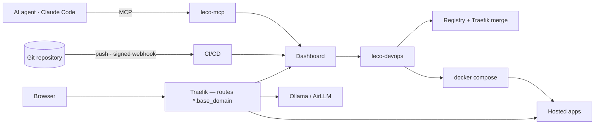

# Welcome to LEco DevOps

**LEco DevOps Open Project** is **community-driven open source** ([MIT License](/?tab=docsTab&doc=open-source-license)). Operational stewardship: **[Techtonic Systems Media And Research LLC](https://techtonic.systems/)**.

**LEco DevOps** is a local DevOps platform: Traefik edge routing, Ollama, AirLLM, Open WebUI, n8n, Paperclip, Postgres, Cloudflare-local adapters, an MCP server for AI agents, a CI/CD engine, and the **hosted apps** you register with `leco-devops`.

This **Help & User Manual** is a guided tour from first install through daily management and complete removal. Use the **tree on the left** to jump between topics, or **search** (top) for keywords like `webhook`, `mcp`, `502`, or `uninstall`.

## Platform at a glance

There are now **three ways in**, not one. A browser is no longer the only way to drive LEco.

```mermaid
flowchart LR
  B["Browser"] --> T["Traefik — routes *.base_domain"]
  A["AI agent · Claude Code"] -->|MCP| M["leco-mcp"]
  G[("Git repository")] -->|"push · signed webhook"| CI["CI/CD"]

  T --> D["Dashboard"]
  T --> LLM["Ollama / AirLLM"]
  T --> H["Hosted apps"]

  M --> D
  CI --> D

  D --> CLI["leco-devops"]
  CLI --> R["Registry + Traefik merge"]
  CLI --> C["docker compose"]
  C --> H
```

The two edges worth noticing are **`leco-mcp → Dashboard`** and **`CI/CD → Dashboard`**. Neither the MCP server nor the CI/CD engine touches Docker on its own — both act *through* the dashboard API, so lifecycle rules, safety gates, and the control token live in exactly one place no matter who is driving.

Hostnames follow **`base_domain`** from `config/leco-platform.yaml`: `.lh` on a laptop, a domain you own on a server. See [Platform tab](help:dash-platform).

Full interactive charts (stack, hosting, onboarding flow, Traefik, overrides): **[Architecture & diagrams](help:architecture-diagrams)**.

## How this manual is organized

| Section | What you will learn |
|--------|---------------------|
| **Architecture & diagrams** | Stack, hosting, data flows (illustrated) |
| **Requirements** | Docker, disk, RAM, macOS vs Linux notes |
| **Installation** | Stack, CLI, DNS and local TLS, Cloudflare DNS/SSL for a VM |
| **Daily operations** | Dashboard tabs, **Platform** (dev stacks), Control, Infrastructure, **FTP/SFTP** |
| **AI agents & automation** | **Paperclip**, the **MCP server** that lets an agent run LEco |
| **Local AI** | Ollama + AirLLM model managers (UI + CLI) |
| **Updates & LLM catalogs** | Auto-checked stack versions + Ollama/AirLLM model tables |
| **Hosting & onboarding** | New apps from a folder **or a Git URL**, `wsp:` materialize, **CI/CD**, overrides, deploy/rebuild |
| **LEco CLI** | `leco-devops`, register, offload, hooks |
| **Developer's guide** | Codebase map, dashboard/CLI/stack, debugging |
| **Troubleshooting** | 404/502, webhooks, clones, certificates, containers |
| **Removal** | Stop stack, delete volumes, uninstall CLI |

## The dashboard, in its new grouping

The top navigation is grouped. Four items open a dropdown:

**Overview** · **Deploy ▾** (Hosted apps · CI/CD · Routes) · **Operate ▾** (Control · Infrastructure) · **Insight ▾** (Metrics · Logs · Reference) · **Platform ▾** (Platform · MCP) · **Help** · **Service hubs**

Full tour: **[Dashboard tour](help:dash-overview)**.

## Quick links (in the dashboard)

- **Overview** — live CPU/RAM charts, URL probes, hosted app links.
- **Deploy → Hosted apps** — register from a **local folder or a Git URL**, deploy, read logs; wizard under **Register application**.
- **Deploy → CI/CD** — pipelines, signed webhooks, run history, rollback ([guide](help:git-cicd)).
- **Operate → Infrastructure** — **5 · Ollama** and **6 · AirLLM** hold the **Model manager** panels.
- **Operate → Control** — start/stop/restart ecosystem services; per-service default policies.
- **Insight → Reference** — every `*.lh` URL with a live probe badge.
- **Platform → Platform** — dev stack builder, deployment mode, base domain, TLS mode ([guide](help:dash-platform)).
- **Platform → MCP** — connected agents, plugin commands, audited activity log ([guide](help:mcp-server)).
- **Service hubs** — per-service ops pages, **UI access** credentials ([guide](help:file-transfer)), and **AI providers** (pick a provider, list its real models, choose one).
- **Help** (this page) — `https://localhost.lh/help`.

## Product names (avoid confusion)

| Name | Meaning |
|------|---------|
| **LEco DevOps Open Project** | The repository / open-source project |
| **LEco DevOps** | The web dashboard at `https://localhost.lh` |
| **`leco-devops`** | The CLI command (`pip install -e tools/deploy-cli`) |
| **`leco-app`** | PyPI package name only (same CLI) |
| **`leco-mcp`** | The MCP server AI agents connect to |

## Start here

1. Install prerequisites → [Requirements](help:requirements)
2. Start the stack → [Ecosystem stack](help:install-stack)
3. Set up `*.lh` DNS and the local certificate → [DNS and certificates](help:install-dns)
4. Open `https://localhost.lh` and get your bearings → [Dashboard tour](help:dash-overview)
5. Put your first application on a hostname → [Onboarding new apps](help:onboarding-overview) (from a folder **or** a Git URL)
6. Make a push redeploy it → [Git onboarding & CI/CD](help:git-cicd)
7. Optional — let an AI agent drive it → [MCP server](help:mcp-server)
8. Optional — pull a small local model → [Ollama](help:ollama)

**Before you expose this on a real domain**, read **[PRODUCTION_HARDENING.md](/?tab=docsTab&doc=production-hardening)**. The laptop defaults — an open control API, `insecure` Traefik API, ports on `0.0.0.0`, local-dev credentials — are not defaults for a public address.

When something fails, start with [Common issues](help:ts-common), [502 / routing](help:ts-502), or [503 / Varnish backend](help:ts-503) for Node+Varnish apps.
