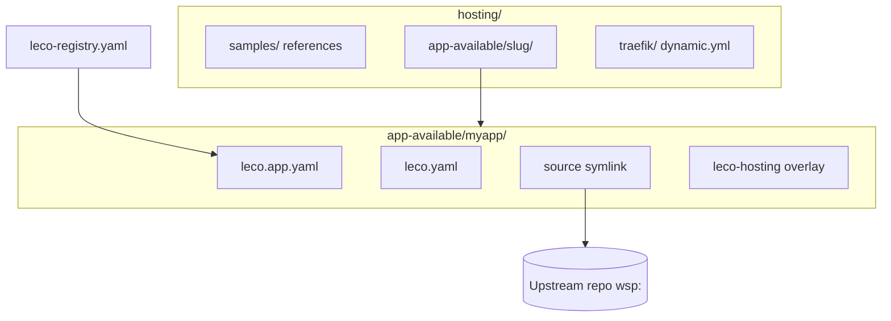

# Hosting layout & components

LEco keeps **writable** hosting state under the ecosystem repo (`hosting/`). Upstream application repos (sibling folders, Git clones) are often mounted **read-only** — manifests and LEco-only files must not be written there.



## Directory map

| Path | Purpose |
|------|---------|
| `hosting/samples/` | Reference `leco.app.yaml` / `leco.yaml` packs. **Not** listed as Hosted apps. Start here when learning patterns. |
| `hosting/app-available/<slug>/` | **Production slot** for each hosted app: bridge, profile, optional `source` symlink, LEco overlays, `.leco-runtime/`, `.dev.vars`. |
| `hosting/traefik/dynamic.yml` | **Writable merge target** for per-app Traefik routers/services. |
| `hosting/traefik/01-stack-core.yml` | Copy of repo `traefik/dynamic.yml` on Traefik start (platform `*.lh` routes). |
| `config/leco-registry.yaml` | Registry: `id`, `label`, `manifest` path (gitignored; copy from `config/leco-registry.example.yaml`). |

There is **no** `hosting/app-staging/` directory. The word **staging** in the UI/CLI means **offload** (compose down + strip Traefik keys) while **keeping** files under `app-available/`.

## Bridge vs profile (v3)

| File | Role |
|------|------|
| **`leco.app.yaml`** (bridge) | `name` (slug), `root` (`.` or `source`), `localHostProfile`, `applicationVersion`, optional `configRefs`, `localhost.notes`. |
| **`leco.yaml`** (profile) | `infrastructure` (compose, cloudflare, routing, runtimes), `urls`, `lifecycle`, `archetype`, `notes`. |

**Effective manifest** = bridge + profile `infrastructure` merged — same rule in dashboard and `leco-devops` (`load_effective_manifest`).

## Typical materialized layout

```
hosting/app-available/myapp/
  leco.app.yaml              # root: source
  leco.yaml
  source -> /workspace-parent/MyRepo   # symlink to real app tree
  docker-compose.leco-hosting.yml      # optional LEco overlay
  docker-compose.leco-runtime.yml      # generated for edge runtimes
  .dev.vars / .dev.vars.example
  .leco-runtime/<runtime-id>/          # D1 bootstrap, sanitized wrangler
```

## Registry entry

After register, `config/leco-registry.yaml` contains:

```yaml
apps:
  - id: myapp
    label: My App
    manifest: hosting/app-available/myapp/leco.app.yaml
```

Control targets use **`leco-stack-myapp`** for compose start/stop/deploy.

## Pending registration

The **Hosted apps** tab also lists folders under `app-available/` that have valid manifests but **no** registry row yet (`pending_registration: true`). Complete **Register** to add the registry entry and Traefik merge.

## Related topics

- [Onboarding new apps](help:onboarding-overview)
- [wsp: paths & materialize](help:onboarding-materialize)
- [Overriding upstream apps](help:hosting-overrides)
- [Deploy & rebuild](help:deploy-rebuild)
