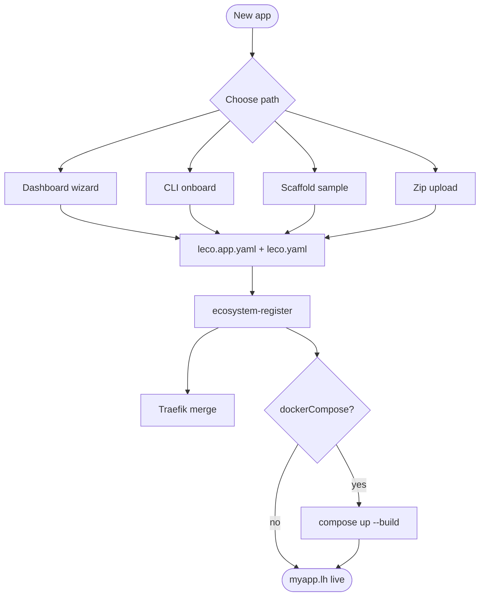

# Onboarding new apps (overview)

**Onboarding** means: represent your application in LEco (YAML), register it in the ecosystem, merge Traefik routes, optionally provision Cloudflare-local resources, and deploy containers or local edge runtimes.

## Choose your path

| Path | Best for | Entry |
|------|----------|-------|
| **Dashboard wizard** | Interactive detect, edit YAML, AI assist | **Hosted apps → Register application** |
| **CLI one-shot** | CI, scripts, repeatability | `leco-devops onboard -E "$LECO_ECOSYSTEM_ROOT"` |
| **CLI step-by-step** | Fine control | `init` → edit YAML → `deploy` → `ecosystem-register` |
| **Scaffold from sample** | Known pattern (Node+varnish, CF Worker, multi-Wrangler monorepo, …) | `leco-devops scaffold … --template …` |
| **Zip upload** | No Git on machine | **Hosted apps** zip API or dashboard upload |

All paths converge on the same artifacts: **`leco.app.yaml`**, **`leco.yaml`**, registry row, and (when configured) **`hosting/traefik/dynamic.yml`** merge.



More diagrams: [Architecture & diagrams](help:architecture-diagrams).

## Prerequisites

1. Ecosystem stack running (`traefik`, `lh-network`, dashboard).
2. `LECO_ECOSYSTEM_ROOT` set to your clone of local-ecosystem.
3. CLI installed: `cd tools/deploy-cli && pip install -e .`
4. App services that use Docker must join external network **`lh-network`** (via hosting overlay or upstream compose).

## Dashboard wizard (high level)

1. **Path** — absolute path, repo-relative under `/project`, or **`wsp:SiblingRepo/subpath`** (read-only sibling mount).
2. **Detect** — scans compose, all `wrangler.*.toml` files (including `infra/wrangler.api.toml`), ports, archetype; previews YAML and suggested `runtimes[]`.
3. **Generate YAML** or **Save YAML** (control token) — writes manifests; read-only trees **materialize** under `hosting/app-available/<slug>/`.
4. **Public URLs** table — optional merge into profile `urls[]`.
5. **Register** — `ecosystem-register` + optional **Deploy stack** (`docker compose up -d --build`).
6. Verify on **Hosted apps** — health probes, logs, routes.

Optional: enable **AI-assisted onboarding** on Infrastructure → AI settings to stream analysis and suggested configs (see `docs/AI_ONBOARDING_PLAN.md`).

## CLI one-shot

From your app directory (with manifests):

```bash
export LECO_ECOSYSTEM_ROOT=/path/to/local-ecosystem
leco-devops onboard -E "$LECO_ECOSYSTEM_ROOT"
```

Runs: compose up (if configured) → register → local CF provision (if wrangler + flags) → Traefik merge.

## CLI step-by-step

```bash
cd /path/to/my-upstream-app
leco-devops init -y                    # or hand-write leco.app.yaml + leco.yaml v3
# Edit leco.yaml: infrastructure.dockerCompose, routing, cloudflare, …
leco-devops deploy                     # docker compose up -d --build
leco-devops ecosystem-register -E "$LECO_ECOSYSTEM_ROOT" --merge-traefik
```

## Scaffold from sample

```bash
leco-devops scaffold myapp -E "$LECO_ECOSYSTEM_ROOT" \
  --template sample-node-varnish-multiprocess \
  --source-path /absolute/path/to/upstream
```

Copies `hosting/samples/<template>/` → `hosting/app-available/myapp/` with placeholders. Point **`--source-path`** at the real repo; LEco creates the `source` symlink on register/materialize.

## Zip upload

1. `POST /api/hosted/upload-zip` (control token) → extracts to `hosting/app-available/<slug>/`.
2. **Detect** with path `hosting/app-available/<slug>`.
3. **Register** as usual.

## What register does (all paths)

1. Validates YAML (Pydantic schema shared with CLI).
2. Normalizes hosts, ensures **`docker-compose.leco-hosting.yml`** overlay when needed (`lh-network`).
3. Ensures **local runtime** overlay when `infrastructure.runtimes[]` is set.
4. Runs **`leco-devops ecosystem-register`** — registry row, optional **provision-local-cf**, **Traefik merge**.
5. If **Deploy stack** checked: **`leco-devops deploy`**.

Workers-only apps (no `dockerCompose` in effective manifest) skip compose deploy; control uses the worker/runtime path.

## Next steps

- [wsp: paths & pulling code into hosting](help:onboarding-materialize)
- [Multi-Wrangler monorepos](help:multi-wrangler-monorepo)
- [Overriding upstream behavior](help:hosting-overrides)
- [Deploy, rebuild, offload](help:deploy-rebuild)
- [Hosted apps (dashboard)](help:hosted-apps)
- [Attached services panel](help:hosted-app-attached-services)
