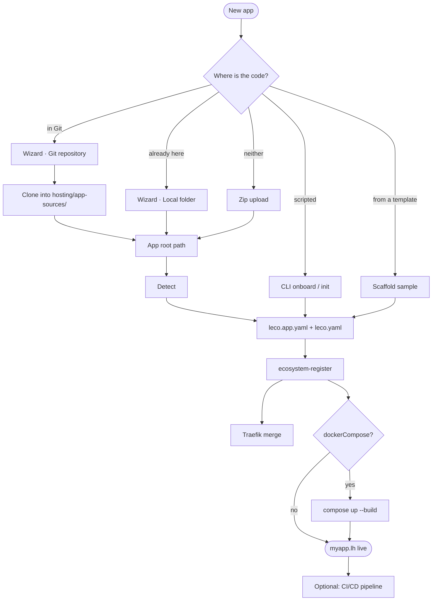

# Onboarding new apps (overview)

**Onboarding** means: represent your application in LEco (YAML), register it in the ecosystem, merge Traefik routes, optionally provision Cloudflare-local resources, and deploy containers or local edge runtimes.

## First question: where is the code?

The dashboard wizard now starts from **two sources**, and the choice is only about *how the code gets onto this machine*:

| Source | Pick it when | You supply |
|--------|--------------|------------|
| **Local folder** | The tree is already here — inside the repo, a sibling repo mounted as `wsp:`, or a host path | An **App root path** |
| **Git repository** | The code lives in Git and there is no checkout here — the usual case on a server, where there is no Finder to browse with | A **Repository URL** (+ branch/ref, + credential for a private repo) |

**They converge at the App root path.** *Clone / update & use* clones into `hosting/app-sources/<id>/` and writes that path into the same field the local-folder branch fills by hand. Everything after that — **Detect → Generate YAML → Register → Deploy** — is identical. Nothing downstream knows or cares which source you used.

## Choose your path

| Path | Best for | Entry |
|------|----------|-------|
| **Dashboard wizard — local folder** | Code already on the machine; interactive detect, edit YAML, AI assist | **Hosted apps → Register application → Source: Local folder** |
| **Dashboard wizard — Git repository** | A server, a fresh machine, or any repo you would otherwise clone by hand first | **Hosted apps → Register application → Source: Git repository** |
| **CLI one-shot** | CI, scripts, repeatability | `leco-devops onboard -E "$LECO_ECOSYSTEM_ROOT"` |
| **CLI step-by-step** | Fine control | `init` → edit YAML → `deploy` → `ecosystem-register` |
| **Scaffold from sample** | Known pattern (Node+varnish, CF Worker, multi-Wrangler monorepo, …) | `leco-devops scaffold … --template …` |
| **Zip upload** | Neither the folder nor Git access | **Hosted apps** zip API or dashboard upload |

All paths converge on the same artifacts: **`leco.app.yaml`**, **`leco.yaml`**, a registry row, and (when configured) a **`hosting/traefik/dynamic.yml`** merge.


```mermaid
flowchart TD
  Start([New app]) --> Path{Where is the code?}
  Path -->|already here| L[Wizard · Local folder]
  Path -->|in Git| G[Wizard · Git repository]
  Path -->|neither| Z[Zip upload]
  Path -->|scripted| O[CLI onboard / init]
  Path -->|from a template| S[Scaffold sample]
  G --> Clone[Clone into hosting/app-sources/]
  Clone --> Root[App root path]
  L --> Root
  Z --> Root
  Root --> Det[Detect]
  Det --> YAML[leco.app.yaml + leco.yaml]
  O --> YAML
  S --> YAML
  YAML --> Reg[ecosystem-register]
  Reg --> Tr[Traefik merge]
  Reg --> Dep{dockerCompose?}
  Dep -->|yes| Up[compose up --build]
  Dep -->|no| Done([myapp.lh live])
  Up --> Done
  Done --> CI[Optional: CI/CD pipeline]
```

More diagrams: [Architecture & diagrams](help:architecture-diagrams).

## Prerequisites

1. Ecosystem stack running (`traefik`, `lh-network`, dashboard).
2. `LECO_ECOSYSTEM_ROOT` set to your clone of local-ecosystem.
3. CLI installed: `cd tools/deploy-cli && pip install -e .`
4. App services that use Docker must join external network **`lh-network`** (via hosting overlay or upstream compose).

## Dashboard wizard (high level)

Open **Deploy ▾ → Hosted apps → Register application (generate YAML · save · register)**.

**Step 0 — SOURCE.** Choose **Local folder** or **Git repository**.

*Local folder:* type or **Browse…** to an **App root path** — repo-relative under `/project`, **`wsp:SiblingRepo/subpath`** (read-only sibling mount), or a host path when the dashboard was started with path hints.

*Git repository:* paste a **Repository URL**, optionally a **branch, tag or commit**. For a private repo add a **token or SSH private key** (optionally saved as a named credential). Press **Check repository** to list refs without cloning, then **Clone / update & use** — LEco clones into `hosting/app-sources/<id>/` (shallow by default, 300 s / 2048 MB guarded) and **fills the App root path** for you.

From here the two sources are the same wizard:

1. **App id (slug)** and **Label** — the label is guessed from `package.json` / the Wrangler name / the compose top-level name after Detect.
2. **Detect** — scans compose, all `wrangler.*.toml` files (including `infra/wrangler.api.toml`), ports, archetype; previews YAML and suggested `runtimes[]`.
3. **Generate YAML** or **Save YAML** (control token) — writes manifests; read-only trees **materialize** under `hosting/app-available/<slug>/` with a `source` symlink ([wsp: & materialize](help:onboarding-materialize)).
4. **Public URLs** table — edit every `urls[]` entry; **Write into profile YAML** copies them into the textarea before **Save YAML**.
5. **Register** — `ecosystem-register` + optional **Deploy stack** (`docker compose up -d --build`, on by default when the manifest has `dockerCompose`).
6. Verify on **Hosted apps** — health probes, logs, routes.
7. **Seed data (optional)** — if `hosting/app-available/<slug>/data/` exists, the register wizard reports it; import is **manual** after deploy via **Import data** or `leco-devops import-data` ([Seed data import](help:hosted-app-data-import)).
8. **CI/CD (optional)** — give the app a pipeline so a push redeploys it: [Git onboarding & CI/CD](help:git-cicd).

### Which source, when

| | Local folder | Git repository |
|---|---|---|
| Code already checked out here | ✅ | — |
| Server with no Finder and no checkout | — | ✅ |
| Sibling monorepo you also edit locally | ✅ (`wsp:`) | ✅ if you prefer a pinned ref |
| Needs a specific tag or commit | manual `git checkout` | ✅ built in |
| Private repository | already cloned, credentials already yours | ✅ token or SSH key, stored `0600`, never in the clone |
| Feeds a CI/CD pipeline later | pipeline still needs the repository URL | ✅ the URL is already known |

### AI-assisted onboarding (optional)

Toggle **AI-assisted onboarding** in the wizard to stream an analysis of the detected tree and suggested configuration. The pill next to it names the **active provider**; **Configure AI provider →** jumps to **Service hubs → AI providers (LLM access)**, which is where a provider is picked and its model chosen from the provider's real catalogue — see [Infrastructure tab](help:dash-infra) § *AI provider*. Background: `docs/AI_ONBOARDING_PLAN.md`.

## CLI one-shot

From your app directory (with manifests):

```bash
export LECO_ECOSYSTEM_ROOT=/path/to/local-ecosystem
leco-devops onboard -E "$LECO_ECOSYSTEM_ROOT"
```

Runs: compose up (if configured) → register → local CF provision (if wrangler + flags) → Traefik merge.

## CLI step-by-step

```bash
cd /path/to/my-upstream-app
leco-devops init -y                    # or hand-write leco.app.yaml + leco.yaml v3
# Edit leco.yaml: infrastructure.dockerCompose, routing, cloudflare, …
leco-devops deploy                     # docker compose up -d --build
leco-devops ecosystem-register -E "$LECO_ECOSYSTEM_ROOT" --merge-traefik
```

## Scaffold from sample

```bash
leco-devops scaffold myapp -E "$LECO_ECOSYSTEM_ROOT" \
  --template sample-node-varnish-multiprocess \
  --source-path /absolute/path/to/upstream
```

Copies `hosting/samples/<template>/` → `hosting/app-available/myapp/` with placeholders. Point **`--source-path`** at the real repo; LEco creates the `source` symlink on register/materialize.

For **Node + Varnish** apps, pass **`--health-path`** matching the upstream app (e.g. **`/alb-health-check`** for botfeed). The template includes **`server` healthchecks**, **`varnish` waits for healthy server**, and **`LECO_DISABLE_VARNISH_NCSA`** so restarts do not cause [503 Backend fetch failed](help:ts-503).

## Zip upload

1. `POST /api/hosted/upload-zip` (control token) → extracts to `hosting/app-available/<slug>/`.
2. **Detect** with path `hosting/app-available/<slug>`.
3. **Register** as usual.

## What register does (all paths)

1. Validates YAML (Pydantic schema shared with CLI).
2. Normalizes hosts, ensures **`docker-compose.leco-hosting.yml`** overlay when needed (`lh-network`).
3. Ensures **local runtime** overlay when `infrastructure.runtimes[]` is set.
4. Runs **`leco-devops ecosystem-register`** — registry row, optional **provision-local-cf**, **Traefik merge**.
5. If **Deploy stack** checked: **`leco-devops deploy`**.

Workers-only apps (no `dockerCompose` in effective manifest) skip compose deploy; control uses the worker/runtime path.

## After the first deploy

Onboarding puts the app on a hostname **once**. To keep it there:

- **[Git onboarding & CI/CD](help:git-cicd)** — a pipeline that redeploys on push and verifies the app really answered.
- **[Deploy, rebuild, offload](help:deploy-rebuild)** — manual redeploys and taking an app back down.
- **[Attached services panel](help:hosted-app-attached-services)** — the connection strings the app's own config needs.

## Next steps

- [Hosted apps (dashboard)](help:hosted-apps)
- [wsp: paths & pulling code into hosting](help:onboarding-materialize)
- [Multi-Wrangler monorepos](help:multi-wrangler-monorepo)
- [Overriding upstream behavior](help:hosting-overrides)
- [Seed data import](help:hosted-app-data-import)
- Something broke → [Common issues](help:ts-common) · [502 / routing](help:ts-502)
