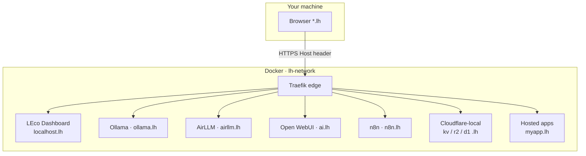
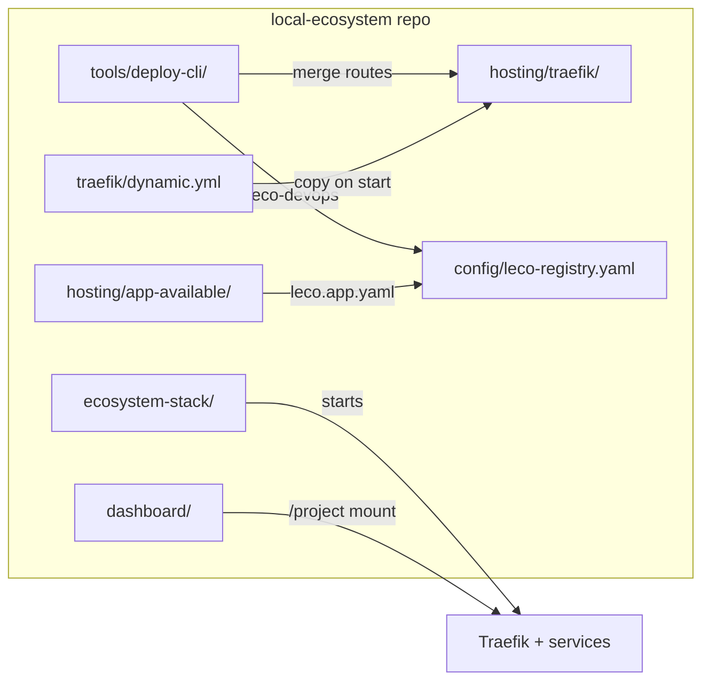
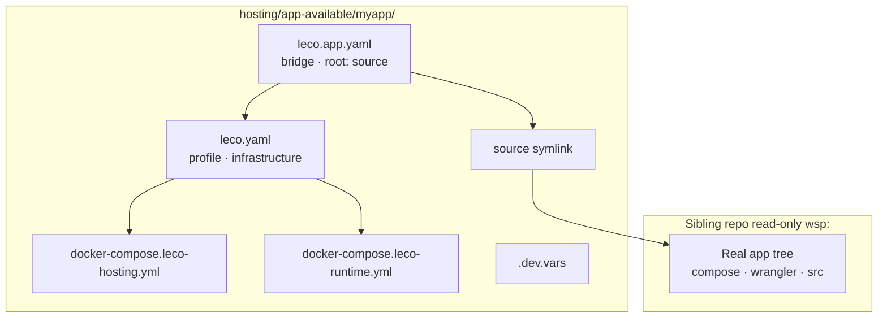
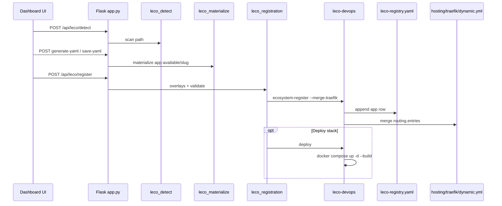
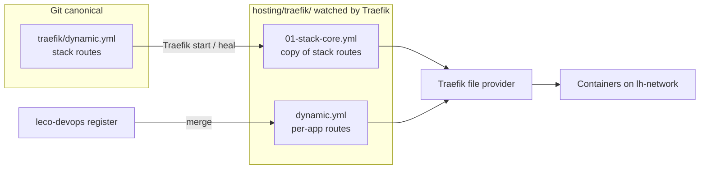
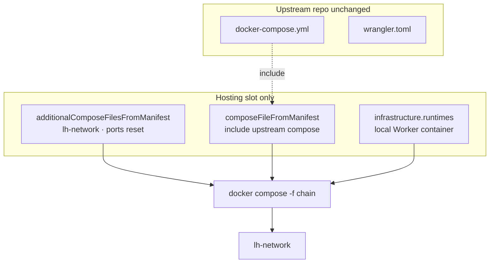
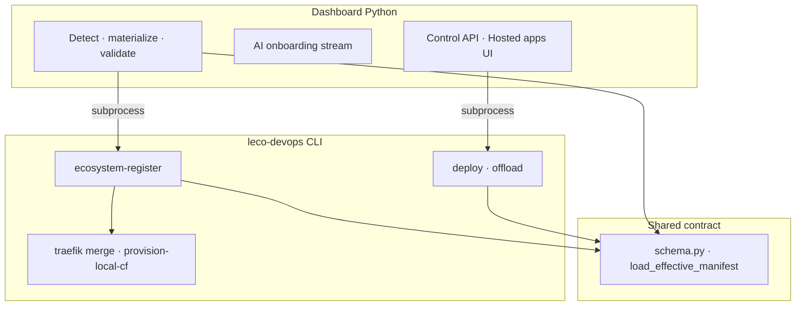
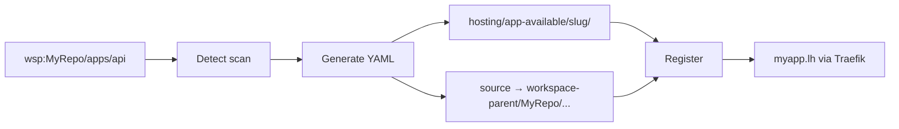

# Architecture & diagrams

Visual maps of the LEco DevOps platform. Diagrams render automatically on this page (Mermaid). If a diagram does not appear, hard-refresh the browser.

## Platform stack

## Repository layout

## Hosting slot (materialized app)

## Onboarding & registration data flow

## Traefik routing (two files)

## Overriding upstream (three layers)

## CLI vs dashboard responsibilities

## wsp: materialize path

## Related topics

- [Onboarding overview](help:onboarding-overview)
- [Hosting layout](help:hosting-layout)
- [Registration flow developer](help:dev-registration-flow)
- [Developer's guide](help:dev-overview)
