# Architecture & diagrams

Visual maps of the LEco DevOps platform. Diagrams render automatically on this page (Mermaid). If a diagram does not appear, hard-refresh the browser.

## Platform stack

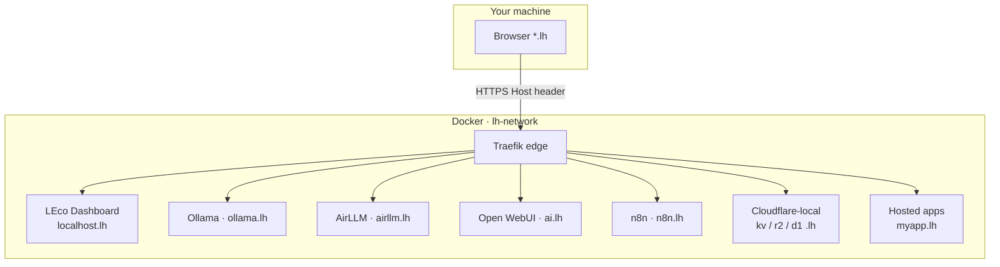
```mermaid
flowchart TB
  subgraph Browser["Your machine"]
    U[Browser *.lh]
  end
  subgraph Edge["Docker · lh-network"]
    T[Traefik edge]
    D[LEco Dashboard<br/>localhost.lh]
    O[Ollama · ollama.lh]
    A[AirLLM · airllm.lh]
    W[Open WebUI · ai.lh]
    N[n8n · n8n.lh]
    CF[Cloudflare-local<br/>kv / r2 / d1 .lh]
    H[Hosted apps<br/>myapp.lh]
  end
  U -->|HTTPS Host header| T
  T --> D
  T --> O
  T --> A
  T --> W
  T --> N
  T --> CF
  T --> H
```

## Repository layout

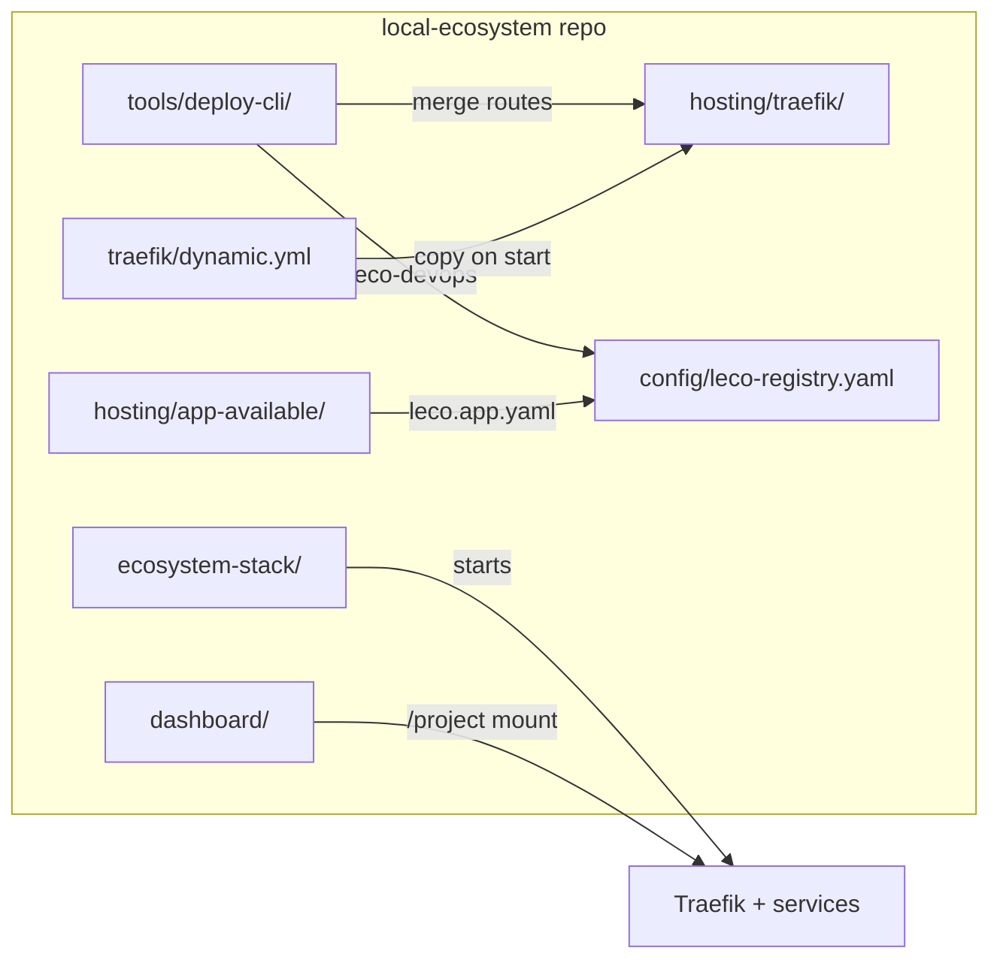
```mermaid
flowchart LR
  subgraph Repo["local-ecosystem repo"]
    ES[ecosystem-stack/]
    DB[dashboard/]
    CLI[tools/deploy-cli/]
    TR[traefik/dynamic.yml]
    HO[hosting/app-available/]
    HT[hosting/traefik/]
    RG[config/leco-registry.yaml]
  end
  ES -->|starts| T2[Traefik + services]
  DB -->|/project mount| T2
  CLI -->|leco-devops| RG
  CLI -->|merge routes| HT
  HO -->|leco.app.yaml| RG
  TR -->|copy on start| HT
```

## Hosting slot (materialized app)

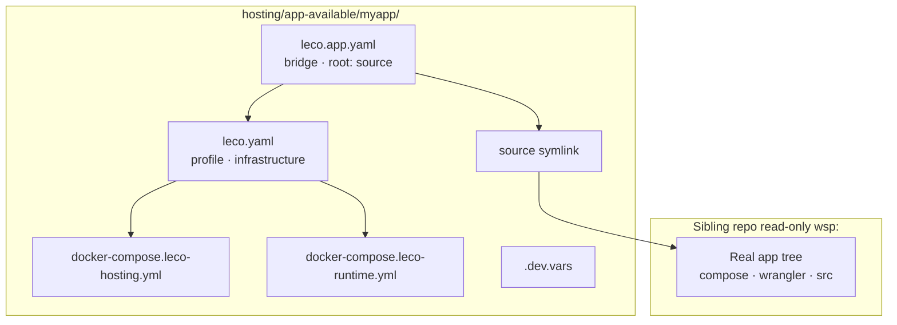
```mermaid
flowchart TB
  subgraph Slot["hosting/app-available/myapp/"]
    B[leco.app.yaml<br/>bridge · root: source]
    P[leco.yaml<br/>profile · infrastructure]
    S[source symlink]
    OV[docker-compose.leco-hosting.yml]
    RT[docker-compose.leco-runtime.yml]
    DV[.dev.vars]
  end
  subgraph Upstream["Sibling repo read-only wsp:"]
    APP[Real app tree<br/>compose · wrangler · src]
  end
  B --> P
  S --> APP
  P --> OV
  P --> RT
  B --> S
```

## Onboarding & registration data flow

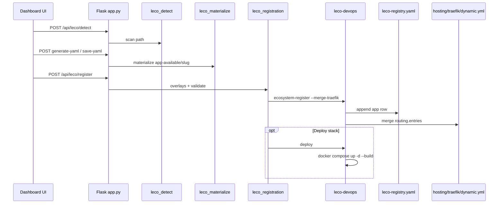
```mermaid
sequenceDiagram
  participant UI as Dashboard UI
  participant API as Flask app.py
  participant Det as leco_detect
  participant Mat as leco_materialize
  participant Reg as leco_registration
  participant CLI as leco-devops
  participant Rg as leco-registry.yaml
  participant Tr as hosting/traefik/dynamic.yml

  UI->>API: POST /api/leco/detect
  API->>Det: scan path
  UI->>API: POST generate-yaml / save-yaml
  API->>Mat: materialize app-available/slug
  UI->>API: POST /api/leco/register
  API->>Reg: overlays + validate
  Reg->>CLI: ecosystem-register --merge-traefik
  CLI->>Rg: append app row
  CLI->>Tr: merge routing.entries
  opt Deploy stack
    Reg->>CLI: deploy
    CLI->>CLI: docker compose up -d --build
  end
```

## Onboarding from a Git repository

Git is a **source adapter**, not a second pipeline: once the clone lands, the wizard continues exactly as it does for a local folder. Full behaviour: [Git onboarding & CI/CD](help:git-cicd).

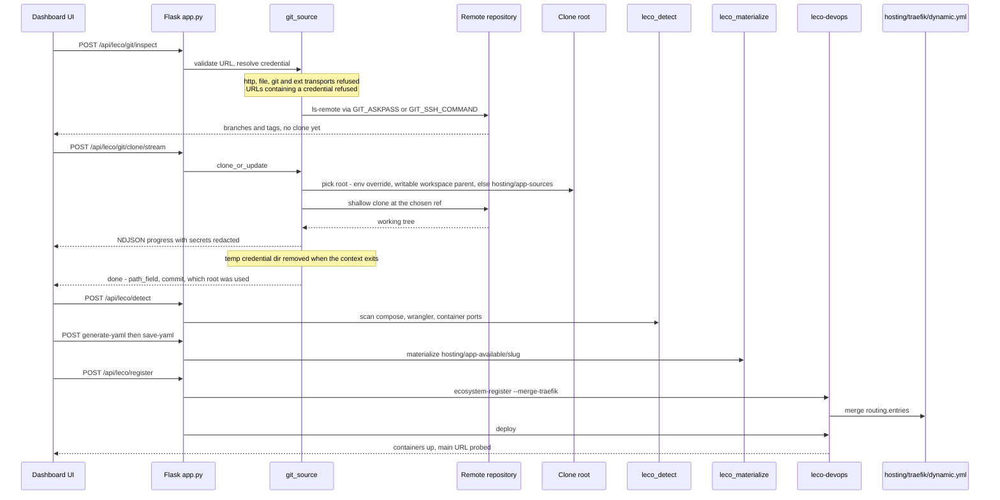
```mermaid
sequenceDiagram
  participant UI as Dashboard UI
  participant API as Flask app.py
  participant Git as git_source
  participant Rem as Remote repository
  participant Root as Clone root
  participant Det as leco_detect
  participant Mat as leco_materialize
  participant CLI as leco-devops
  participant Tr as hosting/traefik/dynamic.yml

  UI->>API: POST /api/leco/git/inspect
  API->>Git: validate URL, resolve credential
  Note over Git: http, file, git and ext transports refused<br/>URLs containing a credential refused
  Git->>Rem: ls-remote via GIT_ASKPASS or GIT_SSH_COMMAND
  Rem-->>UI: branches and tags, no clone yet
  UI->>API: POST /api/leco/git/clone/stream
  API->>Git: clone_or_update
  Git->>Root: pick root - env override, writable workspace parent, else hosting/app-sources
  Git->>Rem: shallow clone at the chosen ref
  Rem-->>Git: working tree
  Git-->>UI: NDJSON progress with secrets redacted
  Note over Git: temp credential dir removed when the context exits
  Git-->>UI: done - path_field, commit, which root was used
  UI->>API: POST /api/leco/detect
  API->>Det: scan compose, wrangler, container ports
  UI->>API: POST generate-yaml then save-yaml
  API->>Mat: materialize hosting/app-available/slug
  UI->>API: POST /api/leco/register
  API->>CLI: ecosystem-register --merge-traefik
  CLI->>Tr: merge routing.entries
  API->>CLI: deploy
  CLI-->>UI: containers up, main URL probed
```

## CI/CD run (and the failure branch that matters)

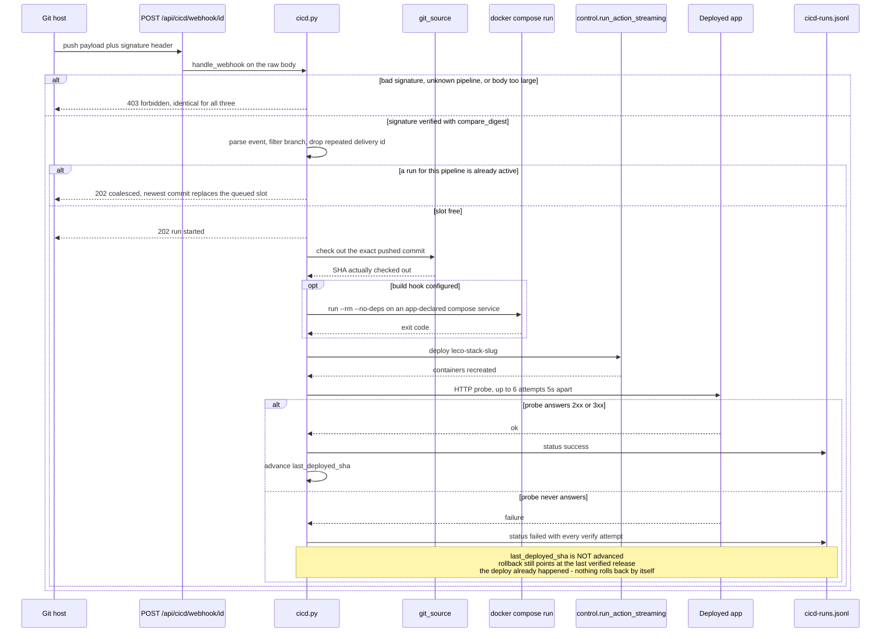
```mermaid
sequenceDiagram
  participant GH as Git host
  participant HK as POST /api/cicd/webhook/id
  participant CI as cicd.py
  participant Git as git_source
  participant B as docker compose run
  participant Ctl as control.run_action_streaming
  participant App as Deployed app
  participant Runs as cicd-runs.jsonl

  GH->>HK: push payload plus signature header
  HK->>CI: handle_webhook on the raw body
  alt bad signature, unknown pipeline, or body too large
    CI-->>GH: 403 forbidden, identical for all three
  else signature verified with compare_digest
    CI->>CI: parse event, filter branch, drop repeated delivery id
    alt a run for this pipeline is already active
      CI-->>GH: 202 coalesced, newest commit replaces the queued slot
    else slot free
      CI-->>GH: 202 run started
      CI->>Git: check out the exact pushed commit
      Git-->>CI: SHA actually checked out
      opt build hook configured
        CI->>B: run --rm --no-deps on an app-declared compose service
        B-->>CI: exit code
      end
      CI->>Ctl: deploy leco-stack-slug
      Ctl-->>CI: containers recreated
      CI->>App: HTTP probe, up to 6 attempts 5s apart
      alt probe answers 2xx or 3xx
        App-->>CI: ok
        CI->>Runs: status success
        CI->>CI: advance last_deployed_sha
      else probe never answers
        App-->>CI: failure
        CI->>Runs: status failed with every verify attempt
        Note over CI,Runs: last_deployed_sha is NOT advanced<br/>rollback still points at the last verified release<br/>the deploy already happened - nothing rolls back by itself
      end
    end
  end
```

If no verify URL can be derived the probe is recorded as **skipped**, the run succeeds, and the outcome says the release was not verified.

## An agent operating the platform over MCP

The MCP server has no Docker socket and no shell. Every tool is an HTTP call against the dashboard API, so an agent can never do more than the dashboard already allows. Tool tables and configuration: [MCP server](help:mcp-server).

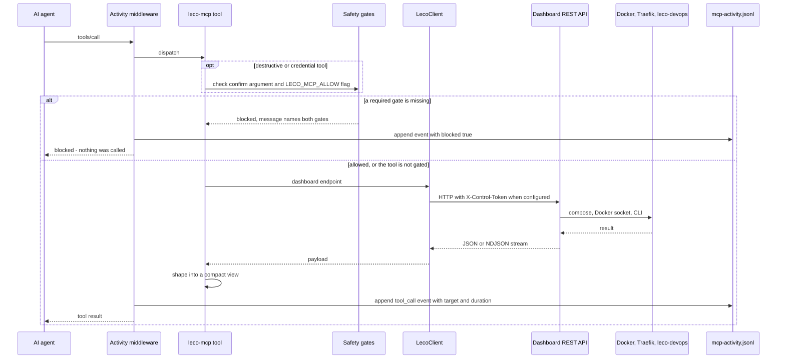
```mermaid
sequenceDiagram
  participant Ag as AI agent
  participant MW as Activity middleware
  participant T as leco-mcp tool
  participant SG as Safety gates
  participant Cl as LecoClient
  participant API as Dashboard REST API
  participant Eng as Docker, Traefik, leco-devops
  participant Log as mcp-activity.jsonl

  Ag->>MW: tools/call
  MW->>T: dispatch
  opt destructive or credential tool
    T->>SG: check confirm argument and LECO_MCP_ALLOW flag
  end
  alt a required gate is missing
    SG-->>T: blocked, message names both gates
    MW->>Log: append event with blocked true
    MW-->>Ag: blocked - nothing was called
  else allowed, or the tool is not gated
    T->>Cl: dashboard endpoint
    Cl->>API: HTTP with X-Control-Token when configured
    API->>Eng: compose, Docker socket, CLI
    Eng-->>API: result
    API-->>Cl: JSON or NDJSON stream
    Cl-->>T: payload
    T->>T: shape into a compact view
    MW->>Log: append tool_call event with target and duration
    MW-->>Ag: tool result
  end
```

The dashboard reads that same log to build the **MCP** tab — it never writes it.

## RAG answer over the platform's own docs

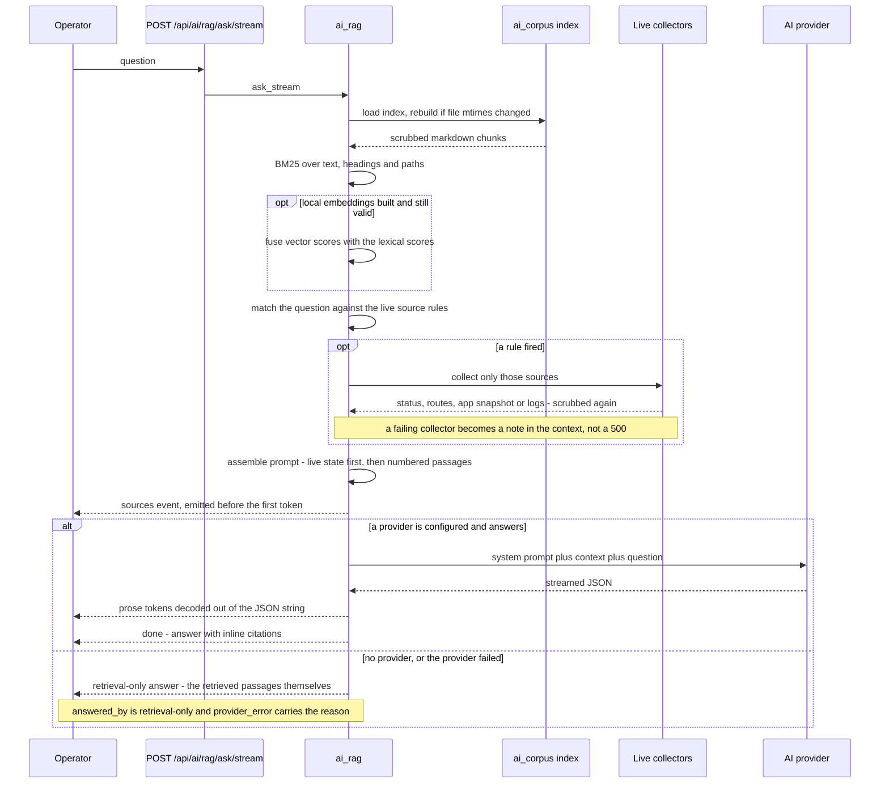
```mermaid
sequenceDiagram
  participant U as Operator
  participant API as POST /api/ai/rag/ask/stream
  participant R as ai_rag
  participant C as ai_corpus index
  participant Live as Live collectors
  participant P as AI provider

  U->>API: question
  API->>R: ask_stream
  R->>C: load index, rebuild if file mtimes changed
  C-->>R: scrubbed markdown chunks
  R->>R: BM25 over text, headings and paths
  opt local embeddings built and still valid
    R->>R: fuse vector scores with the lexical scores
  end
  R->>R: match the question against the live source rules
  opt a rule fired
    R->>Live: collect only those sources
    Live-->>R: status, routes, app snapshot or logs - scrubbed again
    Note over Live,R: a failing collector becomes a note in the context, not a 500
  end
  R->>R: assemble prompt - live state first, then numbered passages
  R-->>U: sources event, emitted before the first token
  alt a provider is configured and answers
    R->>P: system prompt plus context plus question
    P-->>R: streamed JSON
    R-->>U: prose tokens decoded out of the JSON string
    R-->>U: done - answer with inline citations
  else no provider, or the provider failed
    R-->>U: retrieval-only answer - the retrieved passages themselves
    Note over R,U: answered_by is retrieval-only and provider_error carries the reason
  end
```

A local provider keeps the whole exchange on the machine. A cloud provider receives the question, the retrieved documentation and any live state collected for it — which can include container logs. The RAG status panel names the destination host for exactly that reason.

## Traefik routing (two files)

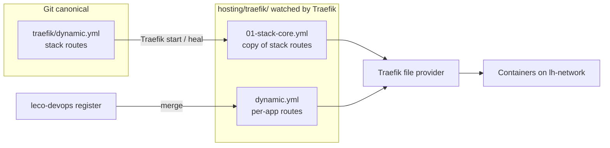
```mermaid
flowchart LR
  subgraph Git["Git canonical"]
    TD[traefik/dynamic.yml<br/>stack routes]
  end
  subgraph Runtime["hosting/traefik/ watched by Traefik"]
    C[01-stack-core.yml<br/>copy of stack routes]
    DY[dynamic.yml<br/>per-app routes]
  end
  TD -->|Traefik start / heal| C
  REG[leco-devops register] -->|merge| DY
  C --> T[Traefik file provider]
  DY --> T
  T --> SVC[Containers on lh-network]
```

## Overriding upstream (three layers)

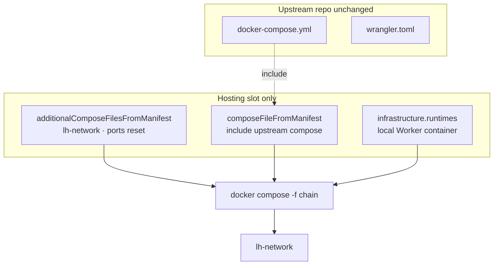
```mermaid
flowchart TB
  subgraph Up["Upstream repo unchanged"]
    UC[docker-compose.yml]
    UW[wrangler.toml]
  end
  subgraph LEco["Hosting slot only"]
    L1[additionalComposeFilesFromManifest<br/>lh-network · ports reset]
    L2[composeFileFromManifest<br/>include upstream compose]
    L3[infrastructure.runtimes<br/>local Worker container]
  end
  UC -.->|include| L2
  L1 --> Compose[docker compose -f chain]
  L2 --> Compose
  L3 --> Compose
  Compose --> Net[lh-network]
```

## CLI vs dashboard responsibilities

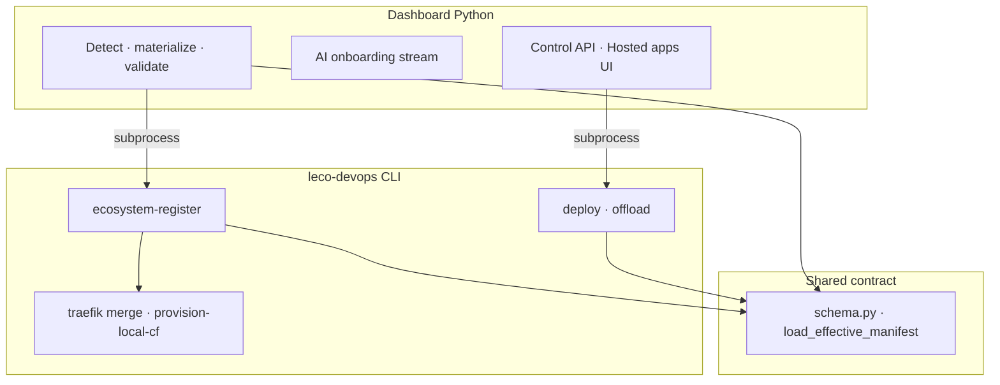
```mermaid
flowchart TB
  subgraph Dash["Dashboard Python"]
    D1[Detect · materialize · validate]
    D2[AI onboarding stream]
    D3[Control API · Hosted apps UI]
  end
  subgraph Shared["Shared contract"]
    SCH[schema.py · load_effective_manifest]
  end
  subgraph CLI2["leco-devops CLI"]
    C1[ecosystem-register]
    C2[deploy · offload]
    C3[traefik merge · provision-local-cf]
  end
  D1 --> SCH
  D1 -->|subprocess| C1
  D3 -->|subprocess| C2
  C1 --> SCH
  C2 --> SCH
  C1 --> C3
```

## wsp: materialize path

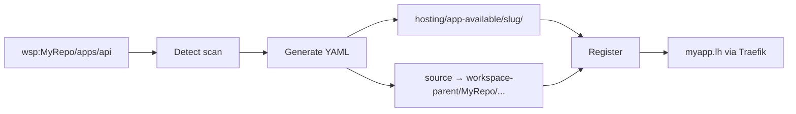
```mermaid
flowchart LR
  W[wsp:MyRepo/apps/api] --> Det[Detect scan]
  Det --> Gen[Generate YAML]
  Gen --> AV[hosting/app-available/slug/]
  Gen --> Sym[source → workspace-parent/MyRepo/...]
  AV --> Reg[Register]
  Sym --> Reg
  Reg --> Live[myapp.lh via Traefik]
```

## Related topics

- [Onboarding overview](help:onboarding-overview)
- [Hosting layout](help:hosting-layout)
- [Git onboarding & CI/CD](help:git-cicd)
- [MCP server](help:mcp-server) · [MCP server developer notes](help:dev-mcp-server)
- [Registration flow developer](help:dev-registration-flow)
- [Developer's guide](help:dev-overview)
