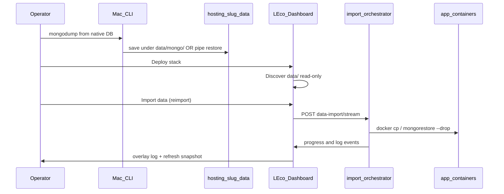
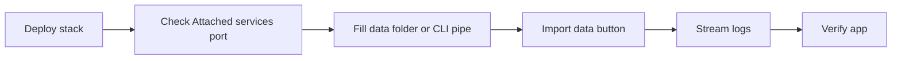

# Hosted app — seed data import

Import database dumps and files into a **running** hosted app stack after deploy. LEco does **not** import seed data during **Register** — detection is informational only; use **Import data** or the CLI when the stack is up.

## Before you import

1. **Deploy** the app (`Register` with **Deploy stack**, or `leco-devops deploy`).
2. Open **Hosted apps → [slug] → Attached services** and note **From your Mac (host)** URIs and ports.
3. For **D1 / R2 / KV**, ensure **`leco.local-cf.yaml`** exists (local CF provision after register).
4. Large dumps: the **Seed data** card warns above ~500 MiB per item.



## Three ways to seed

| Method | When to use |
|--------|-------------|
| **A. CLI pipe** | One-shot Mac/native → container published port (no `data/` folder) |
| **B. `data/` folder + Import data** | Repeatable layout; same files the dashboard imports |
| **C. Dashboard only** | Place files under `data/`, click **Import data** |

Replace placeholders (`<host-port>`, `<database>`, …) using **Attached services** for your app — do not copy example credentials into commands.

---

## Method A — CLI pipe (MongoDB example)

**One database** (when you only need a single DB, e.g. the app’s primary database):

```bash
mongodump --uri="mongodb://localhost:27017" --db=<source-database> --archive \
  | mongorestore --uri="mongodb://127.0.0.1:<host-port>/<target-database>" --archive --drop
```

**Full server** (all databases on the source instance — omit `--db` on `mongodump`):

```bash
mongodump --uri="mongodb://localhost:27017" --archive \
  | mongorestore --uri="mongodb://127.0.0.1:<host-port>" --archive --drop
```

Use a restore URI **without** a database path for full-server restores. For folder-based imports, a full dump creates `data/mongo/<database>/` per DB; **Import data** runs one step per subfolder.

**Authentication:** if required, extend the URIs with your own options (e.g. `?authSource=admin`) or use environment variables — **never commit usernames/passwords** to the repo or paste them into shared docs.

Verify publish: `docker ps` should show `0.0.0.0:<host-port>->27017/tcp` for the mongo service. If missing, add `ports:` in compose and **recreate** mongo (`docker compose up -d mongo`).

---

## Method B — `data/` folder + LEco import

Layout under `hosting/app-available/<slug>/data/`:

```
data/
  README.md
  manifest.yaml          # optional explicit plan
  mongo/<database>/      # mongodump directory (per-DB folder)
  mysql/<database>.sql
  postgres/<database>.sql
  redis/dump.rdb
  d1/<database>.sql
  r2/<bucket-name>/...
  kv/<namespace>/keys.json
  files/uploads/...
```

Dump then import:

```bash
SLUG=<your-app-slug>
DATA="hosting/app-available/${SLUG}/data"
mkdir -p "${DATA}/mongo"

# One database:
mongodump --uri="mongodb://localhost:27017" --db=<source-database> --out="${DATA}/mongo"

# Or full server (all databases — omit --db):
# mongodump --uri="mongodb://localhost:27017" --out="${DATA}/mongo"

leco-devops import-data --manifest "hosting/app-available/${SLUG}/leco.app.yaml" --reimport
```

`leco-devops scaffold` copies a starter `data/README.md` and `manifest.yaml.example`.

---

## Method C — Dashboard



1. **Hosted apps → [slug]** — **Seed data** lists discovered items with **checkboxes** (e.g. skip large log DBs like `varnish404Logs`). **Select all** toggles every row; the summary shows selected count and size.
2. **Import data** — imports **only checked rows**, confirms reimport (drop/replace), streams NDJSON logs with per-step progress.
3. **Dry-run plan** — same plan as CLI `--dry-run` (no writes).
4. Refresh snapshot; verify the app against your health or data checks.

---

## Per-store CLI cookbook

### MongoDB — docker exec only (no host publish)

```bash
# One database
mongodump --uri="mongodb://localhost:27017" --db=<source-database> --out=/tmp/seed
docker cp /tmp/seed <container-name>:/tmp/seed
docker exec <container-name> mongorestore --drop --db=<target-database> /tmp/seed/<target-database>

# Full server
mongodump --uri="mongodb://localhost:27017" --out=/tmp/seed
docker cp /tmp/seed <container-name>:/tmp/seed
docker exec <container-name> mongorestore --drop /tmp/seed
```

### MySQL

```bash
mysqldump -h 127.0.0.1 -P <source-port> -u <user> -p <database> > hosting/app-available/<slug>/data/mysql/<database>.sql
docker exec -i <container-name> mysql -u<user> -p <database> < hosting/app-available/<slug>/data/mysql/<database>.sql
```

(`-p` prompts for password interactively.)

### PostgreSQL

```bash
pg_dump -h localhost -U <user> -W <database> > hosting/app-available/<slug>/data/postgres/<database>.sql
docker exec -i <container-name> psql -U <user> -d <database> < hosting/app-available/<slug>/data/postgres/<database>.sql
```

### Redis

```bash
redis-cli -h 127.0.0.1 -p <source-port> --rdb /tmp/dump.rdb
cp /tmp/dump.rdb hosting/app-available/<slug>/data/redis/dump.rdb
```

Automated import: FLUSHALL + copy RDB into the container (see importer).

### D1 / R2 / KV (local CF)

```bash
curl -sS -X POST "https://d1.lh/databases/<database-id>/execute" \
  -H "Content-Type: application/json" \
  -d '{"sql":"INSERT INTO items(name) VALUES (?);","params":["seed"]}'
```

Or place SQL/objects under `data/d1`, `data/r2`, `data/kv` and use **Import data**.

---

## Troubleshooting

| Symptom | Fix |
|---------|-----|
| Compass cannot connect to host port | `docker ps` — no host port → add `ports:` and recreate mongo |
| Wrong database name | Match dump DB to app config; check `LECO_MONGO_DATABASE` / URI path in hosting overlay |
| Import failed: container not found | Stack not running; `docker compose ps` in app directory |
| `data/` exists, nothing listed | Add `manifest.yaml` or standard subdirs (`mongo/`, `mysql/`, …) |
| D1/R2/KV import skipped | Missing `leco.local-cf.yaml` — re-register with local CF provision |

## Related

- [Attached services panel](help:hosted-app-attached-services)
- [Onboarding overview](help:onboarding-overview)
- [Data import (developers)](help:dev-data-import)
