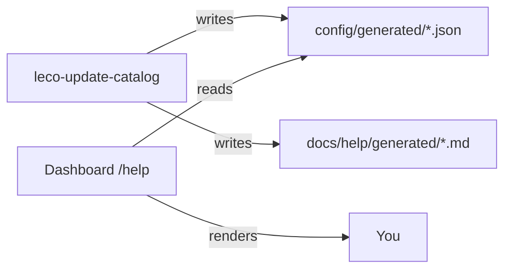

# Update catalog service (`leco-update-catalog`)

A **background Docker service** checks for ecosystem stack image updates, new Ollama library models, and trending HuggingFace instruct models. It writes JSON catalogs and **regenerates Help manual tables** automatically.

## Start the watcher

```bash
# Build image + run daemon (default: every 6 hours)
./ecosystem-stack/services/update-catalog.sh start

# One-shot refresh (CI or first install)
./ecosystem-stack/services/update-catalog.sh run-once

# Logs
./ecosystem-stack/services/update-catalog.sh logs
```

Environment:

| Variable | Default | Meaning |
|----------|---------|---------|
| `UPDATE_CATALOG_INTERVAL_HOURS` | `6` | Sleep between checks |

## What it checks

| Target | Source | Output |
|--------|--------|--------|
| Traefik, Ollama, n8n, Postgres, Open WebUI, … | Docker Hub / GitHub releases | `ecosystem-updates.json` |
| Local images (dashboard, AirLLM) | Running container vs expected tag | Rebuild instructions |
| Ollama models | `https://ollama.com/api/tags` + seed catalog | `llm-catalog-ollama.json` |
| AirLLM / HF models | HuggingFace API + seed catalog | `llm-catalog-airllm.json` |

## Output files

| Path | Purpose |
|------|---------|
| `ecosystem-stack/config/generated/ecosystem-updates.json` | Service version status + new model alerts |
| `ecosystem-stack/config/generated/llm-catalog-ollama.json` | Full Ollama catalog with publisher, niche, install |
| `ecosystem-stack/config/generated/llm-catalog-airllm.json` | Full AirLLM / HF catalog |
| `docs/help/generated/14-ecosystem-updates.md` | Auto Help: stack updates |
| `docs/help/generated/15-llm-catalog-ollama.md` | Auto Help: Ollama table |
| `docs/help/generated/16-llm-catalog-airllm.md` | Auto Help: AirLLM table |

**Seed metadata** (publisher, niche, specialty) is edited in:

- `ecosystem-stack/config/llm-catalog-ollama-seed.json`
- `ecosystem-stack/config/llm-catalog-airllm-seed.json`

The watcher **merges** seeds with online discovery — new Ollama library names appear with 🆕 in Help tables.

## Dashboard APIs

| API | Data |
|-----|------|
| `GET /api/ecosystem/updates` | Stack update status |
| `GET /api/llm-catalog/ollama` | Full Ollama catalog JSON |
| `GET /api/llm-catalog/airllm` | Full AirLLM catalog JSON |
| `GET /api/ecosystem/catalog-meta` | Last run timestamps |

## Help topics (live tables)

- [Stack & model updates](help:ecosystem-updates)
- [Ollama LLM catalog](help:llm-catalog-ollama)
- [AirLLM LLM catalog](help:llm-catalog-airllm)

## Upgrade when a stack update is available

Follow steps in [Deploy & rebuild](help:deploy-rebuild) for each service. Example:

```bash
./ecosystem-stack/ecosystem-stack.sh restart ollama
./ecosystem-stack/ecosystem-stack.sh heal traefik
```


