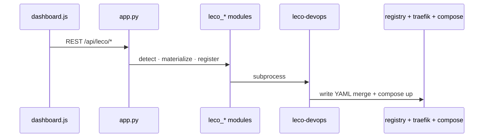

# Developer's guide — codebase overview

This section is for contributors who **extend**, **fix**, or **debug** LEco DevOps. It complements the **Docs** tab (`docs/ARCHITECTURE.md`, `docs/DEVELOPMENT_PLAYBOOK.md`, `docs/LECO_APP_BLUEPRINT.md`).

## Repository map

| Path | Responsibility |
|------|----------------|
| `dashboard/` | Flask UI + REST APIs (overview, control, hosted apps, LEco wizard, AI, Traefik editor, help) |
| `tools/deploy-cli/leco_app/` | `leco-devops` CLI — schema, compose, register, Traefik merge, CF provision |
| `ecosystem-stack/` | `ecosystem-stack.sh`, `core.sh`, `services/*.sh` — Docker lifecycle |
| `traefik/dynamic.yml` | Git-canonical **stack** `*.lh` routes |
| `hosting/` | Writable app slots + Traefik merge target |
| `config/leco-registry.yaml` | Hosted app registry (gitignored) |
| `cloudflare-local/` | KV/R2/D1/Workers adapters |
| `infra/` | Optional runtime images (`infra/runtimes/`) |
| `docs/` | Architecture, runbooks, blueprint |
| `docs/help/` | In-app Help & User Manual (this tree) |

## Product boundaries

- **LEco DevOps** = dashboard at `https://localhost.lh`
- **`leco-devops`** = CLI entrypoint (PyPI package name `leco-app`)
- **Effective manifest** = `leco.app.yaml` + profile `infrastructure` via `load_effective_manifest()` in `schema.py`

Dashboard and CLI **must** stay aligned on schema and path rules (`AGENTS.md`).

## High-level data flow

Full diagrams: **[Architecture & diagrams](help:architecture-diagrams)**.

## Where to start by task

| Task | Start here |
|------|------------|
| Registration bug | [Registration flow](help:dev-registration-flow), `leco_registration.py` |
| Compose path wrong | `compose_runner.py`, `leco_detect.py`, `schema.py` |
| Traefik 404/502 | [Traefik code](help:dev-traefik), `HOSTED_APPS_TRAEFIK_RUNBOOK.md` |
| New stack service | [Ecosystem stack](help:dev-ecosystem-stack), `traefik/dynamic.yml` |
| New manifest field | [CLI & schema](help:dev-cli), `schema.py` + `leco_validate.py` |
| Dashboard API | [Dashboard architecture](help:dev-dashboard), `app.py` |
| Tests / CI | [Debugging & validation](help:dev-debugging) |

## Reading order (repo docs)

1. `docs/ARCHITECTURE.md`
2. `docs/DEVELOPMENT_PLAYBOOK.md`
3. `docs/LECO_APP_BLUEPRINT.md` (§8–9 code map)
4. `docs/HLD.md` / `docs/LLD.md`
5. `docs/HOSTED_APPS_TRAEFIK_RUNBOOK.md`
6. `AGENTS.md` (agent validation checklist)

## Next

- [Dashboard architecture](help:dev-dashboard)
- [CLI & schema](help:dev-cli)
- [Registration data flow](help:dev-registration-flow)
