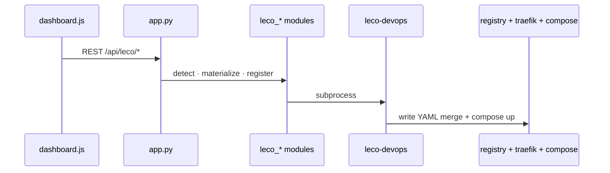

# Developer's guide — codebase overview

This section is for contributors who **extend**, **fix**, or **debug** LEco DevOps. It complements the **Docs** tab (`docs/ARCHITECTURE.md`, `docs/DEVELOPMENT_PLAYBOOK.md`, `docs/LECO_APP_BLUEPRINT.md`).

## Repository map

| Path | Responsibility |
|------|----------------|
| `dashboard/` | Flask UI + REST APIs (overview, control, hosted apps, LEco wizard, AI + RAG, Git source, CI/CD, MCP insights, Traefik editor, help) |
| `tools/deploy-cli/leco_app/` | `leco-devops` CLI — schema, compose, register, Traefik merge, CF provision |
| `tools/mcp-server/leco_mcp/` | `leco-mcp` MCP server — 65 tools, stdio + streamable HTTP, proxy over the dashboard API |
| `tools/claude-plugin/` | Claude Code plugin — MCP server, skill, commands, read-only diagnostician subagent |
| `ecosystem-stack/` | `ecosystem-stack.sh`, `core.sh`, `services/*.sh` — Docker lifecycle |
| `ecosystem-stack/config/generated/` | Machine-written state — MCP activity log, CI/CD runs, RAG index |
| `traefik/dynamic.yml` | Git-canonical **stack** routes (`mcp.lh` lives here too) |
| `scripts/render-platform-traefik.py` | Renders stack routes for the configured base domain + TLS mode |
| `hosting/` | Writable app slots + Traefik merge target; `hosting/app-sources/` is the fallback Git clone root |
| `config/leco-registry.yaml` | Hosted app registry (gitignored) |
| `config/leco-platform.yaml` | `deployment_mode`, `base_domain`, `tls.mode` |
| `cloudflare-local/` | KV/R2/D1/Workers adapters |
| `infra/` | Optional runtime images (`infra/runtimes/`) |
| `docs/` | Architecture, runbooks, blueprint |
| `docs/help/` | In-app Help & User Manual (this tree) |

Gitignored secret files, all `0600`, all written server-side and only ever returned masked: `config/ai-providers.yaml`, `config/git-credentials.yaml`, `config/cicd-pipelines.yaml`.

## Product boundaries

- **LEco DevOps** = dashboard at `https://localhost.lh`
- **`leco-devops`** = CLI entrypoint (PyPI package name `leco-app`)
- **`leco-mcp`** = MCP server; a *client* of the dashboard API, never a second implementation of it
- **Effective manifest** = `leco.app.yaml` + profile `infrastructure` via `load_effective_manifest()` in `schema.py`

Dashboard and CLI **must** stay aligned on schema and path rules (`AGENTS.md`).

Three things enter the dashboard API from outside and differ only in how they authenticate:

| Entry point | Authentication |
|-------------|----------------|
| Browser / UI | `DASHBOARD_CONTROL_TOKEN` on mutating endpoints |
| MCP server | The same control token, plus its own gates (`confirm=true` + `LECO_MCP_ALLOW_DESTRUCTIVE=1`) that restrict an agent *below* what the token permits |
| CI/CD webhook | Per-pipeline HMAC signature over the raw body — **not** the control token, because a Git host cannot send that header |

## High-level data flow

Full diagrams: **[Architecture & diagrams](help:architecture-diagrams)**.

```mermaid
sequenceDiagram
  participant JS as dashboard.js
  participant APP as app.py
  participant LECO as leco_* modules
  participant CLI as leco-devops
  participant Disk as registry + traefik + compose

  JS->>APP: REST /api/leco/*
  APP->>LECO: detect · materialize · register
  LECO->>CLI: subprocess
  CLI->>Disk: write YAML merge + compose up
```

## Where to start by task

| Task | Start here |
|------|------------|
| Registration bug | [Registration flow](help:dev-registration-flow), `leco_registration.py` |
| Compose path wrong | `compose_runner.py`, `leco_detect.py`, `schema.py` |
| Traefik 404/502 | [Traefik code](help:dev-traefik), `HOSTED_APPS_TRAEFIK_RUNBOOK.md` |
| New stack service | [Ecosystem stack](help:dev-ecosystem-stack), `traefik/dynamic.yml` |
| New manifest field | [CLI & schema](help:dev-cli), `schema.py` + `leco_validate.py` |
| Dashboard API | [Dashboard architecture](help:dev-dashboard), `app.py` |
| New or changed MCP tool | [MCP server](help:dev-mcp-server), `tools/mcp-server/leco_mcp/tools/`, then `docs/MCP_SERVER.md` tool tables |
| Clone / credential problem | `git_source.py`, [Git onboarding & CI/CD](help:git-cicd) |
| Pipeline never runs, or runs twice | `cicd.py` (signature verification, then the coalescing slot) |
| Wrong hostname on a real domain | `platform_config.py`, `routing_domain()` / `app_hostname()` in `leco_detect.py`, `scripts/render-platform-traefik.py` |
| Wrangler config picked from the wrong repo | `leco_wrangler_paths.py` and the repository-boundary check in `leco_detect.py` |
| RAG answers are wrong or leak | `ai_corpus.py` (index + scrubbing), `ai_rag.py` (retrieval, live rules, prompt) |
| Tests / CI | [Debugging & validation](help:dev-debugging) |

## Reading order (repo docs)

1. `docs/ARCHITECTURE.md`
2. `docs/DEVELOPMENT_PLAYBOOK.md`
3. `docs/LECO_APP_BLUEPRINT.md` (§8–9 code map)
4. `docs/HLD.md` / `docs/LLD.md`
5. `docs/MCP_SERVER.md` / `docs/GIT_AND_CICD.md`
6. `docs/HOSTED_APPS_TRAEFIK_RUNBOOK.md`
7. `docs/PRODUCTION_HARDENING.md` (before anything is exposed)
8. `AGENTS.md` (agent validation checklist)

## Next

- [Dashboard architecture](help:dev-dashboard)
- [CLI & schema](help:dev-cli)
- [Registration data flow](help:dev-registration-flow)
- [Architecture & diagrams](help:architecture-diagrams)
