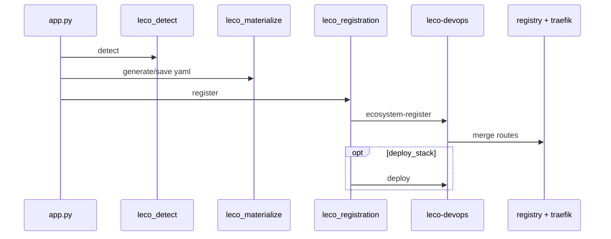

# Registration data flow (developer)

End-to-end path from **Detect** to running app on `lh-network`.

## Sequence diagram



## Step list

```
POST /api/leco/detect
  → leco_detect.scan_app_directory
  → preview bridge + profile YAML

POST /api/leco/generate-yaml | save-yaml  (control token)
  → leco_materialize.materialize_registration_yaml | save_registration_yaml
  → hosting_layout: app-available/<slug>/, source symlink, configRefs symlinks
  → leco_validate (Pydantic)

POST /api/leco/register  (control token)
  → leco_registration.prepare_register_from_disk
  → normalize hosts, ensure_lh_network_hosting_overlay, ensure_local_runtime_overlay
  → leco_subprocess.run_ecosystem_register
  → CLI: ecosystem-register --merge-traefik
  → ecosystem_registry.register_in_ecosystem
  → provision-local-cf (optional)
  → traefik_dynamic_merge.merge_manifest_routing_into_dynamic_yml
  → optional leco_subprocess.run_leco_deploy → CLI deploy
```

## Path resolution (critical)

```python
# Resolved root = where upstream compose/wrangler paths resolve
resolved = (manifest_path.parent / manifest.root).resolve()

# Manifest-relative compose files
hosting_dir = manifest_path.parent
# composeFileFromManifest, additionalComposeFilesFromManifest → relative to hosting_dir
```

Implemented in `schema.py`, `compose_runner.py`, `leco_detect.compute_hosting_source_symlink_target`.

## Materialize (read-only `wsp:`)

| Step | Code |
|------|------|
| Staging dir | `hosting_layout.hosting_staging_dir(slug)` → `hosting/app-available/<slug>` |
| Registry path | `hosting_layout.registry_manifest_relpath(slug)` |
| Source symlink | `hosting_layout.sync_hosting_source_symlink` |
| Config symlinks | `sync_hosting_config_ref_symlinks` — `configRefs`, each `runtimes[].config`, wrangler scan; remaps `/workspace-parent` on host |

## Subprocess boundary

**`leco_subprocess.py`** builds argv for:

- `leco-devops ecosystem-register -E … --merge-traefik [--registry-manifest-relpath …]`
- `leco-devops deploy -f …`
- `leco-devops ecosystem-unregister …`

Dashboard cwd/env passes `LECO_ECOSYSTEM_ROOT` from `/project`.

Streaming register: `iter_ecosystem_register_lines` → `POST /api/leco/register/stream` (NDJSON).

## Control after register

**`leco_control.py`** loads registry, parses effective manifest for compose project name, exposes **`leco-stack-<id>`** to **`control.py`**.

Workers-only: no compose block → worker control path, deploy skipped on register.

## Offboard

**`hosted_offboard.py`** + **`control.py`** `_leco_stack_action`:

1. Local CF teardown (when enabled)
2. `docker compose down` (`-v` on reset)
3. Traefik key cleanup (`traefikCleanup` or inferred keys)
4. `ecosystem-unregister`
5. Remove `hosting/app-available/<slug>` if applicable

## Files to change together (AGENTS.md)

Hosted app behavior changes touch:

- `dashboard/leco_detect.py`
- `dashboard/leco_materialize.py`
- `dashboard/hosting_layout.py`
- `dashboard/leco_registration.py`
- `tools/deploy-cli/leco_app/schema.py`

Routing changes also: `traefik_fragment.py`, `traefik/dynamic.yml`, docs.

## Debugging tips

```bash
# Validate YAML without register
leco-devops detect /path/to/app
curl -X POST localhost.lh/api/leco/validate-yaml -H 'Content-Type: application/json' -d '{"bridge":"...","profile":"..."}'

# Preview Traefik fragment
leco-devops traefik-fragment -f hosting/app-available/myapp/leco.app.yaml

# Runtime overlay diagnostic
leco-devops runtimes -f hosting/app-available/myapp/leco.app.yaml --detect
```

Next: [Traefik & routing code](help:dev-traefik)
