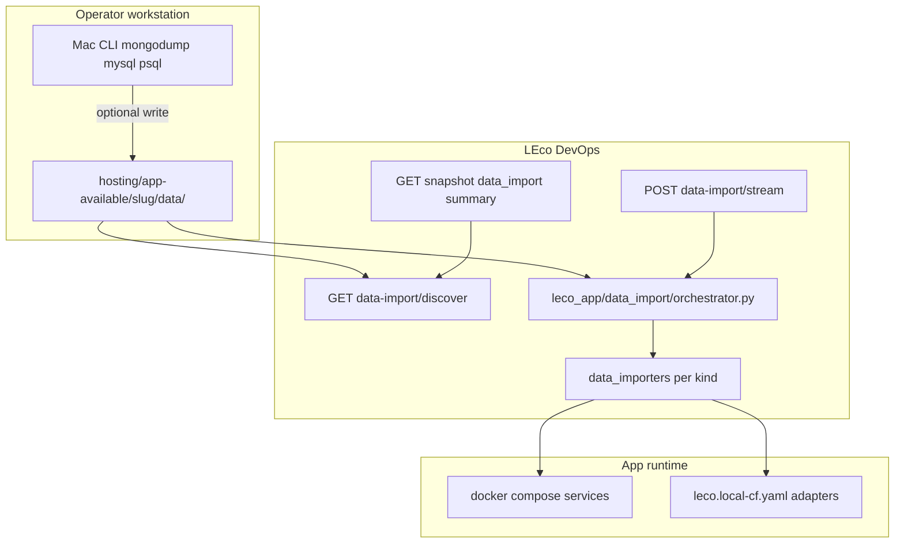

# Data import — developer reference

Hosted apps can seed local databases and files from `hosting/app-available/<slug>/data/`. Operators use [Hosted app data import](help:hosted-app-data-import); this page covers architecture, APIs, and extending importers.

## Architecture



| Layer | Path | Role |
|-------|------|------|
| Plan | `tools/deploy-cli/leco_app/data_import/plan.py` | `manifest.yaml` + auto-discovery |
| Orchestrator | `tools/deploy-cli/leco_app/data_import/orchestrator.py` | `discover_data_import`, `run_import_plan_stream` |
| Importers | `tools/deploy-cli/leco_app/data_import/importers/*.py` | Per-`kind` restore |
| Dashboard | `dashboard/hosted_data_import.py` | HTTP bridge, compose context |
| Snapshot | `dashboard/hosted_apps.py` | `data_import` block |

## `manifest.yaml` (optional)

```yaml
version: 1
imports:
  - id: mongo-primary
    kind: mongodb
    service: mongo
    database: myapp
    path: mongo/myapp
    drop_before_import: true
  - id: mysql-primary
    kind: mysql
    service: db
    database: myapp
    path: mysql/myapp.sql
```

| Field | Required | Description |
|-------|----------|-------------|
| `id` | yes | Stable step id (logging) |
| `kind` | yes | `mongodb`, `mysql`, `postgres`, `redis`, `d1`, `r2`, `kv`, `files` |
| `path` | usually | Relative to `data/` |
| `service` | compose kinds | Compose service name |
| `database` | DB kinds | Target database name |
| `bucket` / `namespace` | r2 / kv | Target binding id |
| `container_path` | files | Destination in container |
| `drop_before_import` | no | Default true; honored when `reimport` is true |

Without `manifest.yaml`, `plan.py` auto-discovers standard subdirectories.

## HTTP API

| Method | Route | Purpose |
|--------|-------|---------|
| GET | `/api/hosted-apps/<slug>/data-import/discover` | Plan + warnings (no writes) |
| POST | `/api/hosted-apps/<slug>/data-import/stream` | NDJSON import (`token`, `reimport`, `dry_run`, `selected_ids[]`) |

**Stream events**

| `type` | Fields | Meaning |
|--------|--------|---------|
| `log` | `text` | Line-oriented log output |
| `progress` | `step`, `total`, `label` | Current import step |
| `done` | `result` | `{ ok, imported, failed, error?, log? }` |

**Snapshot `data_import`**

```json
{
  "present": true,
  "path": "/project/hosting/app-available/<slug>/data",
  "items": [{ "kind": "mongodb", "label": "...", "path": "mongo/myapp", "size_bytes": 123 }],
  "warnings": [],
  "total_bytes": 123,
  "suggested_cli": ["mongodump ... | mongorestore ..."]
}
```

## `ImportContext`

Defined in `context.py`. Importers receive:

- `data_dir`, `manifest_path`, `compose_root`, `compose_tail`
- `services` (merged compose specs), `compose_ps` (running containers)
- `local_cf` (parsed `leco.local-cf.yaml`)
- `reimport`, `dry_run`
- `log(text)` — buffered for stream emission

`container_for_service(name)` resolves from `compose ps` JSON or `container_name` in compose.

## Adding a new `kind`

1. Create `tools/deploy-cli/leco_app/data_import/importers/mykind.py` with `import_mykind(ctx, entry) -> tuple[bool, str]`.
2. Register in `importers/__init__.py` → `IMPORTERS` dict.
3. Add discovery rules in `plan.py` `_auto_discover` (if convention-based).
4. Document CLI dump layout in `docs/help/13-hosted-app-data-import.md`.
5. Add unit tests under `dashboard/tests/test_data_import_plan.py`.

Importers should accept the **same on-disk layouts** as the operator CLI cookbook.

## CLI

```bash
leco-devops import-data \
  --manifest hosting/app-available/<slug>/leco.app.yaml \
  [--reimport] [--dry-run]
```

`--dry-run` prints the YAML plan (same as **Dry-run plan** in the UI).

## Tests

- `dashboard/tests/test_data_import_plan.py` — discovery and manifest merge (no Docker).
- Run: `python -m unittest dashboard.tests.test_data_import_plan`

## Related

- [CLI & schema](help:dev-cli)
- [Attached services API](help:dev-hosted-app-services)
- [Hosted app data import (operators)](help:hosted-app-data-import)
