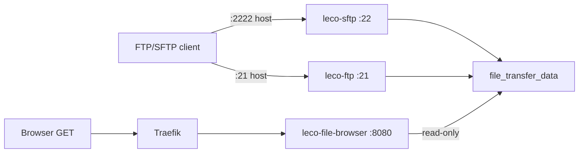
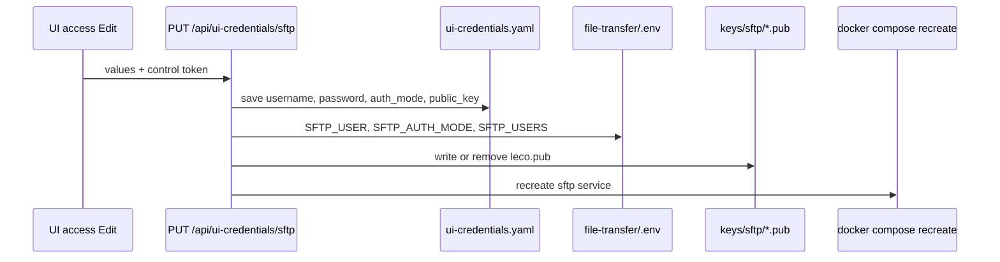

# File transfer stack (developer)

How **FTP**, **SFTP**, and the read-only browser are wired into the LEco DevOps Open Project.

## Repository layout

| Path | Role |
|------|------|
| `file-transfer/docker-compose.yml` | `leco-sftp`, `leco-ftp`, `leco-file-browser` |
| `file-transfer/.env.example` | `SFTP_*`, `FTP_*` defaults (copy to gitignored `.env`) |
| `file-transfer/keys/sftp/` | OpenSSH `.pub` files mounted into SFTP container |
| `ecosystem-stack/services/file-transfer.sh` | `start` / `stop` / `status` wrapper |
| `ecosystem-stack/lib/platform_config.py` | `file-transfer` in `START_ORDER`, profile `file-transfer-full` |
| `ecosystem-stack/config/install-profiles.yaml` | Profile definitions |
| `ecosystem-stack/config/ui-login-registry.json` | UI access slugs `sftp`, `ftp`, `files` |
| `traefik/dynamic.yml` | `files.lh`, `ftp-files.lh`, `sftp-files.lh` → browser |

## Runtime topology



All services attach to **`lh-network`**. SFTP uses host port **2222** (not 22) to avoid macOS SSH. FTP publishes passive **21100–21110**.

## Dashboard modules

| Module | Responsibility |
|--------|----------------|
| `dashboard/control_targets.py` | `FILE_TRANSFER_TARGETS`, compose service ids |
| `dashboard/control.py` | Compose actions for `file-transfer/docker-compose.yml` |
| `dashboard/monitor.py` | `SERVICE_MAP` entries + hub slugs |
| `dashboard/service_policies.py` | Policy includes file-transfer targets |
| `dashboard/ui_credentials.py` | Vault merge, `login_details`, SFTP auth modes |
| `dashboard/ui_credential_reset.py` | Write `.env`, `.pub` keys, recreate containers |
| `dashboard/static/dashboard.js` | Infrastructure **2b · File transfer**, UI access table |
| `dashboard/service_hub.py` | Per-hub pages from `hub_slug` |

## Credential apply flow



**SFTP_USERS** format ([atmoz/sftp](https://github.com/atmoz/sftp)): `user:pass:uid:gid`. Public-key-only: empty password (`leco::1000:1000`). Keys bind-mount to `/home/${SFTP_USER}/.ssh/keys/`.

## Traefik (browser only)

FTP/SFTP are **not** HTTP-routed. Only the read-only browser uses Traefik:

- Host rules: `files.lh`, `ftp-files.lh`, `sftp-files.lh`
- Backend: `http://leco-file-browser:8080`

After editing `traefik/dynamic.yml`, run `./ecosystem-stack/ecosystem-stack.sh heal traefik`.

## Adding or changing behavior

When you change file-transfer behavior, keep these aligned (see root **`AGENTS.md`**):

1. `file-transfer/docker-compose.yml` and `.env.example`
2. `ecosystem-stack/services/file-transfer.sh`, `core.sh` network repair list
3. `dashboard/control_targets.py`, `monitor.py`, `control.py`
4. `ui-login-registry.json`, `ui_credentials.py`, `ui_credential_reset.py`
5. `traefik/dynamic.yml` (browser hosts only)
6. `docs/FILE_TRANSFER.md`, this page, [operator help](help:file-transfer)
7. `CHANGELOG.md` `[Unreleased]` for user-visible changes

## Smoke test

```bash
./ecosystem-stack/services/file-transfer.sh start
echo smoke-test > /tmp/leco-ft-smoke.txt
sftp -P 2222 -o StrictHostKeyChecking=no leco@localhost <<< "put /tmp/leco-ft-smoke.txt"
curl -fsS -H 'Host: files.lh' http://127.0.0.1/ | grep -i smoke
```

## Related docs

- Operator: [FTP & SFTP file transfer](help:file-transfer)
- Architecture: [ARCHITECTURE.md](../../ARCHITECTURE.md) · [HLD.md](../../HLD.md) · [LLD.md](../../LLD.md)
- [UI credential vault](../../UI_CREDENTIAL_VAULT.md)
- [Ecosystem stack](help:dev-ecosystem-stack)
