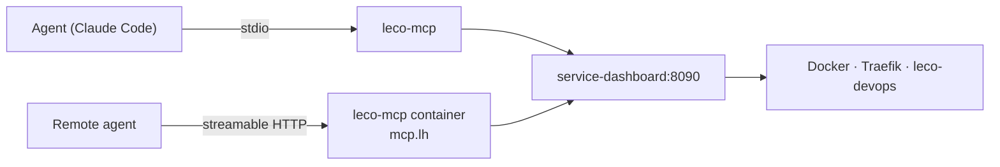

# MCP server (developer)

How the **Model Context Protocol** server is wired into the LEco DevOps Open Project.

## Repository layout

| Path | Role |
|------|------|
| `tools/mcp-server/pyproject.toml` | Distribution `leco-mcp`, console script `leco-mcp` |
| `tools/mcp-server/leco_mcp/__main__.py` | CLI: `stdio` \| `http` \| `doctor` |
| `tools/mcp-server/leco_mcp/server.py` | `MCPServer` assembly + client-facing instructions |
| `tools/mcp-server/leco_mcp/config.py` | `Settings.from_env()` — every `LECO_MCP_*` variable |
| `tools/mcp-server/leco_mcp/client.py` | Dashboard HTTP client, base-URL discovery, NDJSON streaming |
| `tools/mcp-server/leco_mcp/safety.py` | Destructive + credential gates |
| `tools/mcp-server/leco_mcp/shaping.py` | Response compaction and size caps |
| `tools/mcp-server/leco_mcp/runtime.py` | `Deps`, stream consumption → progress notifications |
| `tools/mcp-server/leco_mcp/tools/*.py` | One module per tool family, each exporting `register(server, deps)` |
| `tools/mcp-server/leco_mcp/prompts.py` | Workflow prompts |
| `tools/mcp-server/Dockerfile` | HTTP transport image (build context = repo root) |
| `ecosystem-stack/services/mcp.sh` | `start` / `stop` / `restart` / `reset` wrapper |
| `traefik/dynamic.yml` | `mcp-http` / `mcp-https` routers → `mcp-service` |
| `dashboard/control_targets.py` | `ai-mcp` target; `mcp` requires `dashboard` |
| `dashboard/monitor.py` | `SERVICE_MAP` entry + `INTERNAL_PROBE_BY_CONTAINER["leco-mcp"]` |
| `dashboard/app_evidence.py` | Backs `leco_app_evidence` / `leco_compose_validate` / `leco_verify` — port attribution with an `owner_source` per port, compose merge resolution, and route probing that classifies rather than asserting a status code |
| `tools/claude-plugin/` | Claude Code plugin: bundles this server plus a skill and commands |

## Architecture: why it is a proxy, not a second brain

Every tool is an HTTP call to the dashboard API. The MCP server has **no Docker socket**, runs **no shell commands**, and holds **no copy** of lifecycle or routing logic.



The payoff: fixing a lifecycle bug in `dashboard/control.py` fixes it for the UI, the CLI, and every agent at once. The cost: the MCP server is useless while the dashboard is down — which is the correct failure mode, since a half-operating agent is worse than a stopped one.

## Adding a tool

1. Put it in the matching module under `leco_mcp/tools/`. Each module exposes `register(server, deps)` and is listed in `leco_mcp/tools/__init__.py::REGISTRARS` (order controls how tools appear in a client's list).
2. Call the dashboard through `deps.client` (`get` / `post` / `put`), never `httpx` directly — that is where token injection, base-URL discovery, and timeout policy live.
3. Streaming actions go through `deps.run_stream(path, body, ctx=ctx)`, which consumes the NDJSON stream, forwards each line as an MCP progress notification, and returns a normalized result.
4. Shape the response. Return a compact view by default and expose a `detail` / `sections` / `full` knob; finish with `shaping.guard_size(payload, settings.max_response_chars)`.
5. Gate destructive paths through `safety.guard_destructive(...)` or `safety.guard_explicit_destructive(...)`.
6. Declare `ToolAnnotations(read_only_hint=…, destructive_hint=…)` so clients can distinguish a read from a teardown.
7. The **docstring is the tool description** the model reads. Write it for an agent that has never seen this platform: what it does, what the arguments mean, what to call first, and what it costs.

```python
@server.tool(name="leco_example", annotations=READ_ONLY)
async def leco_example(slug: str, full: bool = False) -> dict[str, Any]:
    """One-line summary the model sees first.

    Explain arguments and ordering constraints here.
    """
    payload = await client.get(f"/api/example/{slug.strip()}")
    return guard_size(payload if full else pick(payload, "id", "status"),
                      settings.max_response_chars)
```

Context injection: annotate the parameter as `ctx: Context | None = None`, importing `Context` from **`mcp.server.mcpserver`**. Importing it from `mcp.server.context` yields a different class that the SDK will not recognise, and the tool then fails at registration with a JSON-schema error.

## Response shaping is not optional

`/api/overview` is ~56 KB and takes 10–15 seconds. A handful of unshaped tools would exhaust an agent's context before it did any work. Every tool returns a compact projection by default; `LECO_MCP_MAX_RESPONSE_CHARS` is the backstop that replaces an oversized result with a truncation notice.

## Change-together modules

When the tool surface changes, update:

- `docs/MCP_SERVER.md` and `tools/mcp-server/README.md` (tool tables)
- `tools/claude-plugin/skills/operate/references/tool-map.md` and `SKILL.md`
- `docs/help/20-mcp-server.md` if the operator-facing story changes

When the transport or container changes, update `ecosystem-stack/services/mcp.sh`, `traefik/dynamic.yml`, `ecosystem-stack/core.sh` (`START_ORDER`, `NETWORK_CONTAINERS`), `ecosystem-stack/config/install-profiles.yaml`, `dashboard/control_targets.py`, and `dashboard/monitor.py`.

## Tests

```bash
pip install -e './tools/mcp-server[dev]'
python -m pytest tools/mcp-server/tests -q
```

Covers the safety gates, response shaping, configuration resolution, and server assembly — all without a running stack. Integration behaviour is verified by driving the server in-process with the MCP `Client` against a live dashboard.

## Debugging

```bash
leco-mcp doctor                          # resolved URL, token state, tool list
docker logs -f leco-mcp                  # HTTP transport
LECO_MCP_LOG_LEVEL=DEBUG leco-mcp http   # verbose
```

`doctor` is the first thing to run for any "the agent cannot do X" report: it separates *dashboard down* from *token missing* from *gate closed*, which are the three causes behind nearly every failure.
